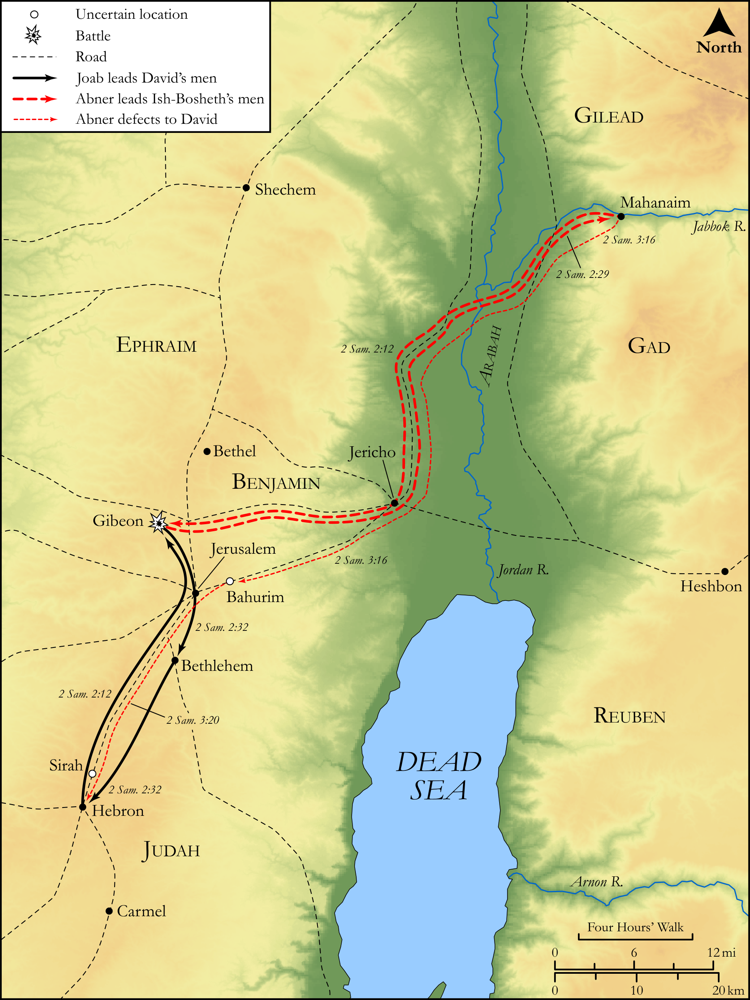

# Biblica Open Bible Maps

## License Information

Biblica Open Bible Maps, © 2023–2025 Biblica, Inc. This work is licensed under Creative Commons Attribution-ShareAlike 4.0 International (<a href="https://creativecommons.org/licenses/by-sa/4.0/">https://creativecommons.org/licenses/by-sa/4.0/</a>). More Information: <a href="https://docs.google.com/document/d/1Pp44yZ0Zdnd59vJHTrt2rPYq0SppfX5rZbPBt6mz37U/edit?tab=t.0#heading=h.oev9aj1ksvk2">https://docs.google.com/document/d/1Pp44yZ0Zdnd59vJHTrt2rPYq0SppfX5rZbPBt6mz37U/edit?tab=t.0#heading=h.oev9aj1ksvk2</a>

--------------------------------

## Historical: Wars Between the Houses of David and Saul (id: OT095)

### Image Content

[link](images/OT095.png)

Original: [Historical: Wars Between the Houses of David and Saul](https://drive.google.com/open?id=1mJac-D9M4dY5LZ_RdxDaBGZKGopGy-rI&usp=drive_copy)

* **Associated Passages:** 2 Samuel 2:1-3:39

* **Associated ACAI Concepts:** Abner (ID: `person:Abner`); David (ID: `person:David`); Joab (ID: `person:Joab`); Saul (ID: `person:Saul.2`); Israel (ID: `person:Israel`); Hebron (ID: `place:Hebron`); Asahel (ID: `person:Asahel`); Ish-bosheth (ID: `person:Ish-bosheth`); LORD (ID: `deity:Lord`); Judah (ID: `person:Judah.4`); Tribe of Judah (ID: `group:Judah`); Ner (ID: `person:Ner.2`); Tribe of Benjamin (ID: `group:Benjamin`); Benjamin (ID: `person:Benjamin`); Gibeon (ID: `place:Gibeon`); An Angel (ID: `deity:Angel`); Jezreel (ID: `place:Jezreel.2`); Zeruiah (ID: `person:Zeruiah`); Abishai (ID: `person:Abishai`); Peace (ID: `keyterm:IntactState`); Smear (ID: `keyterm:Smear`); Mahanaim (ID: `place:Mahanaim`); Kindness (ID: `keyterm:Kindness`); Covenant (ID: `keyterm:Covenant`); Abigail (ID: `person:Abigail`); Ahinoam (ID: `person:Ahinoam.2`); Carmelites (ID: `group:Carmel`); Michal (ID: `person:Michal`); Philistines (ID: `group:Philistine`); Jezreel (ID: `place:Jezreel`)
