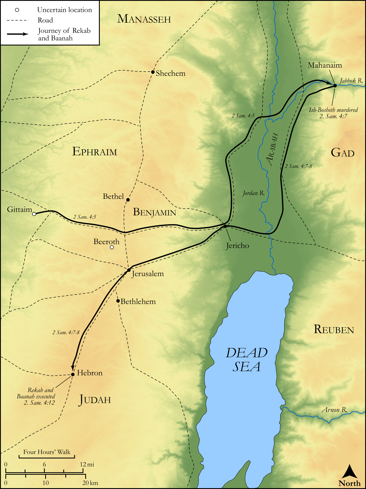

# Biblica Open Bible Maps

## License Information

Biblica Open Bible Maps, © 2023–2025 Biblica, Inc. This work is licensed under Creative Commons Attribution-ShareAlike 4.0 International (<a href="https://creativecommons.org/licenses/by-sa/4.0/">https://creativecommons.org/licenses/by-sa/4.0/</a>). More Information: <a href="https://docs.google.com/document/d/1Pp44yZ0Zdnd59vJHTrt2rPYq0SppfX5rZbPBt6mz37U/edit?tab=t.0#heading=h.oev9aj1ksvk2">https://docs.google.com/document/d/1Pp44yZ0Zdnd59vJHTrt2rPYq0SppfX5rZbPBt6mz37U/edit?tab=t.0#heading=h.oev9aj1ksvk2</a>

--------------------------------

## Historical: Ish-Boseth Murdered (id: OT096)

### Image Content

[link](images/OT096.png)

Original: [Historical: Ish\-Boseth Murdered](https://drive.google.com/open?id=1qc28Xm-yEk1J96K3yWVHIDIxQWo_EzOL&usp=drive_copy)

* **Associated Passages:** 2 Samuel 4:1-12

* **Associated ACAI Concepts:** Saul (ID: `person:Saul.2`); Baanah (ID: `person:Baanah`); Rechab (ID: `person:Rechab`); Beeroth (ID: `place:Beeroth`); Beerothites (ID: `group:Beeroth`); Ish-bosheth (ID: `person:Ish-bosheth`); Rimmon (ID: `person:Rimmon`); House (ID: `realia:House`); Hebron (ID: `place:Hebron`); David (ID: `person:David`); Abner (ID: `person:Abner`); LORD (ID: `deity:Lord`); Bed (ID: `realia:Bed`); Jezreel (ID: `place:Jezreel.3`); Gittaim (ID: `place:Gittaim`); Mephibosheth (ID: `person:Mephibosheth`); Arabah (ID: `place:Arabah`); Jonathan (ID: `person:Jonathan.3`); Ziklag (ID: `place:Ziklag`); Tribe of Benjamin (ID: `group:Benjamin`); Israel (ID: `person:Israel`); Redeem (ID: `keyterm:Redeem`); Benjamin (ID: `person:Benjamin`); Wheat (ID: `flora:Wheat`)
