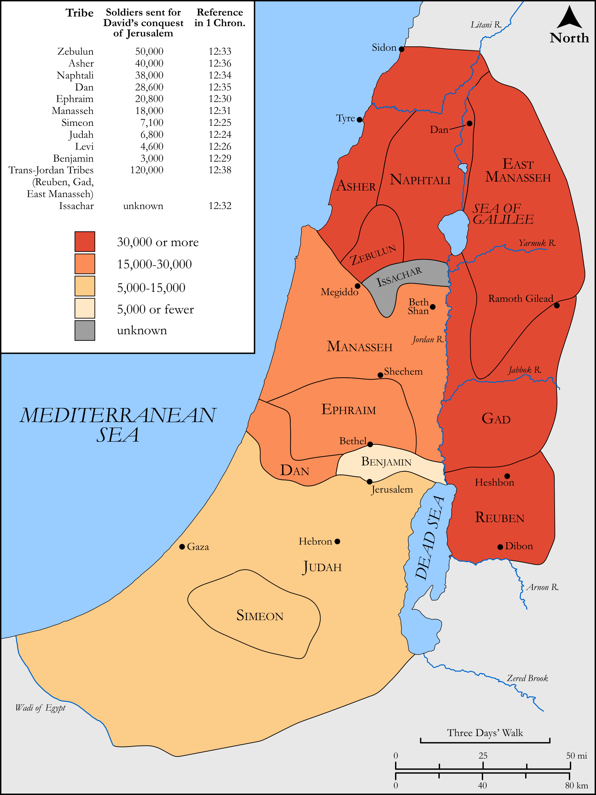

# Biblica Open Bible Maps

## License Information

Biblica Open Bible Maps, © 2023–2025 Biblica, Inc. This work is licensed under Creative Commons Attribution-ShareAlike 4.0 International (<a href="https://creativecommons.org/licenses/by-sa/4.0/">https://creativecommons.org/licenses/by-sa/4.0/</a>). More Information: <a href="https://docs.google.com/document/d/1Pp44yZ0Zdnd59vJHTrt2rPYq0SppfX5rZbPBt6mz37U/edit?tab=t.0#heading=h.oev9aj1ksvk2">https://docs.google.com/document/d/1Pp44yZ0Zdnd59vJHTrt2rPYq0SppfX5rZbPBt6mz37U/edit?tab=t.0#heading=h.oev9aj1ksvk2</a>

--------------------------------

## Historical: David’s Army Assembles at Hebron (id: OT097)

### Image Content

[link](images/OT097.png)

Original: [Historical: David’s Army Assembles at Hebron](https://drive.google.com/open?id=1gskJ6uDtQQ-uEhZ3vB6Pb5FdopqfYQim&usp=drive_copy)

* **Associated Passages:** 1 Chronicles 12:1-41

* **Associated ACAI Concepts:** David (ID: `person:David`); Saul (ID: `person:Saul.2`); LORD (ID: `deity:Lord`); Manasseh (ID: `person:Manasseh`); Tribe of Manasseh (ID: `group:Manasseh`); Tribe of Benjamin (ID: `group:Benjamin`); Benjamin (ID: `person:Benjamin`); Gad (ID: `person:Gad`); Israel (ID: `person:Israel`); Tribe of Issachar (ID: `group:Issachar`); Large Shield (ID: `realia:LargeShield`); Spear (ID: `realia:Spear`); Ziklag (ID: `place:Ziklag`); Judah (ID: `person:Judah.4`); Peace (ID: `keyterm:IntactState`); Jordan River (ID: `place:Jordan`); Tribe of Zebulun (ID: `group:Zebulun`); Naphtali (ID: `person:Naphtali`); Zebulun (ID: `person:Zebulun`); Tribe of Judah (ID: `group:Judah`); Hebron (ID: `place:Hebron`); Tribe of Naphtali (ID: `group:Naphtali`); Issachar (ID: `person:Issachar`); Jerimoth (ID: `person:Jerimoth.2`); Machbannai (ID: `person:Machbannai`); Johanan (ID: `person:Johanan.3`); Azarel (ID: `person:Azarel.2`); Joezer (ID: `person:Joezer`); Jeziel (ID: `person:Jeziel`); Zillethai (ID: `person:Zillethai.2`); Elkanah (ID: `person:Elkanah.6`); Elzabad (ID: `person:Elzabad`); Elihu (ID: `person:Elihu.2`); Jediael (ID: `person:Jediael.3`); Jeremiah (ID: `person:Jeremiah.4`); Joash (ID: `person:Joash.6`); Attai (ID: `person:Attai.2`); Isshiah (ID: `person:Isshiah.2`); Jeremiah (ID: `person:Jeremiah.5`); Obadiah (ID: `person:Obadiah.6`); Jozabad (ID: `person:Jozabad`); Adnah (ID: `person:Adnah`); Mishmannah (ID: `person:Mishmannah`); Eluzai (ID: `person:Eluzai`); Jahaziel (ID: `person:Jahaziel`); Ezer (ID: `person:Ezer.4`); Michael (ID: `person:Michael.7`); Shephatiah (ID: `person:Shephatiah.3`); Shemariah (ID: `person:Shemariah`); Jehu (ID: `person:Jehu.5`); Bealiah (ID: `person:Bealiah`); Jashobeam (ID: `person:Jashobeam.2`); Jozabad (ID: `person:Jozabad.3`); Jozabad (ID: `person:Jozabad.2`); Amasai (ID: `person:Amasai.2`); Eliel (ID: `person:Eliel.6`); Ishmaiah (ID: `person:Ishmaiah`); Shemaah (ID: `person:Shemaah`); Pelet (ID: `person:Pelet.2`); Joelah (ID: `person:Joelah`); Beracah (ID: `person:Beracah`); Haruphites (ID: `group:Haruphites`); Johanan (ID: `person:Johanan.2`); Ahiezer (ID: `person:Ahiezer.2`); Eliab (ID: `person:Eliab.4`); Azmaveth (ID: `person:Azmaveth.3`); Jeremiah (ID: `person:Jeremiah.3`); Jeroham (ID: `person:Jeroham.5`); Zebadiah (ID: `person:Zebadiah.3`); Fortress (ID: `realia:Fortress`); Tribe of Reuben (ID: `group:Reuben`); Korah (ID: `person:Korah.3`); Tribe of Dan (ID: `group:Dan`); Korahites (ID: `group:Korah`); Tribe of Levi (ID: `group:Levi`); Dan (ID: `place:Dan`); Deceit (ID: `keyterm:Deceit`); Asher (ID: `person:Asher`); Tribe of Ephraim (ID: `group:Ephraim`); Kish (ID: `person:Kish`); Philistines (ID: `group:Philistine`); Simeon (ID: `person:Simeon.5`); Arrow (ID: `keyterm:Arrow`); Understanding (ID: `keyterm:Understanding`); Tribe of Simeon (ID: `group:Simeon`); Anathoth (ID: `place:Anathoth`); Philistia (ID: `place:Philistine`); Aaron (ID: `person:Aaron`); Gedor (ID: `place:Gedor`); Ephraim (ID: `person:Ephraim`); Levi (ID: `person:Levi.3`); Jesse (ID: `person:Jesse`); Zadok (ID: `person:Zadok.2`); Gibeonites (ID: `group:Gibeon`); Tribe of Asher (ID: `group:Asher`); Gibeah (ID: `place:Gibeah.2`); Gibeon (ID: `place:Gibeon`); Reuben (ID: `person:Reuben`); Gederah (ID: `place:Gederah`); Counsel (ID: `keyterm:Counsel`); Jehoiada (ID: `person:Jehoiada`); Fig Cake (ID: `realia:FigCake`); Arrow (ID: `realia:Arrow`); Vine (ID: `flora:Vine`); Goat (ID: `fauna:Goat`); Mule (ID: `fauna:Mule`); Camel (ID: `fauna:Camel`); Donkey (ID: `fauna:Donkey`); Bow (ID: `realia:Bow`); Olive Oil (ID: `realia:OliveOil`); Anointing Oil (ID: `realia:AnointingOil`); Cattle (ID: `fauna:Bull`); Wine (ID: `realia:Wine`); Flock (ID: `fauna:Flock`); Lion (ID: `fauna:Lion`); Gazelle (ID: `fauna:Gazelle`)
