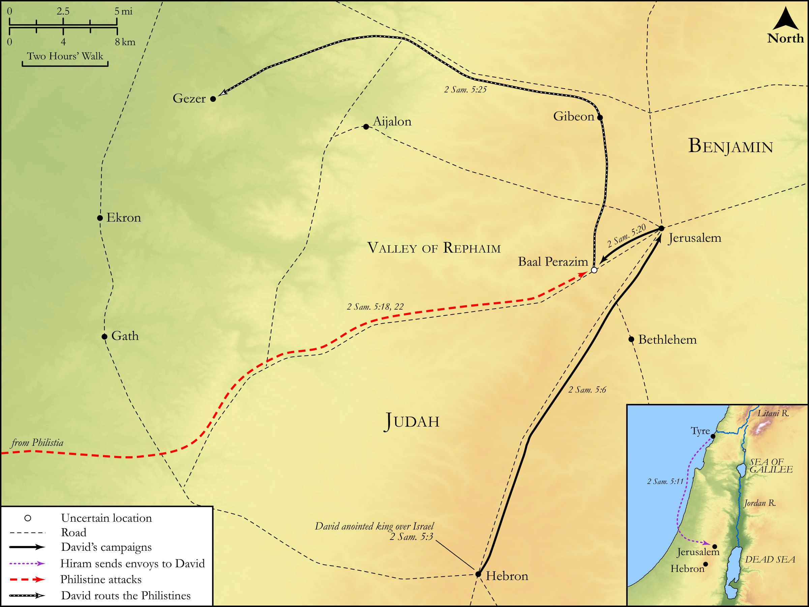

# Biblica Open Bible Maps

## License Information

Biblica Open Bible Maps, © 2023–2025 Biblica, Inc. This work is licensed under Creative Commons Attribution-ShareAlike 4.0 International (https://creativecommons.org/licenses/by-sa/4.0/). More Information: https://docs.google.com/document/d/1Pp44yZ0Zdnd59vJHTrt2rPYq0SppfX5rZbPBt6mz37U/edit?tab=t.0#heading=h.oev9aj1ksvk2

--------------------------------

## Historical: David Captures and Defends Jerusalem (id: OT098)

### Image Content

[link](images/OT098.png)

Original: [Historical: David Captures and Defends Jerusalem](https://drive.google.com/open?id=1WM-TKaXkcLNz11q04LQPmbzVupB2sASS&usp=drive_copy)

* **Associated Passages:** 2 Samuel 5:1-25

* **Associated ACAI Concepts:** David (ID: `person:David`); LORD (ID: `deity:Lord`); Philistines (ID: `group:Philistine`); Philistia (ID: `place:Philistine`); Israel (ID: `person:Israel`); Jerusalem (ID: `place:Jerusalem`); Hebron (ID: `place:Hebron`); Fortress (ID: `realia:Fortress`); Jebusites (ID: `group:Jebusites`); Valley of Rephaim (ID: `place:RephaimValley`); Smear (ID: `keyterm:Smear`); Elishama (ID: `person:Elishama.2`); Baal-perazim (ID: `place:Baal-perazim`); Shammua (ID: `person:Shammua.2`); Ibhar (ID: `person:Ibhar`); Millo (ID: `place:Millo`); Eliada (ID: `person:Eliada`); Gezer (ID: `place:Gezer`); Shobab (ID: `person:Shobab`); Elishua (ID: `person:Elishua`); Nepheg (ID: `person:Nepheg.2`); House (ID: `realia:House`); Hiram (ID: `person:Hiram`); Japhia (ID: `person:Japhia.2`); Nathan (ID: `person:Nathan`); Eliphelet (ID: `person:Eliphelet`); Covenant (ID: `keyterm:Covenant`); An Angel (ID: `deity:Angel`); Judah (ID: `person:Judah.4`); Solomon (ID: `person:Solomon`); Gibeon (ID: `place:Gibeon`); Saul (ID: `person:Saul.2`); Tribe of Judah (ID: `group:Judah`); Tyre (ID: `place:Tyre`); Water-Tunnel (ID: `realia:Water-tunnel`); Sheep (ID: `fauna:Lamb`); Image (ID: `realia:Image`); Cedar (ID: `flora:Cedar`); Craftsman (ID: `realia:Craftsman`)
