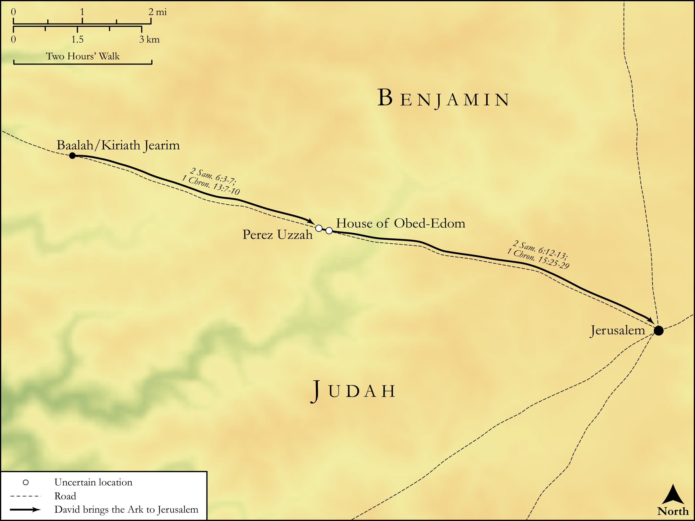

# Biblica Open Bible Maps

## License Information

Biblica Open Bible Maps, © 2023–2025 Biblica, Inc. This work is licensed under Creative Commons Attribution-ShareAlike 4.0 International (https://creativecommons.org/licenses/by-sa/4.0/). More Information: https://docs.google.com/document/d/1Pp44yZ0Zdnd59vJHTrt2rPYq0SppfX5rZbPBt6mz37U/edit?tab=t.0#heading=h.oev9aj1ksvk2

--------------------------------

## Historical: The Ark Recovered (id: OT099)

### Image Content

[link](images/OT099.png)

Original: [Historical: The Ark Recovered](https://drive.google.com/open?id=1nm4m1uzGcuPYWRqlRz4RwxKL0Pt_FH7r&usp=drive_copy)

* **Associated Passages:** 2 Samuel 6:1-7:29; 1 Chronicles 13:1-16:43

* **Associated ACAI Concepts:** LORD (ID: `deity:Lord`); David (ID: `person:David`); Covenant Box (ID: `keyterm:CovenantBox`); Israel (ID: `person:Israel`); Ark of the Covenant (ID: `realia:ArkOfTheCovenant`); Tribe of Levi (ID: `group:Levi`); Levi (ID: `person:Levi.3`); Obed-edom (ID: `person:Obed-edom`); Uzzah (ID: `person:Uzzah`); Bless (ID: `keyterm:Bless`); Covenant (ID: `keyterm:Covenant`); Jeduthun (ID: `person:Jeduthun`); Benaiah (ID: `person:Benaiah.4`); Offering (ID: `keyterm:Offering`); Philistines (ID: `group:Philistine`); Saul (ID: `person:Saul.2`); Philistia (ID: `place:Philistine`); Asaph (ID: `person:Asaph.2`); Michal (ID: `person:Michal`); House (ID: `realia:House`); Jeiel (ID: `person:Jeiel.4`); Zechariah (ID: `person:Zechariah.2`); Nathan (ID: `person:Nathan.2`); Heman (ID: `person:Heman.3`); Cymbals (ID: `realia:Cymbals`); Fear (ID: `keyterm:Fear`); Lyre (ID: `realia:Lyre`); Lute (ID: `realia:Lute`); Trumpet (ID: `realia:Trumpet`); Mattithiah (ID: `person:Mattithiah.2`)
