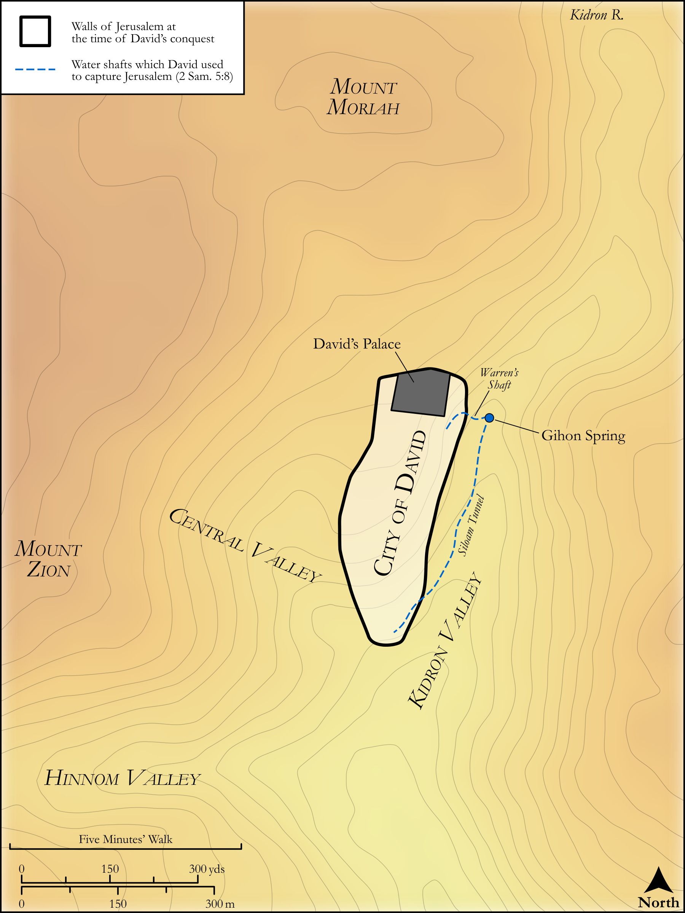

# Biblica Open Bible Maps

## License Information

Biblica Open Bible Maps, © 2023–2025 Biblica, Inc. This work is licensed under Creative Commons Attribution-ShareAlike 4.0 International (https://creativecommons.org/licenses/by-sa/4.0/). More Information: https://docs.google.com/document/d/1Pp44yZ0Zdnd59vJHTrt2rPYq0SppfX5rZbPBt6mz37U/edit?tab=t.0#heading=h.oev9aj1ksvk2

--------------------------------

## Historical: City Plan: Jerusalem in the Time of David (id: OT100)

### Image Content

[link](images/OT100.png)

Original: [Historical: City Plan: Jerusalem in the Time of David](https://drive.google.com/open?id=1PiBeIWIP5ZNMs3PUEXtnO2pWbEYrPQ7S&usp=drive_copy)

* **Associated Passages:** 2 Samuel 1:1-24:25

* **Associated ACAI Concepts:** David (ID: `person:David`); LORD (ID: `deity:Lord`); Israel (ID: `person:Israel`); Joab (ID: `person:Joab`); Absalom (ID: `person:Absalom`); Saul (ID: `person:Saul.2`); Abner (ID: `person:Abner`); Jerusalem (ID: `place:Jerusalem`); Tribe of Judah (ID: `group:Judah`); Judah (ID: `person:Judah.4`); Philistia (ID: `place:Philistine`); Philistines (ID: `group:Philistine`); Hebron (ID: `place:Hebron`); Amnon (ID: `person:Amnon`); Uriah (ID: `person:Uriah`); Covenant Box (ID: `keyterm:CovenantBox`); Ammon (ID: `place:Ammon`); Jonathan (ID: `person:Jonathan.3`); Ahithophel (ID: `person:Ahithophel`); Abishai (ID: `person:Abishai`); An Angel (ID: `deity:Angel`); Ammonites (ID: `group:Ammon`); Zeruiah (ID: `person:Zeruiah`); Ish-bosheth (ID: `person:Ish-bosheth`); Peace (ID: `keyterm:IntactState`); Syrians (ID: `group:Syria`); Ziba (ID: `person:Ziba`); Zadok (ID: `person:Zadok.2`); Mephibosheth (ID: `person:Mephibosheth`); Tamar (ID: `person:Tamar.2`)
