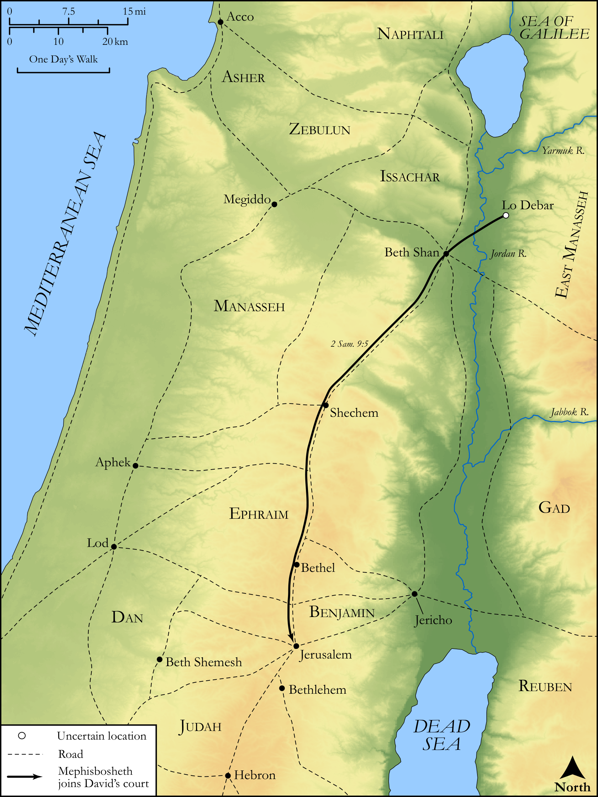

# Biblica Open Bible Maps

## License Information

Biblica Open Bible Maps, © 2023–2025 Biblica, Inc. This work is licensed under Creative Commons Attribution-ShareAlike 4.0 International (<a href="https://creativecommons.org/licenses/by-sa/4.0/">https://creativecommons.org/licenses/by-sa/4.0/</a>). More Information: <a href="https://docs.google.com/document/d/1Pp44yZ0Zdnd59vJHTrt2rPYq0SppfX5rZbPBt6mz37U/edit?tab=t.0#heading=h.oev9aj1ksvk2">https://docs.google.com/document/d/1Pp44yZ0Zdnd59vJHTrt2rPYq0SppfX5rZbPBt6mz37U/edit?tab=t.0#heading=h.oev9aj1ksvk2</a>

--------------------------------

## Historical: Mephibosheth Joins David’s Court (id: OT102)

### Image Content

[link](images/OT102.png)

Original: [Historical: Mephibosheth Joins David’s Court](https://drive.google.com/open?id=1zfqch3HN75v-WnNBUajs1g2OBcrdjfYZ&usp=drive_copy)

* **Associated Passages:** 2 Samuel 9:1-13

* **Associated ACAI Concepts:** Ziba (ID: `person:Ziba`); Saul (ID: `person:Saul.2`); Mephibosheth (ID: `person:Mephibosheth`); David (ID: `person:David`); Jonathan (ID: `person:Jonathan.3`); Kindness (ID: `keyterm:Kindness`); Machir (ID: `person:Machir.2`); Ammiel (ID: `person:Ammiel.2`); House (ID: `realia:House`); Lo-debar (ID: `place:Lo-debar`); Micah (ID: `person:Micah.2`); Jerusalem (ID: `place:Jerusalem`); LORD (ID: `deity:Lord`); Force to Serve (ID: `keyterm:EnticedToServe`); Fear (ID: `keyterm:Fear`); Dog (ID: `fauna:Dog`)
