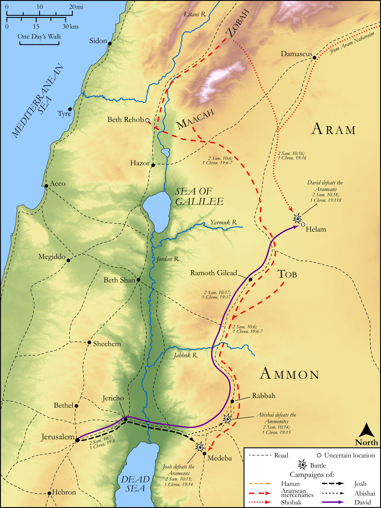

# Biblica Open Bible Maps

## License Information

Biblica Open Bible Maps, © 2023–2025 Biblica, Inc. This work is licensed under Creative Commons Attribution-ShareAlike 4.0 International (<a href="https://creativecommons.org/licenses/by-sa/4.0/">https://creativecommons.org/licenses/by-sa/4.0/</a>). More Information: <a href="https://docs.google.com/document/d/1Pp44yZ0Zdnd59vJHTrt2rPYq0SppfX5rZbPBt6mz37U/edit?tab=t.0#heading=h.oev9aj1ksvk2">https://docs.google.com/document/d/1Pp44yZ0Zdnd59vJHTrt2rPYq0SppfX5rZbPBt6mz37U/edit?tab=t.0#heading=h.oev9aj1ksvk2</a>

--------------------------------

## Historical: David Defeats the Ammonites and Arameans (id: OT103)

### Image Content

[link](images/OT103.png)

Original: [Historical: David Defeats the Ammonites and Arameans](https://drive.google.com/open?id=1S3eUrKHERBfTRf7s_3Zo1WXc6QKxyDIP&usp=drive_copy)

* **Associated Passages:** 2 Samuel 10:1-19; 1 Chronicles 19:1-19

* **Associated ACAI Concepts:** Ammon (ID: `place:Ammon`); Ammonites (ID: `group:Ammon`); Syrians (ID: `group:Syria`); David (ID: `person:David`); Hanun (ID: `person:Hanun`); Israel (ID: `person:Israel`); Joab (ID: `person:Joab`); Shobach (ID: `person:Shobach`); Hadadezer (ID: `person:Hadadezer`); Abishai (ID: `person:Abishai`); Nahash (ID: `person:Nahash.2`); Maacah (ID: `place:Maacah`); Chariot (ID: `realia:Chariot`); Zobah (ID: `place:Zobah`); Beth-rehob (ID: `place:Beth-rehob`); People of Tob (ID: `group:Tob`); Tob (ID: `place:Tob`); Helam (ID: `place:Helam`); Force to Serve (ID: `keyterm:EnticedToServe`); Kindness (ID: `keyterm:Kindness`); Bring Honor and Glory on Oneself (ID: `keyterm:BringHonorAndGloryOnOneself`); Jerusalem (ID: `place:Jerusalem`); Jordan River (ID: `place:Jordan`); An Angel (ID: `deity:Angel`); LORD (ID: `deity:Lord`); Jericho (ID: `place:Jericho`); Salvation (ID: `keyterm:Salvation`); Euphrates River (ID: `place:Euphrates`); Aram-maacah (ID: `place:Aram-maacah`); Mesopotamia (ID: `place:Mesopotamia`); Fear (ID: `keyterm:Fear`); Medeba (ID: `place:Medeba`); Talent (ID: `realia:Talent`); Money (ID: `realia:Money`)
