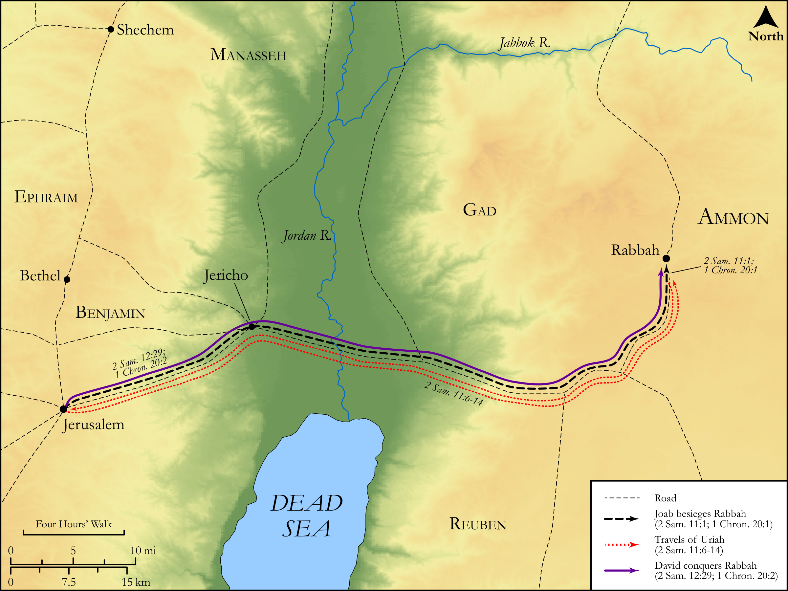

# Biblica Open Bible Maps

## License Information

Biblica Open Bible Maps, © 2023–2025 Biblica, Inc. This work is licensed under Creative Commons Attribution-ShareAlike 4.0 International (https://creativecommons.org/licenses/by-sa/4.0/). More Information: https://docs.google.com/document/d/1Pp44yZ0Zdnd59vJHTrt2rPYq0SppfX5rZbPBt6mz37U/edit?tab=t.0#heading=h.oev9aj1ksvk2

--------------------------------

## Historical: The Conquest of Rabbah (id: OT104)

### Image Content

[link](images/OT104.png)

Original: [Historical: The Conquest of Rabbah](https://drive.google.com/open?id=1SGq0w0-kITFSPQXNb82zsNWdi1fXhX58&usp=drive_copy)

* **Associated Passages:** 2 Samuel 11:1-12:31; 1 Chronicles 20:1-8

* **Associated ACAI Concepts:** David (ID: `person:David`); Uriah (ID: `person:Uriah`); LORD (ID: `deity:Lord`); Joab (ID: `person:Joab`); Ammon (ID: `place:Ammon`); Hittites (ID: `group:Hittite`); Heth (ID: `person:Heth`); Nathan (ID: `person:Nathan.2`); An Angel (ID: `deity:Angel`); Israel (ID: `person:Israel`); Ammonites (ID: `group:Ammon`); Jerusalem (ID: `place:Jerusalem`); House (ID: `realia:House`); Gath (ID: `place:Gath`); Bathsheba (ID: `person:Bathsheba`); Rapha (ID: `person:Rapha`); Philistines (ID: `group:Philistine`); Judah (ID: `person:Judah.4`); Solomon (ID: `person:Solomon`); Tribe of Judah (ID: `group:Judah`); Philistia (ID: `place:Philistine`); Sheep (ID: `fauna:Lamb`); Shimeah (ID: `person:Shimeah.2`); Saph (ID: `person:Saph`); Lahmi (ID: `person:Lahmi`); Jaare-oregim (ID: `person:Jaare-oregim`); An Informant (ID: `person:Informant`); Sibbecai (ID: `person:Sibbecai`); Hushathites (ID: `group:Hushathites`); Eliam (ID: `person:Eliam`)
