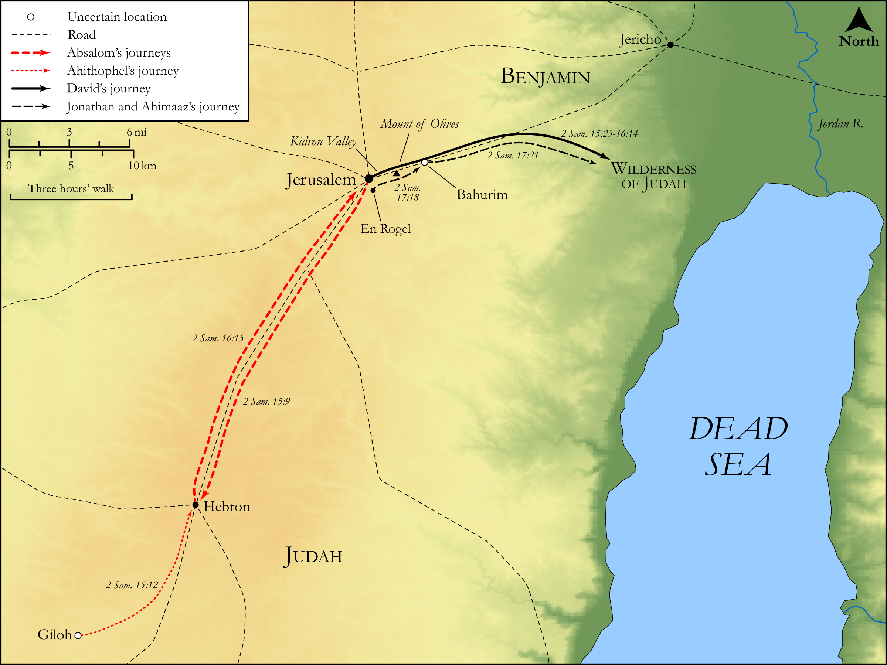

# Biblica Open Bible Maps

## License Information

Biblica Open Bible Maps, © 2023–2025 Biblica, Inc. This work is licensed under Creative Commons Attribution-ShareAlike 4.0 International (<a href="https://creativecommons.org/licenses/by-sa/4.0/">https://creativecommons.org/licenses/by-sa/4.0/</a>). More Information: <a href="https://docs.google.com/document/d/1Pp44yZ0Zdnd59vJHTrt2rPYq0SppfX5rZbPBt6mz37U/edit?tab=t.0#heading=h.oev9aj1ksvk2">https://docs.google.com/document/d/1Pp44yZ0Zdnd59vJHTrt2rPYq0SppfX5rZbPBt6mz37U/edit?tab=t.0#heading=h.oev9aj1ksvk2</a>

--------------------------------

## Historical: Absalom Seizes Jerusalem (id: OT106)

### Image Content

[link](images/OT106.png)

Original: [Historical: Absalom Seizes Jerusalem](https://drive.google.com/open?id=1N8fmu3mxtnCn8j3xA96CP7aPayqR0j82&usp=drive_copy)

* **Associated Passages:** 2 Samuel 15:1-17:29

* **Associated ACAI Concepts:** Absalom (ID: `person:Absalom`); David (ID: `person:David`); Israel (ID: `person:Israel`); Ahithophel (ID: `person:Ahithophel`); LORD (ID: `deity:Lord`); Hushai (ID: `person:Hushai`); Jerusalem (ID: `place:Jerusalem`); Zadok (ID: `person:Zadok.2`); Counsel (ID: `keyterm:Counsel`); Abiathar (ID: `person:Abiathar`); House (ID: `realia:House`); Jonathan (ID: `person:Jonathan.4`); Ahimaaz (ID: `person:Ahimaaz.2`); Archites (ID: `group:Archites`); Ziba (ID: `person:Ziba`); Ittai (ID: `person:Ittai`); Shimei (ID: `person:Shimei.5`); Zeruiah (ID: `person:Zeruiah`); Covenant Box (ID: `keyterm:CovenantBox`); Peace (ID: `keyterm:IntactState`); Hebron (ID: `place:Hebron`); Gath (ID: `place:Gath`); Bahurim (ID: `place:Bahurim`); Favor (ID: `keyterm:Favor`); Saul (ID: `person:Saul.2`); Force to Serve (ID: `keyterm:EnticedToServe`); Jordan River (ID: `place:Jordan`); Mahanaim (ID: `place:Mahanaim`); Gilead (ID: `place:Gilead`); Mephibosheth (ID: `person:Mephibosheth`)
