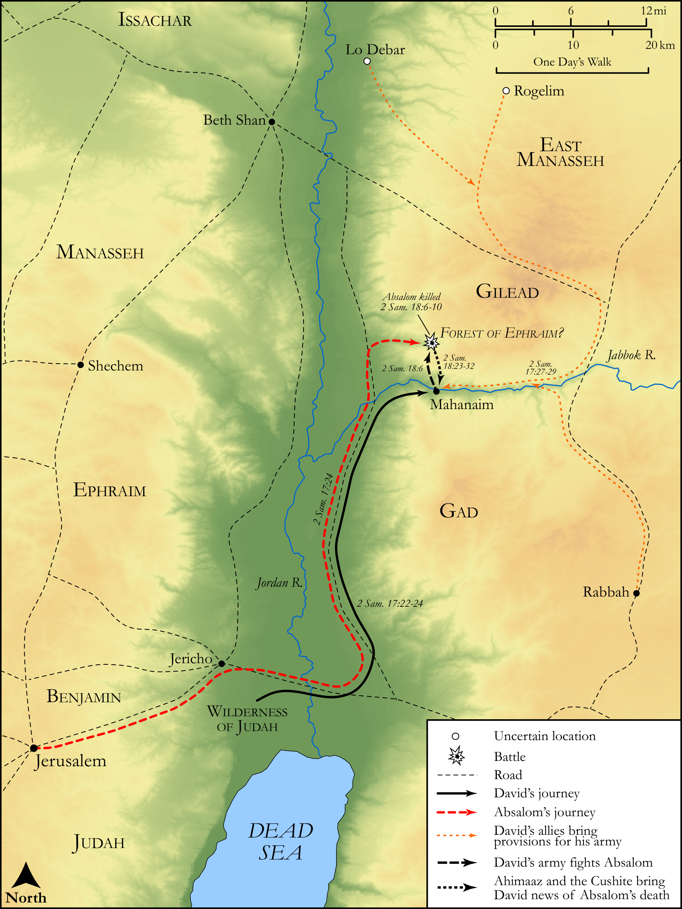

# Biblica Open Bible Maps

## License Information

Biblica Open Bible Maps, © 2023–2025 Biblica, Inc. This work is licensed under Creative Commons Attribution-ShareAlike 4.0 International (https://creativecommons.org/licenses/by-sa/4.0/). More Information: https://docs.google.com/document/d/1Pp44yZ0Zdnd59vJHTrt2rPYq0SppfX5rZbPBt6mz37U/edit?tab=t.0#heading=h.oev9aj1ksvk2

--------------------------------

## Historical: The Defeat of Absalom (id: OT107)

### Image Content

[link](images/OT107.png)

Original: [Historical: The Defeat of Absalom](https://drive.google.com/open?id=1QDshCluiGnJfGep4hvq9Nw0Cq6pFaUoZ&usp=drive_copy)

* **Associated Passages:** 2 Samuel 17:1-29

* **Associated ACAI Concepts:** Absalom (ID: `person:Absalom`); Israel (ID: `person:Israel`); David (ID: `person:David`); Ahithophel (ID: `person:Ahithophel`); Hushai (ID: `person:Hushai`); Counsel (ID: `keyterm:Counsel`); Ahimaaz (ID: `person:Ahimaaz.2`); House (ID: `realia:House`); Mahanaim (ID: `place:Mahanaim`); Archites (ID: `group:Archites`); Jonathan (ID: `person:Jonathan.4`); Gilead (ID: `place:Gilead`); Jordan River (ID: `place:Jordan`); Machir (ID: `person:Machir.2`); En-rogel (ID: `place:En-rogel`); Lo-debar (ID: `place:Lo-debar`); Nahash (ID: `person:Nahash.3`); Amasa (ID: `person:Amasa`); Rogelim (ID: `place:Rogelim`); Ammiel (ID: `person:Ammiel.2`); Barzillai (ID: `person:Barzillai`); Jether (ID: `person:Jether.3`); Nahash (ID: `person:Nahash.4`); Abigail (ID: `person:Abigail.2`); Shobi (ID: `person:Shobi`); Plague (ID: `keyterm:Blow`); Dan (ID: `place:Dan`); Peace (ID: `keyterm:IntactState`); LORD (ID: `deity:Lord`); Ishmaelites (ID: `group:Ishmael`); Joab (ID: `person:Joab`); Abiathar (ID: `person:Abiathar`); Ishmael (ID: `person:Ishmael`); Bahurim (ID: `place:Bahurim`); Beersheba (ID: `place:Beersheba`); Ammonites (ID: `group:Ammon`); Tribe of Dan (ID: `group:Dan`); Gileadites (ID: `group:Gilead`); A Woman (ID: `person:GenericFemale`); Ammon (ID: `place:Ammon`); Zadok (ID: `person:Zadok.2`); Jerusalem (ID: `place:Jerusalem`); Zeruiah (ID: `person:Zeruiah`); Bean (ID: `flora:Bean`); Lentil (ID: `flora:Lentil`); Rope (ID: `realia:Rope`); Flock (ID: `fauna:Flock`); Barley (ID: `flora:Barley`); Donkey (ID: `fauna:Donkey`); Bowl (ID: `realia:Bowl`); Lion (ID: `fauna:Lion`); To Saddle (ID: `realia:ToSaddle`); Goat (ID: `fauna:Goat`); Bear (ID: `fauna:Bear`); Cattle (ID: `fauna:Bull`); Screen (ID: `realia:Screen`); Wheat (ID: `flora:Wheat`); Bed (ID: `realia:Bed`)
