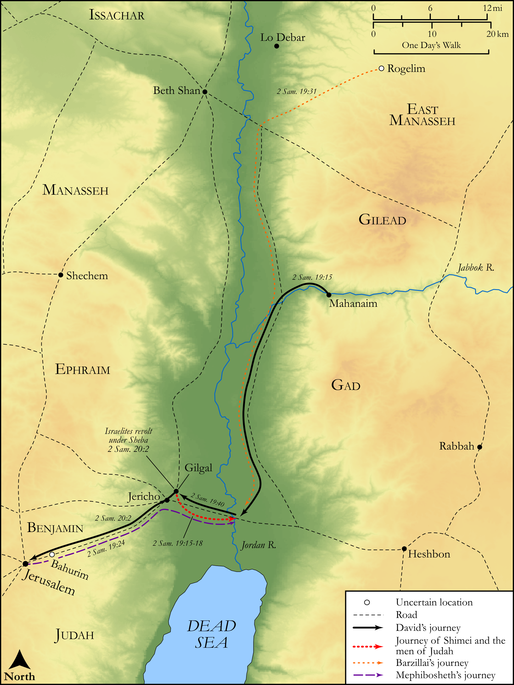

# Biblica Open Bible Maps

## License Information

Biblica Open Bible Maps, © 2023–2025 Biblica, Inc. This work is licensed under Creative Commons Attribution-ShareAlike 4.0 International (https://creativecommons.org/licenses/by-sa/4.0/). More Information: https://docs.google.com/document/d/1Pp44yZ0Zdnd59vJHTrt2rPYq0SppfX5rZbPBt6mz37U/edit?tab=t.0#heading=h.oev9aj1ksvk2

--------------------------------

## Historical: David Returns to Jerusalem (id: OT108)

### Image Content

[link](images/OT108.png)

Original: [Historical: David Returns to Jerusalem](https://drive.google.com/open?id=19C6LCRe75tHbIkOqn417148P5OZ3OXtI&usp=drive_copy)

* **Associated Passages:** 2 Samuel 19:1-20:26

* **Associated ACAI Concepts:** Joab (ID: `person:Joab`); Israel (ID: `person:Israel`); David (ID: `person:David`); Judah (ID: `person:Judah.4`); Tribe of Judah (ID: `group:Judah`); Bichri (ID: `person:Bichri`); Sheba (ID: `person:Sheba.4`); Jerusalem (ID: `place:Jerusalem`); Jordan River (ID: `place:Jordan`); Amasa (ID: `person:Amasa`); Absalom (ID: `person:Absalom`); Barzillai (ID: `person:Barzillai`); LORD (ID: `deity:Lord`); Shimei (ID: `person:Shimei.5`); Chimham (ID: `person:Chimham`); Abel-beth-maacah (ID: `place:Abel-beth-maacah`); Peace (ID: `keyterm:IntactState`); Abishai (ID: `person:Abishai`); Benjamin (ID: `person:Benjamin`); Tribe of Benjamin (ID: `group:Benjamin`); Mephibosheth (ID: `person:Mephibosheth`); Gera (ID: `person:Gera.2`); Cherethites (ID: `group:Cherethite`); Pelethites (ID: `group:Pelethites`); Swear (ID: `keyterm:Swear`); Zadok (ID: `person:Zadok.2`); Ziba (ID: `person:Ziba`); Saul (ID: `person:Saul.2`); Zeruiah (ID: `person:Zeruiah`); Gilgal (ID: `place:Gilgal.2`)
