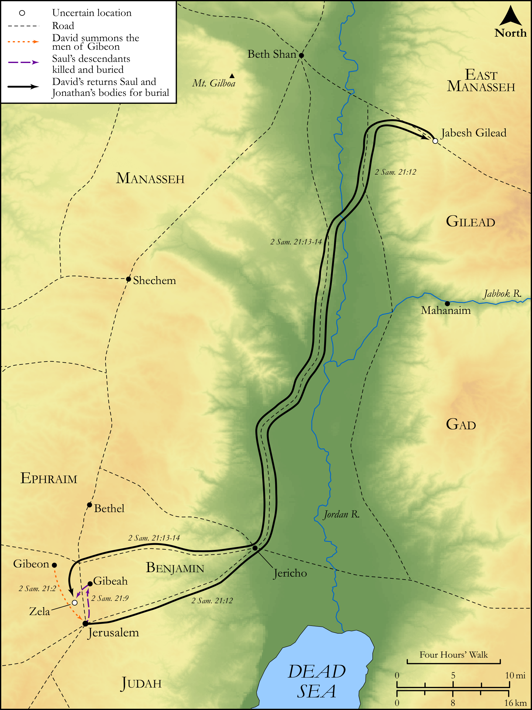

# Biblica Open Bible Maps

## License Information

Biblica Open Bible Maps, © 2023–2025 Biblica, Inc. This work is licensed under Creative Commons Attribution-ShareAlike 4.0 International (<a href="https://creativecommons.org/licenses/by-sa/4.0/">https://creativecommons.org/licenses/by-sa/4.0/</a>). More Information: <a href="https://docs.google.com/document/d/1Pp44yZ0Zdnd59vJHTrt2rPYq0SppfX5rZbPBt6mz37U/edit?tab=t.0#heading=h.oev9aj1ksvk2">https://docs.google.com/document/d/1Pp44yZ0Zdnd59vJHTrt2rPYq0SppfX5rZbPBt6mz37U/edit?tab=t.0#heading=h.oev9aj1ksvk2</a>

--------------------------------

## Historical: The Three-Year Famine (id: OT110)

### Image Content

[link](images/OT110.png)

Original: [Historical: The Three\-Year Famine](https://drive.google.com/open?id=1bUlPUt2nTZUmYMmak3SzHeEKYA3u5Kmi&usp=drive_copy)

* **Associated Passages:** 2 Samuel 21:1-22

* **Associated ACAI Concepts:** David (ID: `person:David`); Saul (ID: `person:Saul.2`); LORD (ID: `deity:Lord`); Israel (ID: `person:Israel`); Gibeonites (ID: `group:Gibeon`); Philistia (ID: `place:Philistine`); Philistines (ID: `group:Philistine`); Gibeon (ID: `place:Gibeon`); Rapha (ID: `person:Rapha`); Jonathan (ID: `person:Jonathan.3`); Aiah (ID: `person:Aiah.2`); Rizpah (ID: `person:Rizpah`); Gath (ID: `place:Gath`); Gezer (ID: `place:Gezer`); Swear (ID: `keyterm:Swear`); Sibbecai (ID: `person:Sibbecai`); Adriel (ID: `person:Adriel`); Armoni (ID: `person:Armoni`); Zela (ID: `place:Zela`); Meholathites (ID: `group:Meholathites`); Hushathites (ID: `group:Hushathites`); Saph (ID: `person:Saph`); Jaare-oregim (ID: `person:Jaare-oregim`); Ishbi-benob (ID: `person:Ishbi-benob`); Elhanan (ID: `person:Elhanan`); Barzillai (ID: `person:Barzillai.2`); Huge Man (ID: `person:HugeMan`); Mephibosheth (ID: `person:Mephibosheth`); Mephibosheth (ID: `person:Mephibosheth.2`); Jonadab (ID: `person:Jonadab.2`); Amorites (ID: `group:Amorites`); Tribe of Judah (ID: `group:Judah`); Be Zealous (ID: `keyterm:Zealous`); Bethlehem (ID: `place:Bethlehem`); Beth-shan (ID: `place:Beth-shan`); Goliath (ID: `person:Goliath`); Bless (ID: `keyterm:Bless`); Bethlehemites (ID: `group:Bethlehem`); Jabesh-gilead (ID: `place:Jabesh-gilead`); Tribe of Benjamin (ID: `group:Benjamin`); Mount Gilboa (ID: `place:GilboaMount`); Merab (ID: `person:Merab`); Gibeah (ID: `place:Gibeah.2`); Kish (ID: `person:Kish`); Appease (ID: `keyterm:Appease`); Judah (ID: `person:Judah.4`); Shimeah (ID: `person:Shimeah.2`); Abishai (ID: `person:Abishai`); To Cause to Possess (ID: `keyterm:Possess`); Zeruiah (ID: `person:Zeruiah`); Benjamin (ID: `person:Benjamin`); Oath (ID: `keyterm:Oath`); Point of Spear (ID: `realia:PointOfSpear`); Weavers Beam (ID: `realia:WeaversBeam`); Barley (ID: `flora:Barley`); Money (ID: `realia:Money`); Sackcloth (ID: `realia:Sackcloth`); Spear (ID: `realia:Spear`); Lamp (ID: `realia:Lamp`)
