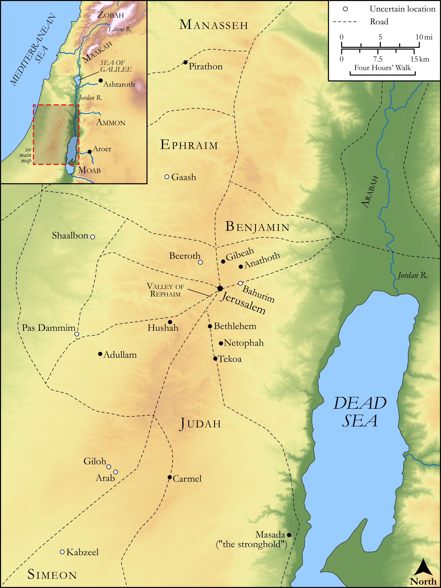

# Biblica Open Bible Maps

## License Information

Biblica Open Bible Maps, © 2023–2025 Biblica, Inc. This work is licensed under Creative Commons Attribution-ShareAlike 4.0 International (https://creativecommons.org/licenses/by-sa/4.0/). More Information: https://docs.google.com/document/d/1Pp44yZ0Zdnd59vJHTrt2rPYq0SppfX5rZbPBt6mz37U/edit?tab=t.0#heading=h.oev9aj1ksvk2

--------------------------------

## Historical: David’s Mighty Warriors (id: OT112)

### Image Content

[link](images/OT112.png)

Original: [Historical: David’s Mighty Warriors](https://drive.google.com/open?id=1Q_KfflO_eIOCIvGiW3Fmz2z7LG4W8nHE&usp=drive_copy)

* **Associated Passages:** 2 Samuel 23:1-39; 1 Chronicles 11:1-12:41

* **Associated ACAI Concepts:** David (ID: `person:David`); LORD (ID: `deity:Lord`); Philistines (ID: `group:Philistine`); Philistia (ID: `place:Philistine`); Israel (ID: `person:Israel`); Joab (ID: `person:Joab`); Bethlehem (ID: `place:Bethlehem`); Saul (ID: `person:Saul.2`); Jehoiada (ID: `person:Jehoiada`); Tribe of Benjamin (ID: `group:Benjamin`); Benjamin (ID: `person:Benjamin`); Spear (ID: `realia:Spear`); Hararites (ID: `group:Hararites`); Ahohites (ID: `group:Ahoah`); Ahoah (ID: `person:Ahoah`); Benaiah (ID: `person:Benaiah`); Salvation (ID: `keyterm:Salvation`); Zeruiah (ID: `person:Zeruiah`); Hebron (ID: `place:Hebron`); Manasseh (ID: `person:Manasseh`); Bring Honor and Glory on Oneself (ID: `keyterm:BringHonorAndGloryOnOneself`); Tribe of Manasseh (ID: `group:Manasseh`); Gad (ID: `person:Gad`); Pit (ID: `realia:Pit`); Fortress (ID: `realia:Fortress`); Pelonites (ID: `group:Pelonites`); Netophathites (ID: `group:Netophah`); Gibeah (ID: `place:Gibeah.2`); Netophah (ID: `place:Netophah`); Anathoth (ID: `place:Anathoth`)
