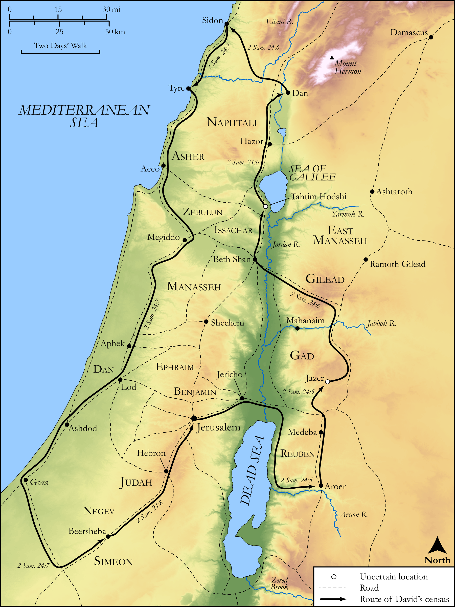

# Biblica Open Bible Maps

## License Information

Biblica Open Bible Maps, © 2023–2025 Biblica, Inc. This work is licensed under Creative Commons Attribution-ShareAlike 4.0 International (https://creativecommons.org/licenses/by-sa/4.0/). More Information: https://docs.google.com/document/d/1Pp44yZ0Zdnd59vJHTrt2rPYq0SppfX5rZbPBt6mz37U/edit?tab=t.0#heading=h.oev9aj1ksvk2

--------------------------------

## Historical: David’s Census and God’s Punishment (id: OT113)

### Image Content

[link](images/OT113.png)

Original: [Historical: David’s Census and God’s Punishment](https://drive.google.com/open?id=14aotOoARZsEc0cZo8LKaS6mZTcKTjydW&usp=drive_copy)

* **Associated Passages:** 2 Samuel 24:1-25; 1 Chronicles 21:1-30

* **Associated ACAI Concepts:** LORD (ID: `deity:Lord`); David (ID: `person:David`); Ornan (ID: `person:Ornan`); Israel (ID: `person:Israel`); Gad (ID: `person:Gad.2`); An Angel (ID: `deity:Angel`); Joab (ID: `person:Joab`); Offering (ID: `keyterm:Offering`); Jebusites (ID: `group:Jebusites`); Jerusalem (ID: `place:Jerusalem`); Threshing Floor (ID: `realia:ThreshingFloor`); Stone Altar (ID: `realia:StoneAltar`); Temple Altar (ID: `realia:TempleAltar`); Tabernacle Altar (ID: `realia:TabernacleAltar`); Altar (ID: `realia:Altar`); Plague (ID: `keyterm:Blow`); Dan (ID: `place:Dan`); Tribe of Judah (ID: `group:Judah`); Judah (ID: `person:Judah.4`); Beersheba (ID: `place:Beersheba`); Tribe of Dan (ID: `group:Dan`); To Sin (ID: `keyterm:Sin`); Sword (ID: `realia:Sword`); Passion (ID: `keyterm:Ardour`); Money (ID: `realia:Money`); Cattle (ID: `fauna:Bull`); Tyre (ID: `place:Tyre`); Tahtim-hodshi (ID: `place:Kadesh`); Canaan (ID: `place:Canaan`); Word of the Lord (ID: `keyterm:WordOfTheLord`)
