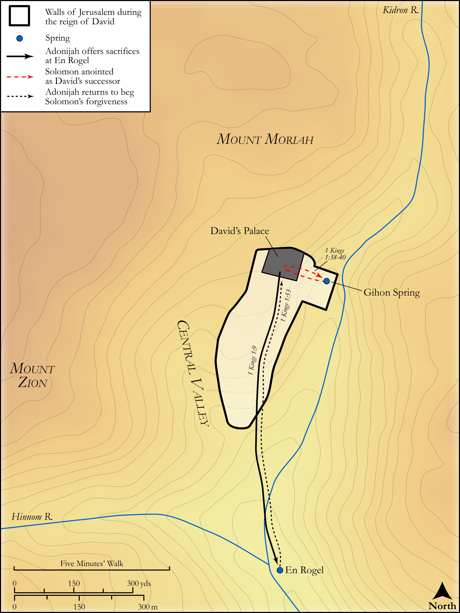

# Biblica Open Bible Maps

## License Information

Biblica Open Bible Maps, © 2023–2025 Biblica, Inc. This work is licensed under Creative Commons Attribution-ShareAlike 4.0 International (https://creativecommons.org/licenses/by-sa/4.0/). More Information: https://docs.google.com/document/d/1Pp44yZ0Zdnd59vJHTrt2rPYq0SppfX5rZbPBt6mz37U/edit?tab=t.0#heading=h.oev9aj1ksvk2

--------------------------------

## Historical: Solomon and Adonijah (id: OT115)

### Image Content

[link](images/OT115.png)

Original: [Historical: Solomon and Adonijah](https://drive.google.com/open?id=1WG1XK0ShrhYPzThm4B2EzMy-hC7GP77p&usp=drive_copy)

* **Associated Passages:** 1 Kings 1:1-53

* **Associated ACAI Concepts:** Solomon (ID: `person:Solomon`); Adonijah (ID: `person:Adonijah`); Nathan (ID: `person:Nathan.2`); David (ID: `person:David`); Zadok (ID: `person:Zadok.2`); Benaiah (ID: `person:Benaiah`); LORD (ID: `deity:Lord`); Jehoiada (ID: `person:Jehoiada`); Israel (ID: `person:Israel`); Bathsheba (ID: `person:Bathsheba`); Swear (ID: `keyterm:Swear`); Abiathar (ID: `person:Abiathar`); Joab (ID: `person:Joab`); Smear (ID: `keyterm:Smear`); Gihon (ID: `place:Gihon`); Abishag (ID: `person:Abishag`); Shunammites (ID: `group:Shunammites`); Haggith (ID: `person:Haggith`); Jonathan (ID: `person:Jonathan.4`); Rams Horn (ID: `realia:RamsHorn`); Pelethites (ID: `group:Pelethites`); Tribe of Judah (ID: `group:Judah`); Judah (ID: `person:Judah.4`); Cherethites (ID: `group:Cherethite`); Bless (ID: `keyterm:Bless`); Fear (ID: `keyterm:Fear`); Flock (ID: `fauna:Flock`); Stone Altar (ID: `realia:StoneAltar`); Temple Altar (ID: `realia:TempleAltar`); Goat (ID: `fauna:Goat`)
