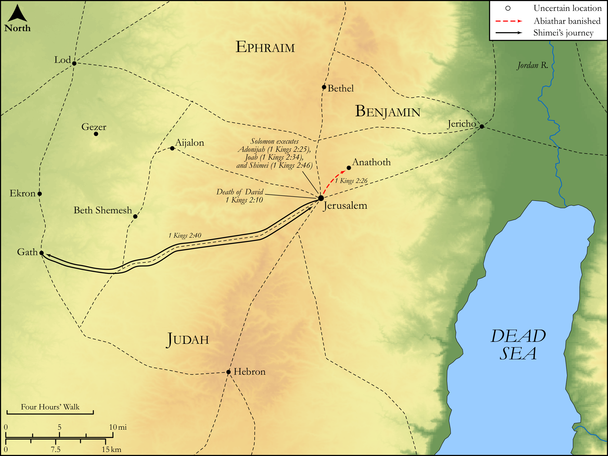

# Biblica Open Bible Maps

## License Information

Biblica Open Bible Maps, © 2023–2025 Biblica, Inc. This work is licensed under Creative Commons Attribution-ShareAlike 4.0 International (https://creativecommons.org/licenses/by-sa/4.0/). More Information: https://docs.google.com/document/d/1Pp44yZ0Zdnd59vJHTrt2rPYq0SppfX5rZbPBt6mz37U/edit?tab=t.0#heading=h.oev9aj1ksvk2

--------------------------------

## Historical: Solomon Consolidates Power (id: OT116)

### Image Content

[link](images/OT116.png)

Original: [Historical: Solomon Consolidates Power](https://drive.google.com/open?id=1QalHGWUhTWCzNQedH5z6pAvC--7euodP&usp=drive_copy)

* **Associated Passages:** 1 Kings 2:1-46

* **Associated ACAI Concepts:** LORD (ID: `deity:Lord`); Solomon (ID: `person:Solomon`); David (ID: `person:David`); Shimei (ID: `person:Shimei.5`); Joab (ID: `person:Joab`); Adonijah (ID: `person:Adonijah`); Benaiah (ID: `person:Benaiah`); Jehoiada (ID: `person:Jehoiada`); Israel (ID: `person:Israel`); Abiathar (ID: `person:Abiathar`); Jerusalem (ID: `place:Jerusalem`); Peace (ID: `keyterm:IntactState`); Abishag (ID: `person:Abishag`); Swear (ID: `keyterm:Swear`); Shunammites (ID: `group:Shunammites`); Gath (ID: `place:Gath`); Bathsheba (ID: `person:Bathsheba`); Jether (ID: `person:Jether.3`); Amasa (ID: `person:Amasa`); Achish (ID: `person:Achish`); Abner (ID: `person:Abner`); Absalom (ID: `person:Absalom`); Zeruiah (ID: `person:Zeruiah`); Ner (ID: `person:Ner.2`); Hell (ID: `place:Hell`); Tent (ID: `realia:Tent`); Gera (ID: `person:Gera.2`); Bahurim (ID: `place:Bahurim`); Barzillai (ID: `person:Barzillai`); Anathoth (ID: `place:Anathoth`); Maoch (ID: `person:Maoch`); Word of the Lord (ID: `keyterm:WordOfTheLord`); Bless (ID: `keyterm:Bless`); Moses (ID: `person:Moses`); Gileadites (ID: `group:Gilead`); Jordan River (ID: `place:Jordan`); Truth (ID: `keyterm:Truth`); Zadok (ID: `person:Zadok.2`); The Way (ID: `keyterm:TheWay`); Eli (ID: `person:Eli`); Shiloh (ID: `place:Shiloh`); Judah (ID: `person:Judah.4`); Hebron (ID: `place:Hebron`); Testimony (ID: `keyterm:Witness.2`); Benjamin (ID: `person:Benjamin`); Tribe of Benjamin (ID: `group:Benjamin`); Tribe of Judah (ID: `group:Judah`); Mahanaim (ID: `place:Mahanaim`); Haggith (ID: `person:Haggith`); Oath (ID: `keyterm:Oath`); Instruction (ID: `keyterm:Instruction`); Kidron (ID: `place:Kidron`); Ability (ID: `keyterm:Ability`); Gilead (ID: `place:Gilead`); Pronounce Innocent (ID: `keyterm:PronounceInnocent`); Kindness (ID: `keyterm:Kindness`); Have Insight (ID: `keyterm:HaveInsight`); Covenant Box (ID: `keyterm:CovenantBox`); Temple Altar (ID: `realia:TempleAltar`); Tabernacle Altar (ID: `realia:TabernacleAltar`); Altar (ID: `realia:Altar`); House (ID: `realia:House`); Stone Altar (ID: `realia:StoneAltar`); Sword (ID: `realia:Sword`); Donkey (ID: `fauna:Donkey`); To Saddle (ID: `realia:ToSaddle`); Horns of Altar (ID: `realia:HornsOfAltar`); Throne (ID: `realia:Throne`); Ark of the Covenant (ID: `realia:ArkOfTheCovenant`)
