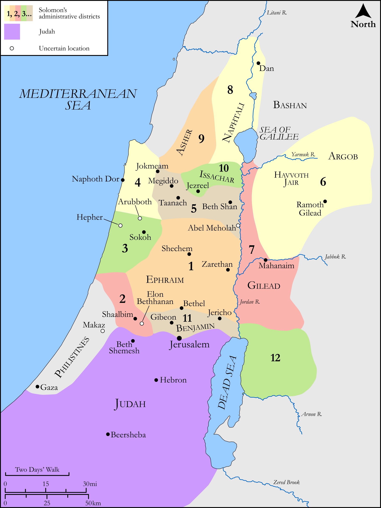

# Biblica Open Bible Maps

## License Information

Biblica Open Bible Maps, © 2023–2025 Biblica, Inc. This work is licensed under Creative Commons Attribution-ShareAlike 4.0 International (https://creativecommons.org/licenses/by-sa/4.0/). More Information: https://docs.google.com/document/d/1Pp44yZ0Zdnd59vJHTrt2rPYq0SppfX5rZbPBt6mz37U/edit?tab=t.0#heading=h.oev9aj1ksvk2

--------------------------------

## Historical: The Districts of Israel (id: OT117)

### Image Content

[link](images/OT117.png)

Original: [Historical: The Districts of Israel](https://drive.google.com/open?id=1pB4Y_TXI1ytDsyBwMYjFjzwf7smOB4b6&usp=drive_copy)

* **Associated Passages:** 1 Kings 4:1-20

* **Associated ACAI Concepts:** Solomon (ID: `person:Solomon`); Israel (ID: `person:Israel`); Ahilud (ID: `person:Ahilud`); Zadok (ID: `person:Zadok.2`); Gilead (ID: `place:Gilead`); Bashan (ID: `place:Bashan`); House (ID: `realia:House`); Jehoshaphat (ID: `person:Jehoshaphat`); Hur (ID: `person:Hur`); Ben-deker (ID: `person:Ben-deker`); Deker (ID: `person:Deker`); Jehoshaphat (ID: `person:Jehoshaphat.2`); Makaz (ID: `place:Makaz`); Ela (ID: `person:Ela`); Basemath (ID: `person:Basemath.2`); Ben-geber (ID: `person:Ben-geber`); Paruah (ID: `person:Paruah`); Iddo (ID: `person:Iddo.3`); Zarethan (ID: `place:Zarethan`); Elihoreph (ID: `person:Elihoreph`); Taphath (ID: `person:Taphath`); Adoram (ID: `person:Adoram`); Ben-hesed (ID: `person:Ben-hesed`); Geber (ID: `person:Geber`); Ahijah (ID: `person:Ahijah`); Ahimaaz (ID: `person:Ahimaaz.3`); Socoh (ID: `place:Socoh.3`); Abel-meholah (ID: `place:Abel-meholah`); Argob (ID: `place:Argob`); Ben-hur (ID: `person:Ben-hur`); Elon-beth-hanan (ID: `place:Elonbeth-hanan`); Baana (ID: `person:Baana.2`); Hesed (ID: `person:Hesed`); Zabud (ID: `person:Zabud`); Shaalbim (ID: `place:Shaalbim`); Baana (ID: `person:Baana`); Abinadab (ID: `person:Abinadab.4`); Seraiah (ID: `person:Seraiah`); Shimei (ID: `person:Shimei.6`); Ahinadab (ID: `person:Ahinadab`); Ben-abinadab (ID: `person:Ben-abinadab`); Dor (ID: `place:Dor`); Abda (ID: `person:Abda`); Azariah (ID: `person:Azariah.2`); Azariah (ID: `person:Azariah.3`); Hepher (ID: `place:Hepher`); Uri (ID: `person:Uri.2`); Ahishar (ID: `person:Ahishar`); Arubboth (ID: `place:Arubboth`); Issachar (ID: `person:Issachar`); Tribe of Benjamin (ID: `group:Benjamin`); Mahanaim (ID: `place:Mahanaim`); Taanach (ID: `place:Taanach`); Jair (ID: `person:Jair.2`); Sihon (ID: `person:Sihon`); Abiathar (ID: `person:Abiathar`); Tribe of Naphtali (ID: `group:Naphtali`); Benaiah (ID: `person:Benaiah`); Tribe of Manasseh (ID: `group:Manasseh`); Judah (ID: `person:Judah.4`); Beth-shemesh (ID: `place:Beth-shemesh`); Tribe of Judah (ID: `group:Judah`); Tribe of Ephraim (ID: `group:Ephraim`); Asher (ID: `person:Asher`); Naphtali (ID: `person:Naphtali`); Ramoth-gilead (ID: `place:Ramoth-gilead`); Megiddo (ID: `place:Megiddo`); Tribe of Asher (ID: `group:Asher`); Benjamin (ID: `person:Benjamin`); Jokneam (ID: `place:Jokneam`); Havvoth-jair (ID: `place:Havvoth-jair`); Tribe of Issachar (ID: `group:Issachar`); Kindness (ID: `keyterm:Kindness`); Nathan (ID: `person:Nathan.2`); Jezreel (ID: `place:Jezreel.2`); Ephraim (ID: `person:Ephraim`); Manasseh (ID: `person:Manasseh`); Hushai (ID: `person:Hushai`); Jehoiada (ID: `person:Jehoiada`); Beth-shan (ID: `place:Beth-shan`); Amorites (ID: `group:Amorites`); Og (ID: `person:Og`); Baalath-beer (ID: `place:Baalath-beer`)
