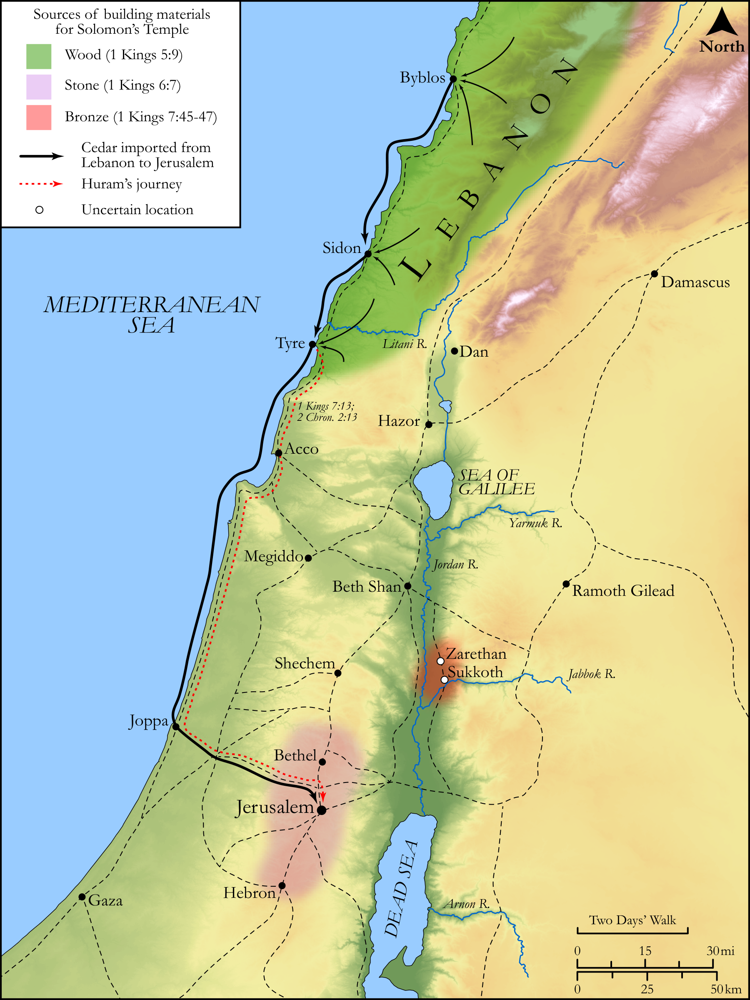

# Biblica Open Bible Maps

## License Information

Biblica Open Bible Maps, © 2023–2025 Biblica, Inc. This work is licensed under Creative Commons Attribution-ShareAlike 4.0 International (https://creativecommons.org/licenses/by-sa/4.0/). More Information: https://docs.google.com/document/d/1Pp44yZ0Zdnd59vJHTrt2rPYq0SppfX5rZbPBt6mz37U/edit?tab=t.0#heading=h.oev9aj1ksvk2

--------------------------------

## Historical: The Construction of Solomon’s Temple (id: OT118)

### Image Content

[link](images/OT118.png)

Original: [Historical: The Construction of Solomon’s Temple](https://drive.google.com/open?id=1f1pUUzQ2mnY1vS2gBWdkoPlxbWgdVtnL&usp=drive_copy)

* **Associated Passages:** 1 Kings 5:1-9:28; 2 Chronicles 2:1-4:22

* **Associated ACAI Concepts:** LORD (ID: `deity:Lord`); Solomon (ID: `person:Solomon`); House (ID: `realia:House`); Israel (ID: `person:Israel`); David (ID: `person:David`); Hiram (ID: `person:Hiram`); Covenant Box (ID: `keyterm:CovenantBox`); To Sin (ID: `keyterm:Sin`); Egypt (ID: `place:Egypt`); Tyre (ID: `place:Tyre`); Plea for Mercy (ID: `keyterm:Supplication`); Hiram (ID: `person:Hiram.2`); Bless (ID: `keyterm:Bless`); Most Holy Place (ID: `place:MostHolyPlace`); Jerusalem (ID: `place:Jerusalem`); Lebanon (ID: `place:Lebanon`); Covenant (ID: `keyterm:Covenant`); Forgive (ID: `keyterm:Forgive`); Offering (ID: `keyterm:Offering`); Cubit (ID: `realia:Cubit`); Winged Creature (ID: `realia:WingedCreature`); Cedar (ID: `flora:Cedar`); Temple Altar (ID: `realia:TempleAltar`); To Beg for Mercy (ID: `keyterm:BegForMercy`); Tabernacle Altar (ID: `realia:TabernacleAltar`); Altar (ID: `realia:Altar`); Stone Altar (ID: `realia:StoneAltar`); Force to Serve (ID: `keyterm:EnticedToServe`); Holy (ID: `keyterm:Holy`); Ark of the Covenant (ID: `realia:ArkOfTheCovenant`)
