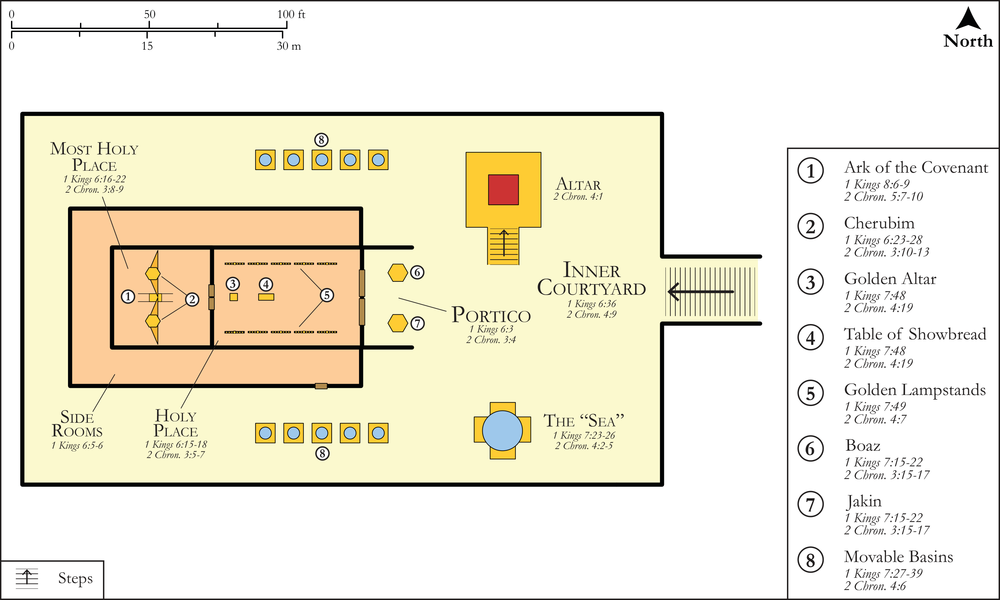

# Biblica Open Bible Maps

## License Information

Biblica Open Bible Maps, © 2023–2025 Biblica, Inc. This work is licensed under Creative Commons Attribution-ShareAlike 4.0 International (https://creativecommons.org/licenses/by-sa/4.0/). More Information: https://docs.google.com/document/d/1Pp44yZ0Zdnd59vJHTrt2rPYq0SppfX5rZbPBt6mz37U/edit?tab=t.0#heading=h.oev9aj1ksvk2

--------------------------------

## Historical: Building Plan: Solomon's Temple (id: OT119)

### Image Content

[link](images/OT119.png)

Original: [Historical: Building Plan: Solomon's Temple](https://drive.google.com/open?id=1x_5EbO4L2ClLcQ18yo-b8vDaLMACLOYX&usp=drive_copy)

* **Associated Passages:** 1 Kings 6:1-7:51; 2 Chronicles 3:1-5:14

* **Associated ACAI Concepts:** House (ID: `realia:House`); Solomon (ID: `person:Solomon`); LORD (ID: `deity:Lord`); Cubit (ID: `realia:Cubit`); Covenant Box (ID: `keyterm:CovenantBox`); Israel (ID: `person:Israel`); Most Holy Place (ID: `place:MostHolyPlace`); Hiram (ID: `person:Hiram.2`); David (ID: `person:David`); Winged Creature (ID: `realia:WingedCreature`); Cedar (ID: `flora:Cedar`); Ark of the Covenant (ID: `realia:ArkOfTheCovenant`); Cattle (ID: `fauna:Bull`); Craftsman (ID: `realia:Craftsman`); Temple Altar (ID: `realia:TempleAltar`); Tabernacle Altar (ID: `realia:TabernacleAltar`); Altar (ID: `realia:Altar`); Stone Altar (ID: `realia:StoneAltar`); Shovel (ID: `realia:Shovel`); Date Palm (ID: `flora:DatePalm`); Pomegranate (ID: `flora:Pomegranate`); Tribe of Levi (ID: `group:Levi`); Levi (ID: `person:Levi.3`); Covenant (ID: `keyterm:Covenant`); Floor (ID: `realia:Floor`); Lily (ID: `flora:Lily`); Aleppo Pine (ID: `flora:PineTree`); Hewn Stone (ID: `realia:HewnStone`); Olive Tree (ID: `flora:OliveTree`); Zarethan (ID: `place:Zarethan`)
