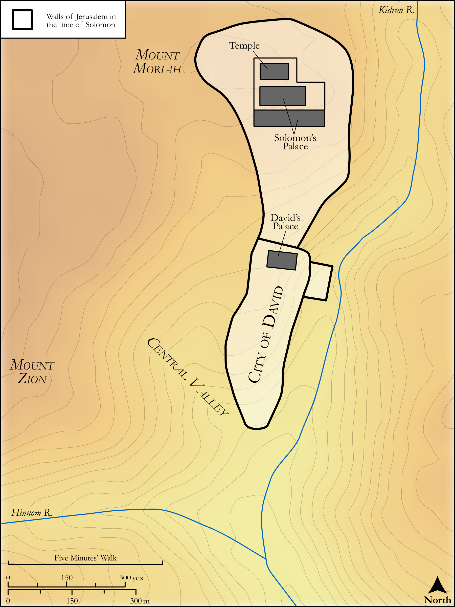

# Biblica Open Bible Maps

## License Information

Biblica Open Bible Maps, © 2023–2025 Biblica, Inc. This work is licensed under Creative Commons Attribution-ShareAlike 4.0 International (<a href="https://creativecommons.org/licenses/by-sa/4.0/">https://creativecommons.org/licenses/by-sa/4.0/</a>). More Information: <a href="https://docs.google.com/document/d/1Pp44yZ0Zdnd59vJHTrt2rPYq0SppfX5rZbPBt6mz37U/edit?tab=t.0#heading=h.oev9aj1ksvk2">https://docs.google.com/document/d/1Pp44yZ0Zdnd59vJHTrt2rPYq0SppfX5rZbPBt6mz37U/edit?tab=t.0#heading=h.oev9aj1ksvk2</a>

--------------------------------

## Historical: City Plan: Jerusalem in the Time of Solomon (id: OT121)

### Image Content

[link](images/OT121.png)

Original: [Historical: City Plan: Jerusalem in the Time of Solomon](https://drive.google.com/open?id=1C0MEC9ChNKK-zKlmoN3ZQjfWJ7r_oz0u&usp=drive_copy)

* **Associated Passages:** 1 Kings 1:1-22:54

* **Associated ACAI Concepts:** LORD (ID: `deity:Lord`); Israel (ID: `person:Israel`); Solomon (ID: `person:Solomon`); David (ID: `person:David`); Jeroboam (ID: `person:Jeroboam`); Ahab (ID: `person:Ahab`); Tribe of Judah (ID: `group:Judah`); Judah (ID: `person:Judah.4`); Elijah (ID: `person:Elijah`); Word of the Lord (ID: `keyterm:WordOfTheLord`); Jerusalem (ID: `place:Jerusalem`); Asa (ID: `person:Asa`); To Sin (ID: `keyterm:Sin`); Adonijah (ID: `person:Adonijah`); Baasha (ID: `person:Baasha`); Jehoshaphat (ID: `person:Jehoshaphat.3`); Egypt (ID: `place:Egypt`); Rehoboam (ID: `person:Rehoboam`); Samaria (ID: `place:Samaria`); Naboth (ID: `person:Naboth`); Benaiah (ID: `person:Benaiah`); Ben-hadad (ID: `person:Ben-hadad`); Ability (ID: `keyterm:Ability`); Hiram (ID: `person:Hiram`); Jezebel (ID: `person:Jezebel`); Joab (ID: `person:Joab`); Jehoiada (ID: `person:Jehoiada`); Nathan (ID: `person:Nathan.2`); Covenant (ID: `keyterm:Covenant`); Offering (ID: `keyterm:Offering`)
