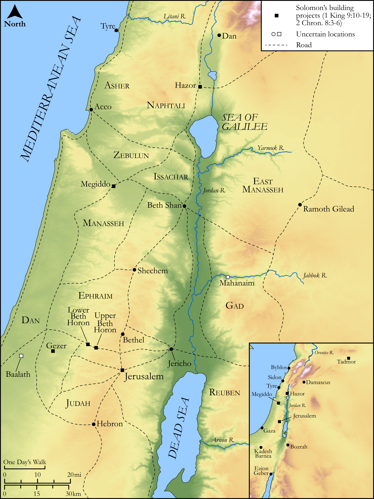

# Biblica Open Bible Maps

## License Information

Biblica Open Bible Maps, © 2023–2025 Biblica, Inc. This work is licensed under Creative Commons Attribution-ShareAlike 4.0 International (https://creativecommons.org/licenses/by-sa/4.0/). More Information: https://docs.google.com/document/d/1Pp44yZ0Zdnd59vJHTrt2rPYq0SppfX5rZbPBt6mz37U/edit?tab=t.0#heading=h.oev9aj1ksvk2

--------------------------------

## Historical: Solomon’s Building Projects (id: OT122)

### Image Content

[link](images/OT122.png)

Original: [Historical: Solomon’s Building Projects](https://drive.google.com/open?id=1-J9ptQdDiV45nFySePn_NyWFXyqZNhJC&usp=drive_copy)

* **Associated Passages:** 1 Kings 9:1-28; 2 Chronicles 8:1-18

* **Associated ACAI Concepts:** Solomon (ID: `person:Solomon`); LORD (ID: `deity:Lord`); Israel (ID: `person:Israel`); Hiram (ID: `person:Hiram`); David (ID: `person:David`); House (ID: `realia:House`); Force to Serve (ID: `keyterm:EnticedToServe`); Gezer (ID: `place:Gezer`); Jerusalem (ID: `place:Jerusalem`); Pharaoh (ID: `person:Pharaoh.7`); Chariot (ID: `realia:Chariot`); Baalath (ID: `place:Baalath.2`); Hivites (ID: `group:Hivites`); Ophir (ID: `place:Ophir`); Edom (ID: `place:Edom`); Holy (ID: `keyterm:Holy`); Lower Beth-horon (ID: `place:Beth-horonLower`); Hittites (ID: `group:Hittite`); Elath (ID: `place:Elath`); Amorites (ID: `group:Amorites`); Millo (ID: `place:Millo`); Ezion-geber (ID: `place:Ezion-geber`); Egypt (ID: `place:Egypt`); Offering (ID: `keyterm:Offering`); Heth (ID: `person:Heth`); Tyre (ID: `place:Tyre`); Lebanon (ID: `place:Lebanon`); Tribe of Levi (ID: `group:Levi`); Jebusites (ID: `group:Jebusites`); Perizzites (ID: `group:Perizzites`); Levi (ID: `person:Levi.3`); Talent (ID: `realia:Talent`); Ship (ID: `realia:Ship`); Tadmor (ID: `place:Tadmor`); Set Apart for Destruction (ID: `keyterm:Proscribe.2`); Hazor (ID: `place:Hazor`); Hamath (ID: `place:Hamath`); Straightness (ID: `keyterm:Straightness`); Cabul (ID: `place:Cabul.2`); Upper Beth-horon (ID: `place:Beth-horonUpper`); Canaan (ID: `place:Canaan`); Proverb (ID: `keyterm:Saying`); Work (ID: `keyterm:Work`); Feast of Tabernacles (ID: `keyterm:FeastOfTabernacles`); Canaanites (ID: `group:Canaan`); Galilee (ID: `place:Galilee`); Feast of Weeks (ID: `keyterm:FeastOfWeeks`); Sabbath (ID: `keyterm:Sabbath`); Zobah (ID: `place:Zobah`); Gibeon (ID: `place:Gibeon`); Moses (ID: `person:Moses`); Red Sea (ID: `place:RedSea`); Appointed Feast (ID: `keyterm:AppointedFeast`); Decree (ID: `keyterm:Decree`); Plea for Mercy (ID: `keyterm:Supplication`); Covenant Box (ID: `keyterm:CovenantBox`); To Beg for Mercy (ID: `keyterm:BegForMercy`); Megiddo (ID: `place:Megiddo`); New Moon Festival (ID: `keyterm:NewMoonFestival`); Stone Altar (ID: `realia:StoneAltar`); Temple Altar (ID: `realia:TempleAltar`); Tabernacle Altar (ID: `realia:TabernacleAltar`); Altar (ID: `realia:Altar`); Cattails (ID: `flora:Cattails`); Phoenician Juniper (ID: `flora:JuniperTree`); Fortification (ID: `realia:Fortification`); Ark of the Covenant (ID: `realia:ArkOfTheCovenant`); Fir (ID: `flora:Fir`); Unleavened Bread (ID: `realia:UnleavenedBread`); Grecian Juniper (ID: `flora:Juniper`); Foundation (ID: `realia:Foundation`); Cedar (ID: `flora:Cedar`); Cypress (ID: `flora:Cypress`)
