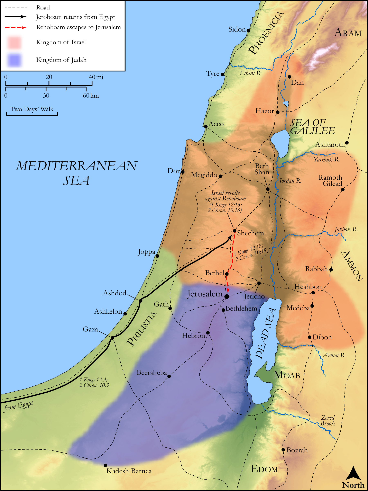

# Biblica Open Bible Maps

## License Information

Biblica Open Bible Maps, © 2023–2025 Biblica, Inc. This work is licensed under Creative Commons Attribution-ShareAlike 4.0 International (https://creativecommons.org/licenses/by-sa/4.0/). More Information: https://docs.google.com/document/d/1Pp44yZ0Zdnd59vJHTrt2rPYq0SppfX5rZbPBt6mz37U/edit?tab=t.0#heading=h.oev9aj1ksvk2

--------------------------------

## Historical: Rehoboam, Jeroboam, and the Divided Kingdom (id: OT125)

### Image Content

[link](images/OT125.png)

Original: [Historical: Rehoboam, Jeroboam, and the Divided Kingdom](https://drive.google.com/open?id=1k8cwjcOEqaQEzLFMfkD5XhsCNtHWg2O6&usp=drive_copy)

* **Associated Passages:** 1 Kings 12:1-33; 2 Chronicles 10:1-19

* **Associated ACAI Concepts:** Israel (ID: `person:Israel`); Rehoboam (ID: `person:Rehoboam`); Jeroboam (ID: `person:Jeroboam`); Judah (ID: `person:Judah.4`); Tribe of Judah (ID: `group:Judah`); LORD (ID: `deity:Lord`); David (ID: `person:David`); Solomon (ID: `person:Solomon`); Counsel (ID: `keyterm:Counsel`); Jerusalem (ID: `place:Jerusalem`); Yoke (ID: `realia:Yoke`); Nebat (ID: `person:Nebat`); Scorpion (ID: `fauna:Scorpion`); Whip (ID: `realia:Whip`); Shechem (ID: `place:Shechem`); Egypt (ID: `place:Egypt`); Force to Serve (ID: `keyterm:EnticedToServe`); Bethel (ID: `place:Bethel`); Adoram (ID: `person:Adoram`); Ahijah (ID: `person:Ahijah.2`); Shilonites (ID: `group:Shiloh`); Tribe of Dan (ID: `group:Dan`); Work (ID: `keyterm:Work`); Shiloh (ID: `place:Shiloh`); Jesse (ID: `person:Jesse`); Benjamin (ID: `person:Benjamin`); Tribe of Benjamin (ID: `group:Benjamin`); Rebel (ID: `keyterm:Rebel`); Dan (ID: `place:Dan`); To Cause to Possess (ID: `keyterm:Possess`)
