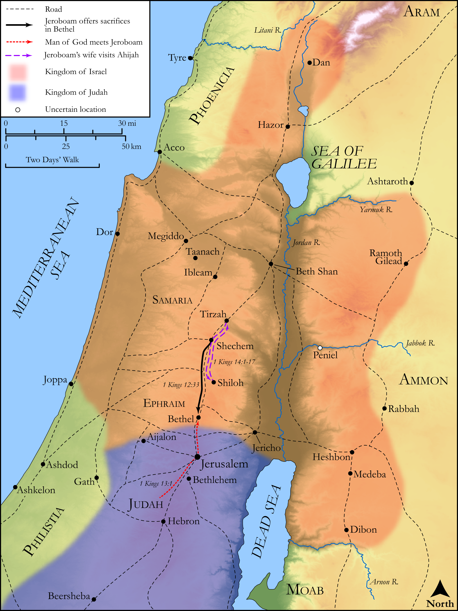

# Biblica Open Bible Maps

## License Information

Biblica Open Bible Maps, © 2023–2025 Biblica, Inc. This work is licensed under Creative Commons Attribution-ShareAlike 4.0 International (https://creativecommons.org/licenses/by-sa/4.0/). More Information: https://docs.google.com/document/d/1Pp44yZ0Zdnd59vJHTrt2rPYq0SppfX5rZbPBt6mz37U/edit?tab=t.0#heading=h.oev9aj1ksvk2

--------------------------------

## Historical: The Sins of Jeroboam (id: OT126)

### Image Content

[link](images/OT126.png)

Original: [Historical: The Sins of Jeroboam](https://drive.google.com/open?id=1ocs9xGDkDJ669t64vFv7xD7HsChKQBkX&usp=drive_copy)

* **Associated Passages:** 1 Kings 12:1-14:31

* **Associated ACAI Concepts:** LORD (ID: `deity:Lord`); Jeroboam (ID: `person:Jeroboam`); Israel (ID: `person:Israel`); Rehoboam (ID: `person:Rehoboam`); Judah (ID: `person:Judah.4`); Tribe of Judah (ID: `group:Judah`); Word of the Lord (ID: `keyterm:WordOfTheLord`); Bethel (ID: `place:Bethel`); David (ID: `person:David`); Ahijah (ID: `person:Ahijah.2`); Solomon (ID: `person:Solomon`); Jerusalem (ID: `place:Jerusalem`); House (ID: `realia:House`); Altar (ID: `realia:Altar`); Stone Altar (ID: `realia:StoneAltar`); Temple Altar (ID: `realia:TempleAltar`); Tabernacle Altar (ID: `realia:TabernacleAltar`); To Sin (ID: `keyterm:Sin`); High Place (ID: `realia:HighPlace`); Stone Pine (ID: `flora:Pine`); Donkey (ID: `fauna:Donkey`); Yoke (ID: `realia:Yoke`); Egypt (ID: `place:Egypt`); Rebel (ID: `keyterm:Rebel`); Shiloh (ID: `place:Shiloh`); Counsel (ID: `keyterm:Counsel`); Lion (ID: `fauna:Lion`); Naamah (ID: `person:Naamah`); Nebat (ID: `person:Nebat`); Tribe of Dan (ID: `group:Dan`)
