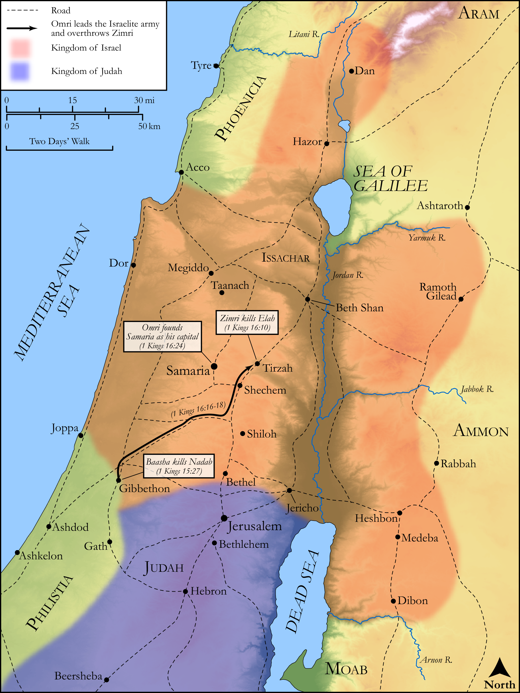

# Biblica Open Bible Maps

## License Information

Biblica Open Bible Maps, © 2023–2025 Biblica, Inc. This work is licensed under Creative Commons Attribution-ShareAlike 4.0 International (https://creativecommons.org/licenses/by-sa/4.0/). More Information: https://docs.google.com/document/d/1Pp44yZ0Zdnd59vJHTrt2rPYq0SppfX5rZbPBt6mz37U/edit?tab=t.0#heading=h.oev9aj1ksvk2

--------------------------------

## Historical: Baasha, Zimri, and Omri (id: OT127)

### Image Content

[link](images/OT127.png)

Original: [Historical: Baasha, Zimri, and Omri](https://drive.google.com/open?id=1G5ZsXKZlsGOlr5BwxtF6HYDux7fLRZDq&usp=drive_copy)

* **Associated Passages:** 1 Kings 15:1-16:34

* **Associated ACAI Concepts:** Israel (ID: `person:Israel`); Asa (ID: `person:Asa`); LORD (ID: `deity:Lord`); Baasha (ID: `person:Baasha`); Judah (ID: `person:Judah.4`); Tribe of Judah (ID: `group:Judah`); Jeroboam (ID: `person:Jeroboam`); Omri (ID: `person:Omri`); Zimri (ID: `person:Zimri.2`); To Sin (ID: `keyterm:Sin`); Tirzah (ID: `place:Tirzah`); David (ID: `person:David`); Word of the Lord (ID: `keyterm:WordOfTheLord`); Elah (ID: `person:Elah.2`); Ahab (ID: `person:Ahab`); Samaria (ID: `place:Samaria`); Nebat (ID: `person:Nebat`); House (ID: `realia:House`); Nadab (ID: `person:Nadab.2`); Maacah (ID: `person:Maacah.3`); Jehu (ID: `person:Jehu`); Gibbethon (ID: `place:Gibbethon`); Abijah (ID: `person:Abijah.4`); Ramah (ID: `place:Ramah.2`); Jerusalem (ID: `place:Jerusalem`); Money (ID: `realia:Money`); Ginath (ID: `person:Ginath`); Ahijah (ID: `person:Ahijah.3`); Tibni (ID: `person:Tibni`); Ben-hadad (ID: `person:Ben-hadad`)
