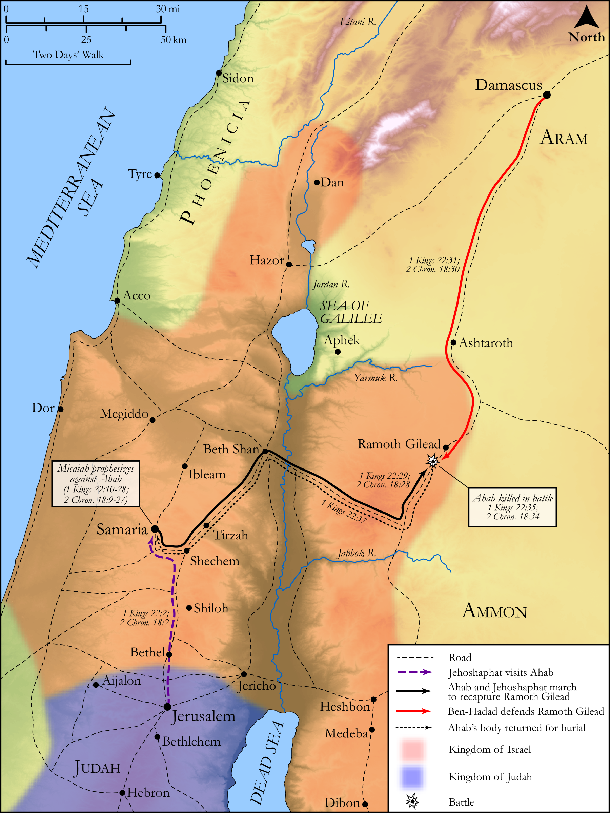

# Biblica Open Bible Maps

## License Information

Biblica Open Bible Maps, © 2023–2025 Biblica, Inc. This work is licensed under Creative Commons Attribution-ShareAlike 4.0 International (https://creativecommons.org/licenses/by-sa/4.0/). More Information: https://docs.google.com/document/d/1Pp44yZ0Zdnd59vJHTrt2rPYq0SppfX5rZbPBt6mz37U/edit?tab=t.0#heading=h.oev9aj1ksvk2

--------------------------------

## Historical: The Battle of Ramoth Gilead (id: OT129)

### Image Content

[link](images/OT129.png)

Original: [Historical: The Battle of Ramoth Gilead](https://drive.google.com/open?id=1Qk3ZkEW3m0LJSZccs-BFAL2KScOJ-ENq&usp=drive_copy)

* **Associated Passages:** 1 Kings 22:1-54; 2 Chronicles 18:1-34

* **Associated ACAI Concepts:** Israel (ID: `person:Israel`); LORD (ID: `deity:Lord`); Jehoshaphat (ID: `person:Jehoshaphat.3`); Micaiah (ID: `person:Micaiah.5`); Ramoth-gilead (ID: `place:Ramoth-gilead`); Ahab (ID: `person:Ahab`); Judah (ID: `person:Judah.4`); Tribe of Judah (ID: `group:Judah`); Speak as a Prophet (ID: `keyterm:Speak`); Peace (ID: `keyterm:IntactState`); Samaria (ID: `place:Samaria`); Word of the Lord (ID: `keyterm:WordOfTheLord`); Chariot (ID: `realia:Chariot`); Chenaanah (ID: `person:Chenaanah`); Zedekiah (ID: `person:Zedekiah.2`); Imlah (ID: `person:Imlah`); Syrians (ID: `group:Syria`); House (ID: `realia:House`); Ahaziah (ID: `person:Ahaziah`); Asa (ID: `person:Asa`); Sheep (ID: `fauna:Lamb`); Throne (ID: `realia:Throne`); Joash (ID: `person:Joash.2`); Amon (ID: `person:Amon.2`); Swear (ID: `keyterm:Swear`); Truth (ID: `keyterm:Truth`); An Angel (ID: `deity:Angel`); Flock (ID: `fauna:Flock`); Goat (ID: `fauna:Goat`); Azubah (ID: `person:Azubah`)
