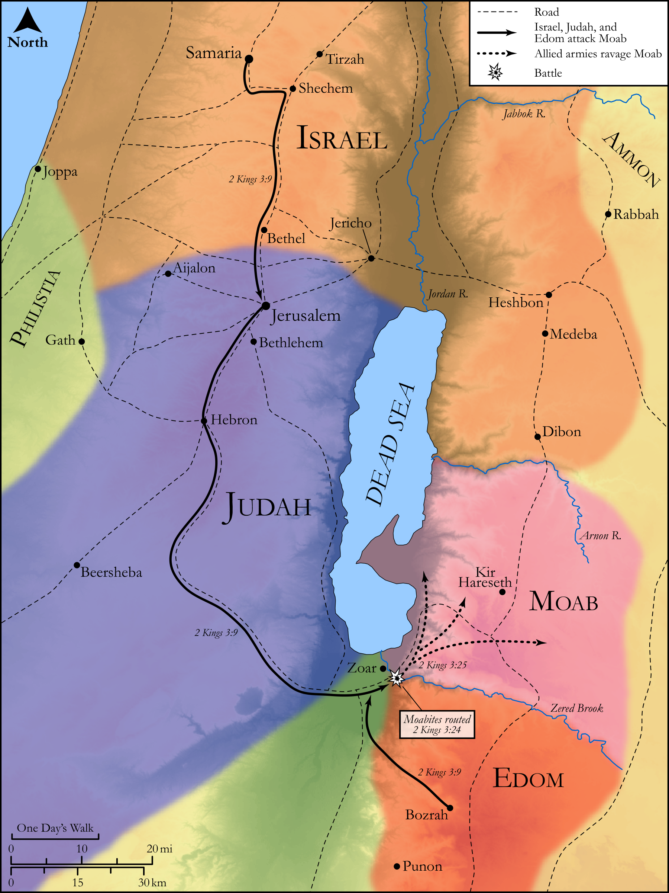

# Biblica Open Bible Maps

## License Information

Biblica Open Bible Maps, © 2023–2025 Biblica, Inc. This work is licensed under Creative Commons Attribution-ShareAlike 4.0 International (https://creativecommons.org/licenses/by-sa/4.0/). More Information: https://docs.google.com/document/d/1Pp44yZ0Zdnd59vJHTrt2rPYq0SppfX5rZbPBt6mz37U/edit?tab=t.0#heading=h.oev9aj1ksvk2

--------------------------------

## Historical: Joram, Elisha, and the Revolt of Moab (id: OT130)

### Image Content

[link](images/OT130.png)

Original: [Historical: Joram, Elisha, and the Revolt of Moab](https://drive.google.com/open?id=1cuggcqDgALtyDEa6h1Uog_xl5glRJ2ce&usp=drive_copy)

* **Associated Passages:** 2 Kings 3:1-27

* **Associated ACAI Concepts:** Israel (ID: `person:Israel`); Moab (ID: `place:Moab`); LORD (ID: `deity:Lord`); Edom (ID: `place:Edom`); Jehoshaphat (ID: `person:Jehoshaphat.3`); Judah (ID: `person:Judah.4`); Tribe of Judah (ID: `group:Judah`); Elisha (ID: `person:Elisha`); Joram (ID: `person:Joram.3`); Ahab (ID: `person:Ahab`); Offering (ID: `keyterm:Offering`); Samaria (ID: `place:Samaria`); Rebel (ID: `keyterm:Rebel`); Mesha (ID: `person:Mesha.2`); Shaphat (ID: `person:Shaphat.2`); Cattle (ID: `fauna:Bull`); Israelites (ID: `group:Israel`); Word of the Lord (ID: `keyterm:WordOfTheLord`); To Sin (ID: `keyterm:Sin`); Elijah (ID: `person:Elijah`); Kir (ID: `place:Kir`); Baal (ID: `deity:Baal`); Jeroboam (ID: `person:Jeroboam`); Nebat (ID: `person:Nebat`); Sheep (ID: `fauna:Lamb`); Sacred Pillar (ID: `realia:SacredPillar`); Sling (ID: `realia:Sling`); Horse (ID: `fauna:Horse`); Wool (ID: `realia:Wool`); Sword (ID: `realia:Sword`)
