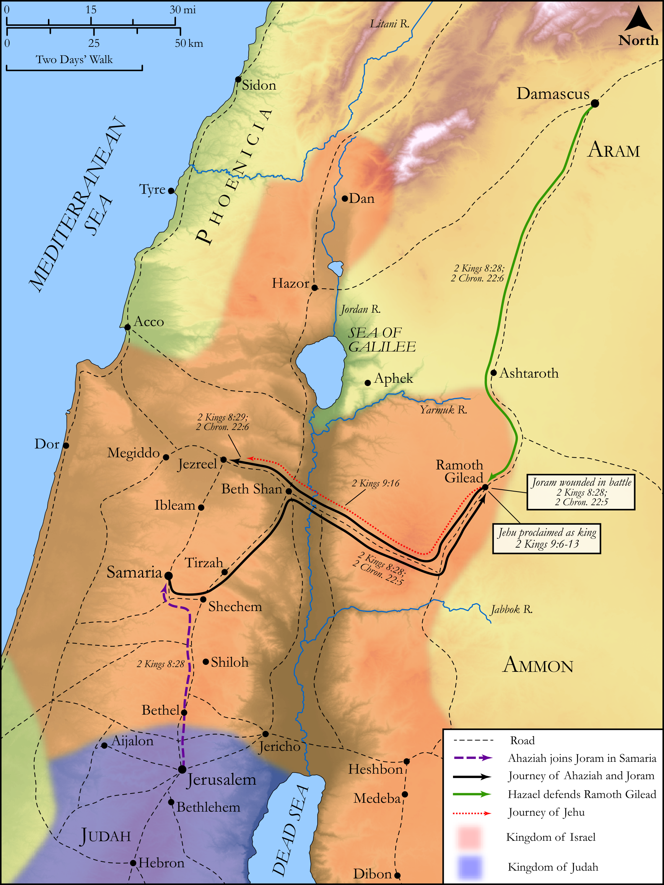

# Biblica Open Bible Maps

## License Information

Biblica Open Bible Maps, © 2023–2025 Biblica, Inc. This work is licensed under Creative Commons Attribution-ShareAlike 4.0 International (<a href="https://creativecommons.org/licenses/by-sa/4.0/">https://creativecommons.org/licenses/by-sa/4.0/</a>). More Information: <a href="https://docs.google.com/document/d/1Pp44yZ0Zdnd59vJHTrt2rPYq0SppfX5rZbPBt6mz37U/edit?tab=t.0#heading=h.oev9aj1ksvk2">https://docs.google.com/document/d/1Pp44yZ0Zdnd59vJHTrt2rPYq0SppfX5rZbPBt6mz37U/edit?tab=t.0#heading=h.oev9aj1ksvk2</a>

--------------------------------

## Historical: The Coup of Jehu (Part 1) (id: OT131)

### Image Content

[link](images/OT131.png)

Original: [Historical: The Coup of Jehu (Part 1\)](https://drive.google.com/open?id=14VAdTen0yRLpIfeM-o2a5dti_mG6p8_1&usp=drive_copy)

* **Associated Passages:** 2 Kings 8:1-10:36; 2 Chronicles 22:1-12

* **Associated ACAI Concepts:** Jehu (ID: `person:Jehu.2`); LORD (ID: `deity:Lord`); Ahab (ID: `person:Ahab`); Ahaziah (ID: `person:Ahaziah.2`); Israel (ID: `person:Israel`); Joram (ID: `person:Joram.3`); Judah (ID: `person:Judah.4`); Tribe of Judah (ID: `group:Judah`); Jezreel (ID: `place:Jezreel.2`); Hazael (ID: `person:Hazael`); Baal (ID: `deity:Baal`); Jehoram (ID: `person:Jehoram`); Ramoth-gilead (ID: `place:Ramoth-gilead`); Elisha (ID: `person:Elisha`); Peace (ID: `keyterm:IntactState`); Jezebel (ID: `person:Jezebel`); Samaria (ID: `place:Samaria`); Athaliah (ID: `person:Athaliah`); Jerusalem (ID: `place:Jerusalem`); Force to Serve (ID: `keyterm:EnticedToServe`); House (ID: `realia:House`); Chariot (ID: `realia:Chariot`); Nimshi (ID: `person:Nimshi`); Word of the Lord (ID: `keyterm:WordOfTheLord`); Offering (ID: `keyterm:Offering`); Smear (ID: `keyterm:Smear`); Syrians (ID: `group:Syria`); Naboth (ID: `person:Naboth`); Jeroboam (ID: `person:Jeroboam`); Edom (ID: `place:Edom`)
