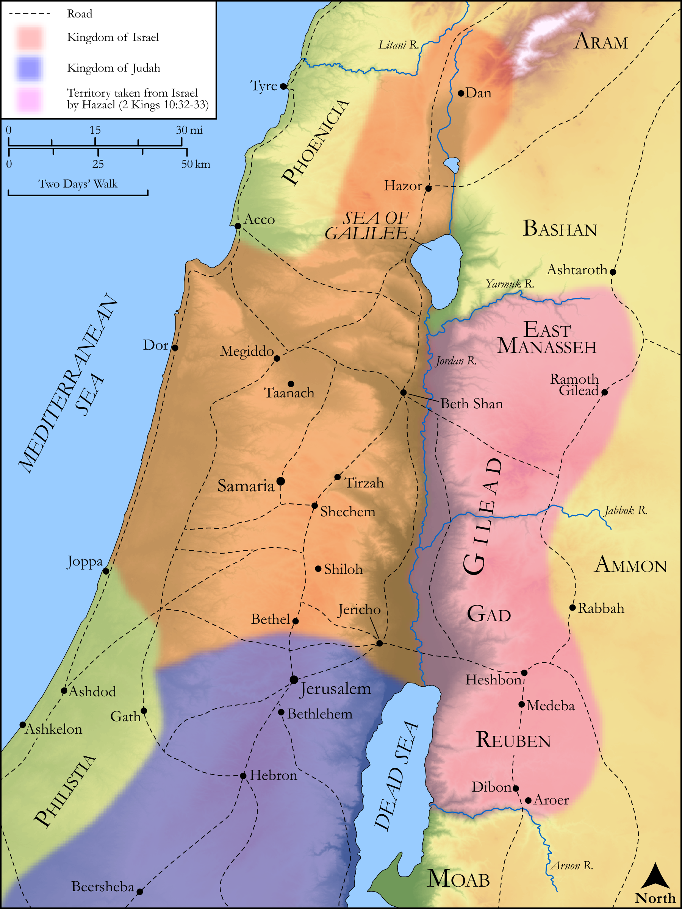

# Biblica Open Bible Maps

## License Information

Biblica Open Bible Maps, © 2023–2025 Biblica, Inc. This work is licensed under Creative Commons Attribution-ShareAlike 4.0 International (https://creativecommons.org/licenses/by-sa/4.0/). More Information: https://docs.google.com/document/d/1Pp44yZ0Zdnd59vJHTrt2rPYq0SppfX5rZbPBt6mz37U/edit?tab=t.0#heading=h.oev9aj1ksvk2

--------------------------------

## Historical: Hazael's Conquests (id: OT134)

### Image Content

[link](images/OT134.png)

Original: [Historical: Hazael's Conquests](https://drive.google.com/open?id=1o072EGPSALZexXvWznluJRK2uCVowB3b&usp=drive_copy)

* **Associated Passages:** 2 Kings 10:1-36

* **Associated ACAI Concepts:** Jehu (ID: `person:Jehu.2`); Baal (ID: `deity:Baal`); Israel (ID: `person:Israel`); LORD (ID: `deity:Lord`); Ahab (ID: `person:Ahab`); Force to Serve (ID: `keyterm:EnticedToServe`); Samaria (ID: `place:Samaria`); House (ID: `realia:House`); Jezreel (ID: `place:Jezreel.2`); Scroll (ID: `realia:Scroll`); Beth-eked (ID: `place:Beth-eked`); Rechab (ID: `person:Rechab.2`); Jonadab (ID: `person:Jonadab`); Chariot (ID: `realia:Chariot`); Word of the Lord (ID: `keyterm:WordOfTheLord`); Jeroboam (ID: `person:Jeroboam`); Slaughtering (ID: `keyterm:Slaughtering`); Offering (ID: `keyterm:Offering`); Elijah (ID: `person:Elijah`); To Sin (ID: `keyterm:Sin`); Tribe of Manasseh (ID: `group:Manasseh`); Sacred Pillar (ID: `realia:SacredPillar`); Dan (ID: `place:Dan`); Peace (ID: `keyterm:IntactState`); Holy (ID: `keyterm:Holy`); An Angel (ID: `deity:Angel`); Tribe of Judah (ID: `group:Judah`); Tribe of Reuben (ID: `group:Reuben`); Judah (ID: `person:Judah.4`); Arnon (ID: `place:Arnon`); Bethel (ID: `place:Bethel`); Tribe of Dan (ID: `group:Dan`); Nebat (ID: `person:Nebat`); Aroer (ID: `place:Aroer.2`); Bless (ID: `keyterm:Bless`); Bashan (ID: `place:Bashan`); Hazael (ID: `person:Hazael`); Manasseh (ID: `person:Manasseh`); Ahaziah (ID: `person:Ahaziah.2`); Gad (ID: `person:Gad`); Fear (ID: `keyterm:Fear`); Gilead (ID: `place:Gilead`); Reuben (ID: `person:Reuben`); Jehoahaz (ID: `person:Jehoahaz.2`); Instruction (ID: `keyterm:Instruction`); Passion (ID: `keyterm:Ardour`); Jordan River (ID: `place:Jordan`); Basket (ID: `realia:Basket`); Molten Image (ID: `realia:MoltenImage`); Weapons (ID: `realia:Weapons`); Cattle (ID: `fauna:Bull`); Pit (ID: `realia:Pit`); Horse (ID: `fauna:Horse`); Sword (ID: `realia:Sword`)
