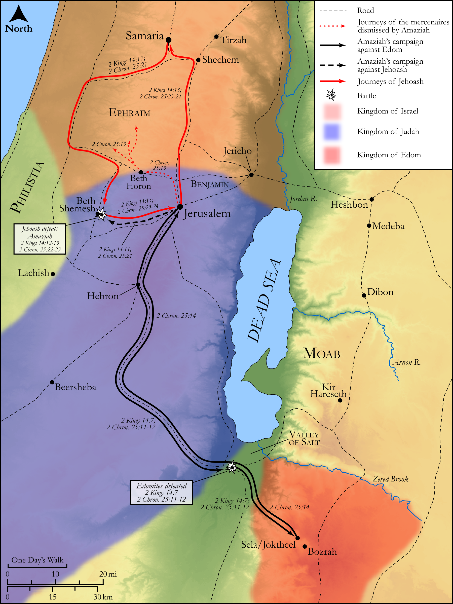

# Biblica Open Bible Maps

## License Information

Biblica Open Bible Maps, © 2023–2025 Biblica, Inc. This work is licensed under Creative Commons Attribution-ShareAlike 4.0 International (<a href="https://creativecommons.org/licenses/by-sa/4.0/">https://creativecommons.org/licenses/by-sa/4.0/</a>). More Information: <a href="https://docs.google.com/document/d/1Pp44yZ0Zdnd59vJHTrt2rPYq0SppfX5rZbPBt6mz37U/edit?tab=t.0#heading=h.oev9aj1ksvk2">https://docs.google.com/document/d/1Pp44yZ0Zdnd59vJHTrt2rPYq0SppfX5rZbPBt6mz37U/edit?tab=t.0#heading=h.oev9aj1ksvk2</a>

--------------------------------

## Historical: The Wars of Amaziah and Jehoash (id: OT135)

### Image Content

[link](images/OT135.png)

Original: [Historical: The Wars of Amaziah and Jehoash](https://drive.google.com/open?id=1taeBDw68_wpeM5MaohXcnHpPCQIa8axD&usp=drive_copy)

* **Associated Passages:** 2 Kings 14:1-29; 2 Chronicles 25:1-28

* **Associated ACAI Concepts:** Amaziah (ID: `person:Amaziah`); Judah (ID: `person:Judah.4`); Israel (ID: `person:Israel`); Tribe of Judah (ID: `group:Judah`); LORD (ID: `deity:Lord`); Joash (ID: `person:Joash.4`); Joash (ID: `person:Joash.3`); Jerusalem (ID: `place:Jerusalem`); Jeroboam (ID: `person:Jeroboam.2`); Jehoahaz (ID: `person:Jehoahaz.2`); Samaria (ID: `place:Samaria`); Edom (ID: `place:Edom`); Beth-shemesh (ID: `place:Beth-shemesh`); House (ID: `realia:House`); Valley of Salt (ID: `place:SaltValley`); Corner Gate (ID: `place:CornerGate`); Ephraim Gate (ID: `place:EphraimGate`); Jehoaddan (ID: `person:Jehoaddan`); Sela (ID: `place:Sela`); Lachish (ID: `place:Lachish`); Hamath (ID: `place:Hamath`); Moses (ID: `person:Moses`); David (ID: `person:David`); Jehu (ID: `person:Jehu.2`); Edomites (ID: `group:Edom`); Tribe of Ephraim (ID: `group:Ephraim`); Lebanon (ID: `place:Lebanon`); Seir (ID: `place:Seir`); Ephraim (ID: `person:Ephraim`); Instruction (ID: `keyterm:Instruction`)
