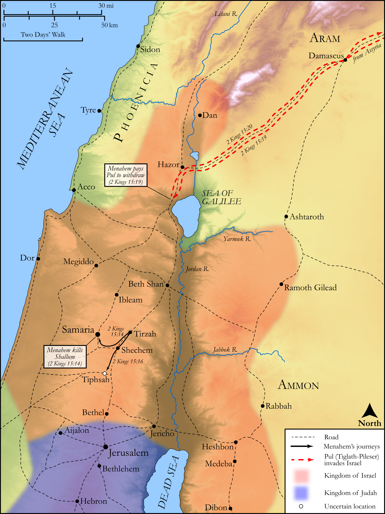

# Biblica Open Bible Maps

## License Information

Biblica Open Bible Maps, © 2023–2025 Biblica, Inc. This work is licensed under Creative Commons Attribution-ShareAlike 4.0 International (https://creativecommons.org/licenses/by-sa/4.0/). More Information: https://docs.google.com/document/d/1Pp44yZ0Zdnd59vJHTrt2rPYq0SppfX5rZbPBt6mz37U/edit?tab=t.0#heading=h.oev9aj1ksvk2

--------------------------------

## Historical: Menahem's Coup and Reign (id: OT137)

### Image Content

[link](images/OT137.png)

Original: [Historical: Menahem's Coup and Reign](https://drive.google.com/open?id=13TyEPl5-ofroORzaQORh9PcUkqY__Gdk&usp=drive_copy)

* **Associated Passages:** 2 Kings 15:1-38

* **Associated ACAI Concepts:** Israel (ID: `person:Israel`); Uzziah (ID: `person:Uzziah`); LORD (ID: `deity:Lord`); Tribe of Judah (ID: `group:Judah`); Judah (ID: `person:Judah.4`); Menahem (ID: `person:Menahem`); Pekah (ID: `person:Pekah`); Samaria (ID: `place:Samaria`); Jotham (ID: `person:Jotham.2`); Remaliah (ID: `person:Remaliah`); Shallum (ID: `person:Shallum.2`); Jeroboam (ID: `person:Jeroboam`); Nebat (ID: `person:Nebat`); To Sin (ID: `keyterm:Sin`); Jabesh (ID: `person:Jabesh`); Pekahiah (ID: `person:Pekahiah`); Assyria (ID: `place:Assyria`); Zechariah (ID: `person:Zechariah.3`); Gadi (ID: `person:Gadi`); Tiglath-pileser (ID: `person:Tiglath-pileser`); House (ID: `realia:House`); Tirzah (ID: `place:Tirzah`); David (ID: `person:David`); Amaziah (ID: `person:Amaziah`); Jeroboam (ID: `person:Jeroboam.2`); Gilead (ID: `place:Gilead`); Jerusalem (ID: `place:Jerusalem`); Zadok (ID: `person:Zadok.3`); Jecoliah (ID: `person:Jecoliah`); Elah (ID: `person:Elah.3`); Jerusha (ID: `person:Jerusha`); Abel-beth-maacah (ID: `place:Abel-beth-maacah`); Ijon (ID: `place:Ijon`); Janoah (ID: `place:Janoah`); Tiphsah (ID: `place:Tiphsah.2`); Arieh (ID: `person:Arieh`); Argob (ID: `person:Argob`); High Place (ID: `realia:HighPlace`); Money (ID: `realia:Money`); Stone Pine (ID: `flora:Pine`); Infectious Skin Disease (ID: `keyterm:InfectiousSkinDisease`); Ibleam (ID: `place:Ibleam`); Word of the Lord (ID: `keyterm:WordOfTheLord`); Rezin (ID: `person:Rezin`); Naphtali (ID: `person:Naphtali`); Hazor (ID: `place:Hazor`); Galilee (ID: `place:Galilee`); Gileadites (ID: `group:Gilead`); Jehu (ID: `person:Jehu.2`); Kedesh (ID: `place:Kedesh`); Ahaz (ID: `person:Ahaz`); Hoshea (ID: `person:Hoshea`); Tribe of Naphtali (ID: `group:Naphtali`); Talent (ID: `realia:Talent`); Shekel (ID: `realia:Shekel`)
