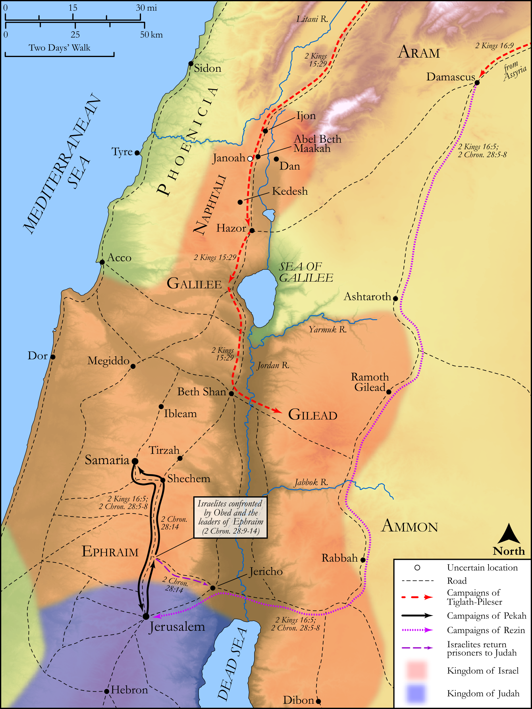

# Biblica Open Bible Maps

## License Information

Biblica Open Bible Maps, © 2023–2025 Biblica, Inc. This work is licensed under Creative Commons Attribution-ShareAlike 4.0 International (https://creativecommons.org/licenses/by-sa/4.0/). More Information: https://docs.google.com/document/d/1Pp44yZ0Zdnd59vJHTrt2rPYq0SppfX5rZbPBt6mz37U/edit?tab=t.0#heading=h.oev9aj1ksvk2

--------------------------------

## Historical: The Wars of Pekah (id: OT138)

### Image Content

[link](images/OT138.png)

Original: [Historical: The Wars of Pekah](https://drive.google.com/open?id=1ZXMlCQwBBA-GaH3lPfqolM6Ieca_rbc7&usp=drive_copy)

* **Associated Passages:** 2 Kings 15:1-16:20; 2 Chronicles 28:1-27

* **Associated ACAI Concepts:** Israel (ID: `person:Israel`); LORD (ID: `deity:Lord`); Tribe of Judah (ID: `group:Judah`); Judah (ID: `person:Judah.4`); Ahaz (ID: `person:Ahaz`); Uzziah (ID: `person:Uzziah`); Pekah (ID: `person:Pekah`); Assyria (ID: `place:Assyria`); Samaria (ID: `place:Samaria`); Menahem (ID: `person:Menahem`); Remaliah (ID: `person:Remaliah`); Jerusalem (ID: `place:Jerusalem`); Jotham (ID: `person:Jotham.2`); Damascus (ID: `place:Damascus`); Tiglath-pileser (ID: `person:Tiglath-pileser`); To Sin (ID: `keyterm:Sin`); David (ID: `person:David`); Uriah (ID: `person:Uriah.3`); House (ID: `realia:House`); Shallum (ID: `person:Shallum.2`); Altar (ID: `realia:Altar`); Stone Altar (ID: `realia:StoneAltar`); Temple Altar (ID: `realia:TempleAltar`); Tabernacle Altar (ID: `realia:TabernacleAltar`); Rezin (ID: `person:Rezin`); Jeroboam (ID: `person:Jeroboam`); Nebat (ID: `person:Nebat`); High Place (ID: `realia:HighPlace`); Stone Pine (ID: `flora:Pine`); Jabesh (ID: `person:Jabesh`)
