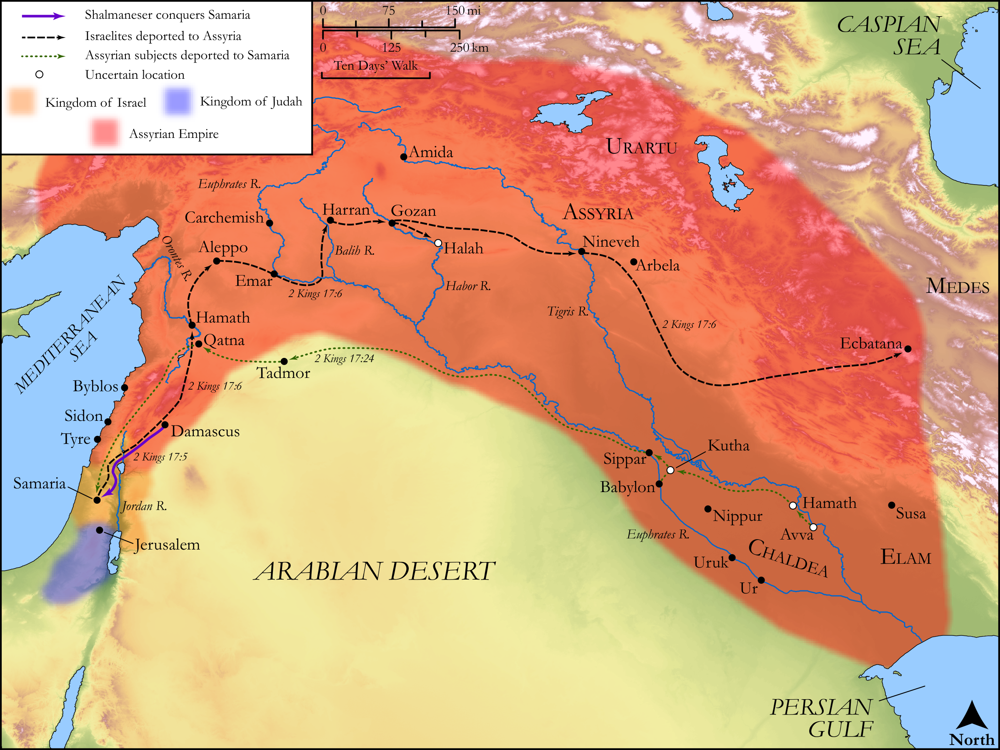

# Biblica Open Bible Maps

## License Information

Biblica Open Bible Maps, © 2023–2025 Biblica, Inc. This work is licensed under Creative Commons Attribution-ShareAlike 4.0 International (https://creativecommons.org/licenses/by-sa/4.0/). More Information: https://docs.google.com/document/d/1Pp44yZ0Zdnd59vJHTrt2rPYq0SppfX5rZbPBt6mz37U/edit?tab=t.0#heading=h.oev9aj1ksvk2

--------------------------------

## Historical: Hoshea and the Fall of Samaria (id: OT139)

### Image Content

[link](images/OT139.png)

Original: [Historical: Hoshea and the Fall of Samaria](https://drive.google.com/open?id=1gHlnOuJYKvBveStCfTP9zD4Oxlv-Y6b0&usp=drive_copy)

* **Associated Passages:** 2 Kings 17:1-18:37

* **Associated ACAI Concepts:** LORD (ID: `deity:Lord`); Assyria (ID: `place:Assyria`); Israel (ID: `person:Israel`); Hezekiah (ID: `person:Hezekiah`); Judah (ID: `person:Judah.4`); Tribe of Judah (ID: `group:Judah`); Samaria (ID: `place:Samaria`); Hoshea (ID: `person:Hoshea`); Fear (ID: `keyterm:Fear`); Trust (ID: `keyterm:LeanOn`); Rabshakeh (ID: `person:Rabshakeh`); Force to Serve (ID: `keyterm:EnticedToServe`); Egypt (ID: `place:Egypt`); Stone Pine (ID: `flora:Pine`); High Place (ID: `realia:HighPlace`); To Sin (ID: `keyterm:Sin`); Covenant (ID: `keyterm:Covenant`); Jerusalem (ID: `place:Jerusalem`); Eliakim (ID: `person:Eliakim.3`); Elah (ID: `person:Elah.3`); Hilkiah (ID: `person:Hilkiah`); Joah (ID: `person:Joah`); Sepharvaim (ID: `place:Sepharvaim`); Ivvah (ID: `place:Ivvah`); Shebna (ID: `person:Shebna`); Moses (ID: `person:Moses`); Hamath (ID: `place:Hamath`); Instruction (ID: `keyterm:Instruction`); Asherah (ID: `deity:Asherah`); House (ID: `realia:House`)
