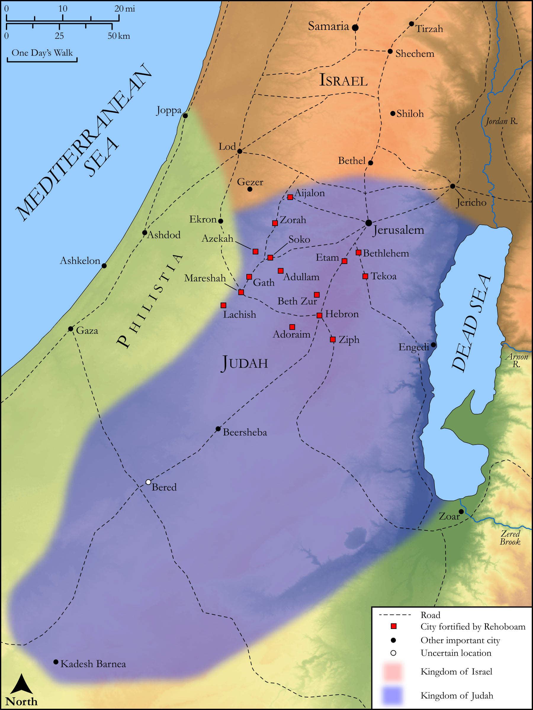

# Biblica Open Bible Maps

## License Information

Biblica Open Bible Maps, © 2023–2025 Biblica, Inc. This work is licensed under Creative Commons Attribution-ShareAlike 4.0 International (<a href="https://creativecommons.org/licenses/by-sa/4.0/">https://creativecommons.org/licenses/by-sa/4.0/</a>). More Information: <a href="https://docs.google.com/document/d/1Pp44yZ0Zdnd59vJHTrt2rPYq0SppfX5rZbPBt6mz37U/edit?tab=t.0#heading=h.oev9aj1ksvk2">https://docs.google.com/document/d/1Pp44yZ0Zdnd59vJHTrt2rPYq0SppfX5rZbPBt6mz37U/edit?tab=t.0#heading=h.oev9aj1ksvk2</a>

--------------------------------

## Historical: Rehoboam Fortifies Judah (id: OT140)

### Image Content

[link](images/OT140.png)

Original: [Historical: Rehoboam Fortifies Judah](https://drive.google.com/open?id=17wwql79Q5Feyp3Eh0bsWyLjnHRgDrNBM&usp=drive_copy)

* **Associated Passages:** 2 Chronicles 11:1-23

* **Associated ACAI Concepts:** Tribe of Judah (ID: `group:Judah`); Judah (ID: `person:Judah.4`); Rehoboam (ID: `person:Rehoboam`); Tribe of Benjamin (ID: `group:Benjamin`); Benjamin (ID: `person:Benjamin`); Jerusalem (ID: `place:Jerusalem`); LORD (ID: `deity:Lord`); Israel (ID: `person:Israel`); Fortification (ID: `realia:Fortification`); Maacah (ID: `person:Maacah.3`); Solomon (ID: `person:Solomon`); David (ID: `person:David`); Abijah (ID: `person:Abijah.4`); Jeroboam (ID: `person:Jeroboam`); Absalom (ID: `person:Absalom`); Tribe of Levi (ID: `group:Levi`); Levi (ID: `person:Levi.3`); Shelomith (ID: `person:Shelomith.3`); Jerimoth (ID: `person:Jerimoth.6`); Ziza (ID: `person:Ziza.2`); Adoraim (ID: `place:Adoraim`); Abihail (ID: `person:Abihail.4`); Ziph (ID: `person:Ziph`); Jeush (ID: `person:Jeush.5`); Mahalath (ID: `person:Mahalath.2`); Attai (ID: `person:Attai.3`); Shemariah (ID: `person:Shemariah.2`); Zaham (ID: `person:Zaham`); Bethlehem (ID: `place:Bethlehem`); Hebron (ID: `place:Hebron`); Jesse (ID: `person:Jesse`); Eliab (ID: `person:Eliab.3`); Beth-zur (ID: `place:Beth-zur`); Azekah (ID: `place:Azekah`); Aijalon (ID: `place:Aijalon`); Tekoa (ID: `place:Tekoa`); Adullam (ID: `place:Adullam`); Gath (ID: `place:Gath`); Lachish (ID: `place:Lachish`); Socoh (ID: `place:Socoh`); Shemaiah (ID: `person:Shemaiah`); Perceive (ID: `keyterm:Perceive`); Love (ID: `keyterm:Love`); Priesthood (ID: `keyterm:Priesthood`); Mareshah (ID: `place:Mareshah`); Zorah (ID: `place:Zorah`); Word of the Lord (ID: `keyterm:WordOfTheLord`); Wine (ID: `realia:Wine`); Anointing Oil (ID: `realia:AnointingOil`); Molten Image (ID: `realia:MoltenImage`); Large Shield (ID: `realia:LargeShield`); Stone Pine (ID: `flora:Pine`); Vine (ID: `flora:Vine`); Cattle (ID: `fauna:Bull`); Spear (ID: `realia:Spear`); House (ID: `realia:House`); High Place (ID: `realia:HighPlace`); Olive Oil (ID: `realia:OliveOil`)
