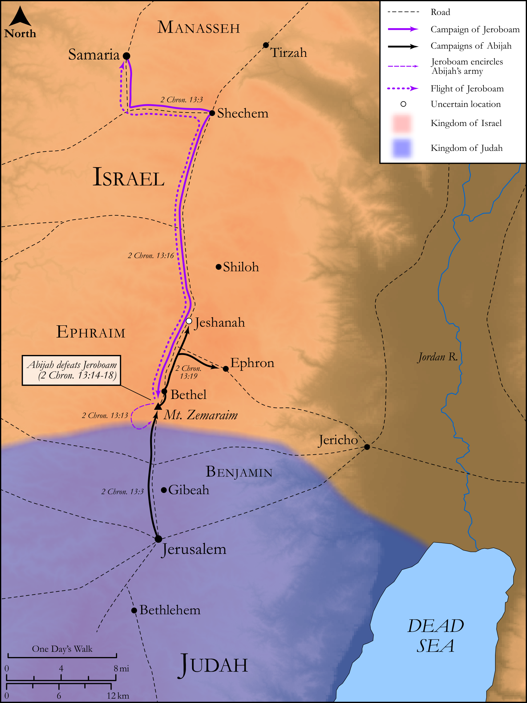

# Biblica Open Bible Maps

## License Information

Biblica Open Bible Maps, © 2023–2025 Biblica, Inc. This work is licensed under Creative Commons Attribution-ShareAlike 4.0 International (<a href="https://creativecommons.org/licenses/by-sa/4.0/">https://creativecommons.org/licenses/by-sa/4.0/</a>). More Information: <a href="https://docs.google.com/document/d/1Pp44yZ0Zdnd59vJHTrt2rPYq0SppfX5rZbPBt6mz37U/edit?tab=t.0#heading=h.oev9aj1ksvk2">https://docs.google.com/document/d/1Pp44yZ0Zdnd59vJHTrt2rPYq0SppfX5rZbPBt6mz37U/edit?tab=t.0#heading=h.oev9aj1ksvk2</a>

--------------------------------

## Historical: Abijah Defeats Jeroboam (id: OT142)

### Image Content

[link](images/OT142.png)

Original: [Historical: Abijah Defeats Jeroboam](https://drive.google.com/open?id=1qbPlUCNW1LzLXsgG0D1vps6QyAkidDSZ&usp=drive_copy)

* **Associated Passages:** 2 Chronicles 13:1-23

* **Associated ACAI Concepts:** LORD (ID: `deity:Lord`); Abijah (ID: `person:Abijah.4`); Jeroboam (ID: `person:Jeroboam`); Israel (ID: `person:Israel`); Tribe of Judah (ID: `group:Judah`); Judah (ID: `person:Judah.4`); David (ID: `person:David`); Solomon (ID: `person:Solomon`); Aaron (ID: `person:Aaron`); Tribe of Levi (ID: `group:Levi`); Ephraim (ID: `person:Ephraim`); Levi (ID: `person:Levi.3`); Trumpet (ID: `realia:Trumpet`); Cattle (ID: `fauna:Bull`); Gibeah (ID: `place:Gibeah`); Jeshanah (ID: `place:Jeshanah`); Iddo (ID: `person:Iddo.5`); Uriel (ID: `person:Uriel.3`); Bethel (ID: `place:Bethel`); Pure (ID: `keyterm:Pure`); Offering (ID: `keyterm:Offering`); Maacah (ID: `person:Maacah.3`); Covenant (ID: `keyterm:Covenant`); Jerusalem (ID: `place:Jerusalem`); Rehoboam (ID: `person:Rehoboam`); Rebel (ID: `keyterm:Rebel`); Tribe of Ephraim (ID: `group:Ephraim`); Nebat (ID: `person:Nebat`); Zemaraim (ID: `place:Zemaraim`); Wickedness (ID: `keyterm:Wickedness`); Strength (ID: `keyterm:Strength`); Bread of Display (ID: `realia:BreadOfDisplay`); Molten Image (ID: `realia:MoltenImage`); Sheep (ID: `fauna:Lamb`); Lampstand (ID: `realia:Lampstand.2`); Lamp (ID: `realia:Lamp`)
