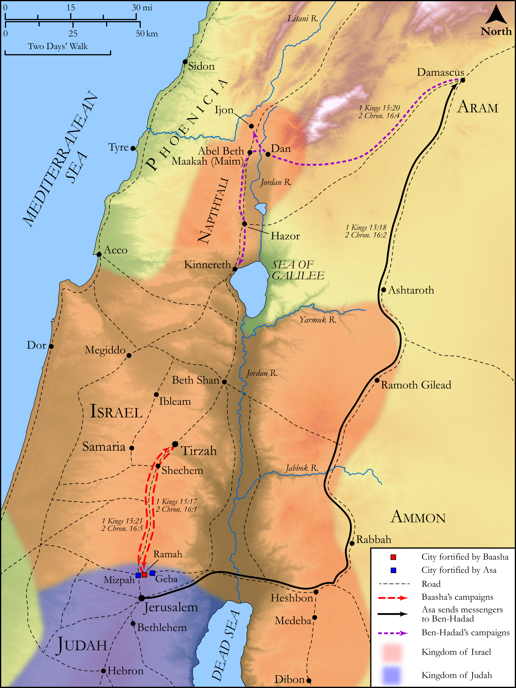

# Biblica Open Bible Maps

## License Information

Biblica Open Bible Maps, © 2023–2025 Biblica, Inc. This work is licensed under Creative Commons Attribution-ShareAlike 4.0 International (https://creativecommons.org/licenses/by-sa/4.0/). More Information: https://docs.google.com/document/d/1Pp44yZ0Zdnd59vJHTrt2rPYq0SppfX5rZbPBt6mz37U/edit?tab=t.0#heading=h.oev9aj1ksvk2

--------------------------------

## Historical: The Wars of Asa and Baasha (id: OT144)

### Image Content

[link](images/OT144.png)

Original: [Historical: The Wars of Asa and Baasha](https://drive.google.com/open?id=1WzRP-_TQ5H1XuVmg_9D0A3VBNfnI2Mq7&usp=drive_copy)

* **Associated Passages:** 1 Kings 15:1-34; 2 Chronicles 16:1-14

* **Associated ACAI Concepts:** Asa (ID: `person:Asa`); Israel (ID: `person:Israel`); LORD (ID: `deity:Lord`); Baasha (ID: `person:Baasha`); Tribe of Judah (ID: `group:Judah`); Judah (ID: `person:Judah.4`); Jeroboam (ID: `person:Jeroboam`); David (ID: `person:David`); Ramah (ID: `place:Ramah.2`); Ben-hadad (ID: `person:Ben-hadad`); To Sin (ID: `keyterm:Sin`); Money (ID: `realia:Money`); Nadab (ID: `person:Nadab.2`); Maacah (ID: `person:Maacah.3`); Abijah (ID: `person:Abijah.4`); Jerusalem (ID: `place:Jerusalem`); House (ID: `realia:House`); Abel-beth-maacah (ID: `place:Abel-beth-maacah`); Ijon (ID: `place:Ijon`); Ahijah (ID: `person:Ahijah.3`); Geba (ID: `place:Geba`); Dan (ID: `place:Dan`); Mizpah (ID: `place:Mizpah`); Naphtali (ID: `person:Naphtali`); Absalom (ID: `person:Absalom`); Tirzah (ID: `place:Tirzah`); Tribe of Dan (ID: `group:Dan`); Damascus (ID: `place:Damascus`); Tribe of Naphtali (ID: `group:Naphtali`); Covenant (ID: `keyterm:Covenant`); Tabrimmon (ID: `person:Tabrimmon`); Hanani (ID: `person:Hanani`); Gibbethon (ID: `place:Gibbethon`); Hezion (ID: `person:Hezion`); Chinnereth (ID: `place:Chinnereth`); Kidron (ID: `place:Kidron`); Tribe of Issachar (ID: `group:Issachar`); Word of the Lord (ID: `keyterm:WordOfTheLord`); Philistines (ID: `group:Philistine`); Ahijah (ID: `person:Ahijah.2`); Tribe of Benjamin (ID: `group:Benjamin`); Hittites (ID: `group:Hittite`); Issachar (ID: `person:Issachar`); Benjamin (ID: `person:Benjamin`); Philistia (ID: `place:Philistine`); Shiloh (ID: `place:Shiloh`); Uriah (ID: `person:Uriah`); Ethiopia (ID: `place:Ethiopia`); Shilonites (ID: `group:Shiloh`); Nebat (ID: `person:Nebat`); Jehoshaphat (ID: `person:Jehoshaphat.3`); Heth (ID: `person:Heth`); Exempt (ID: `keyterm:Exempt`); Asherah (ID: `deity:Asherah`); Rehoboam (ID: `person:Rehoboam`); Ethiopians (ID: `group:Ethiopia`); Libya (ID: `place:Libya`); High Place (ID: `realia:HighPlace`); Lamp (ID: `realia:Lamp`); Image (ID: `realia:Image`); Balsam Tree (ID: `flora:BalsamTree`); Chariot (ID: `realia:Chariot`); Stone Pine (ID: `flora:Pine`); Bed (ID: `realia:Bed`)
