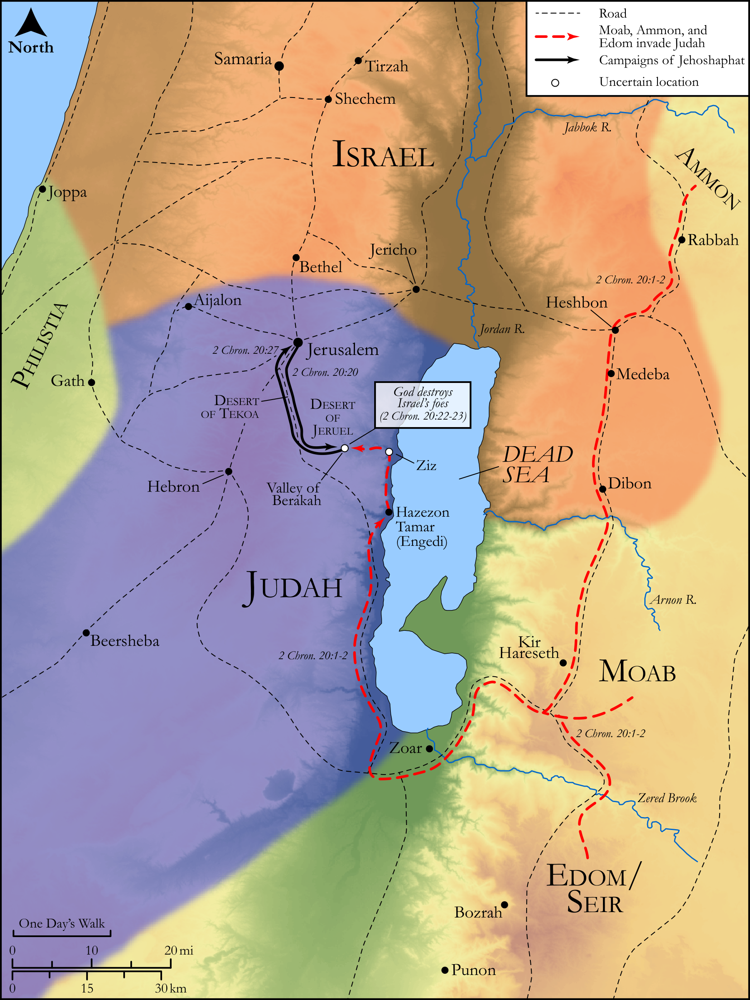

# Biblica Open Bible Maps

## License Information

Biblica Open Bible Maps, © 2023–2025 Biblica, Inc. This work is licensed under Creative Commons Attribution-ShareAlike 4.0 International (<a href="https://creativecommons.org/licenses/by-sa/4.0/">https://creativecommons.org/licenses/by-sa/4.0/</a>). More Information: <a href="https://docs.google.com/document/d/1Pp44yZ0Zdnd59vJHTrt2rPYq0SppfX5rZbPBt6mz37U/edit?tab=t.0#heading=h.oev9aj1ksvk2">https://docs.google.com/document/d/1Pp44yZ0Zdnd59vJHTrt2rPYq0SppfX5rZbPBt6mz37U/edit?tab=t.0#heading=h.oev9aj1ksvk2</a>

--------------------------------

## Historical: Jehoshaphat Defeats Moab and Ammon (id: OT145)

### Image Content

[link](images/OT145.png)

Original: [Historical: Jehoshaphat Defeats Moab and Ammon](https://drive.google.com/open?id=1h-A8IRzmbZLPwPHj2Fb-ixPhyidnVs7g&usp=drive_copy)

* **Associated Passages:** 2 Chronicles 20:1-37

* **Associated ACAI Concepts:** LORD (ID: `deity:Lord`); Jehoshaphat (ID: `person:Jehoshaphat.3`); Tribe of Judah (ID: `group:Judah`); Judah (ID: `person:Judah.4`); Jerusalem (ID: `place:Jerusalem`); Israel (ID: `person:Israel`); Ammon (ID: `place:Ammon`); Moab (ID: `place:Moab`); Mount Seir (ID: `place:SeirMount`); Fear (ID: `keyterm:Fear`); Ahaziah (ID: `person:Ahaziah`); Strength (ID: `keyterm:Strength`); House (ID: `realia:House`); Dispossess (ID: `keyterm:Dispossess`); Tarshish (ID: `place:Tarshish`); Tribe of Levi (ID: `group:Levi`); Levi (ID: `person:Levi.3`); Valley of Beracah (ID: `place:BeracahValley`); Mattaniah (ID: `person:Mattaniah.3`); Jeruel (ID: `place:Jeruel`); Benaiah (ID: `person:Benaiah.6`); Jahaziel (ID: `person:Jahaziel.4`); Eliezer (ID: `person:Eliezer.7`); Azubah (ID: `person:Azubah`); Zechariah (ID: `person:Zechariah.10`); Tekoa (ID: `place:Tekoa`); Meunites (ID: `group:Meunites`); Ascent of Ziz (ID: `place:Ziz`); Dodavahu (ID: `person:Dodavahu`); Shilhi (ID: `person:Shilhi`); Jeiel (ID: `person:Jeiel.5`); Ship (ID: `realia:Ship`); Ezion-geber (ID: `place:Ezion-geber`); Jehu (ID: `person:Jehu`); Kindness (ID: `keyterm:Kindness`); Asa (ID: `person:Asa`); Bless (ID: `keyterm:Bless`); Edom (ID: `place:Edom`); Egypt (ID: `place:Egypt`); To Act Wickedly (ID: `keyterm:ActWickedly`); Korah (ID: `person:Korah.3`); Well-Established (ID: `keyterm:BeFirm`); Believe In (ID: `keyterm:BelieveIn`); Salvation (ID: `keyterm:Salvation`); Seir (ID: `place:Seir`); Korahites (ID: `group:Korah`); Ammonites (ID: `group:Ammon`); Abraham (ID: `person:Abraham`); Love (ID: `keyterm:Love`); Kohathites (ID: `group:Kohath`); To Cause to Possess (ID: `keyterm:Possess`); Asaph (ID: `person:Asaph.2`); Hanani (ID: `person:Hanani`); En-gedi (ID: `place:Engedi`); Kohath (ID: `person:Kohath`); Mareshah (ID: `place:Mareshah`); Speak as a Prophet (ID: `keyterm:Speak`); Lyre (ID: `realia:Lyre`); Trumpet (ID: `realia:Trumpet`); Stone Pine (ID: `flora:Pine`); Lute (ID: `realia:Lute`); High Place (ID: `realia:HighPlace`)
