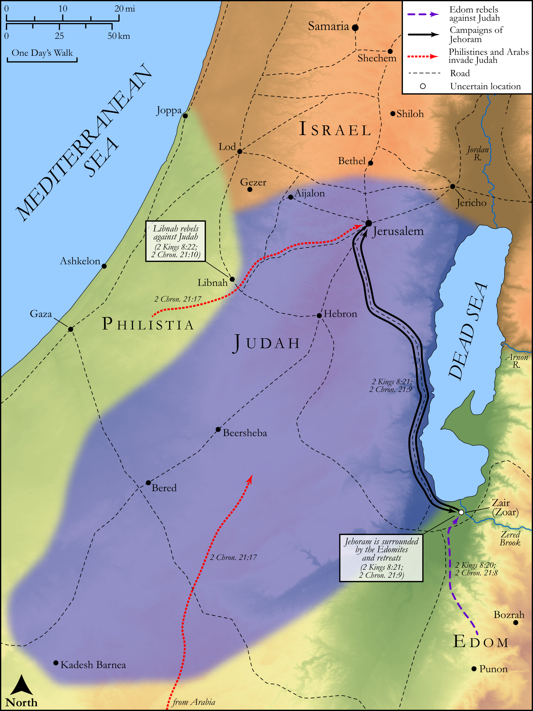

# Biblica Open Bible Maps

## License Information

Biblica Open Bible Maps, © 2023–2025 Biblica, Inc. This work is licensed under Creative Commons Attribution-ShareAlike 4.0 International (<a href="https://creativecommons.org/licenses/by-sa/4.0/">https://creativecommons.org/licenses/by-sa/4.0/</a>). More Information: <a href="https://docs.google.com/document/d/1Pp44yZ0Zdnd59vJHTrt2rPYq0SppfX5rZbPBt6mz37U/edit?tab=t.0#heading=h.oev9aj1ksvk2">https://docs.google.com/document/d/1Pp44yZ0Zdnd59vJHTrt2rPYq0SppfX5rZbPBt6mz37U/edit?tab=t.0#heading=h.oev9aj1ksvk2</a>

--------------------------------

## Historical: The Reign of Jehoram (id: OT146)

### Image Content

[link](images/OT146.png)

Original: [Historical: The Reign of Jehoram](https://drive.google.com/open?id=1e9mYSU6sZDkKNjy-hyeqBRwMV0p_75tE&usp=drive_copy)

* **Associated Passages:** 2 Kings 8:1-29; 2 Chronicles 21:1-20

* **Associated ACAI Concepts:** LORD (ID: `deity:Lord`); Tribe of Judah (ID: `group:Judah`); Judah (ID: `person:Judah.4`); Jehoram (ID: `person:Jehoram`); Israel (ID: `person:Israel`); Hazael (ID: `person:Hazael`); Ahab (ID: `person:Ahab`); Elisha (ID: `person:Elisha`); Ahaziah (ID: `person:Ahaziah.2`); Edom (ID: `place:Edom`); David (ID: `person:David`); Jerusalem (ID: `place:Jerusalem`); Joram (ID: `person:Joram.3`); Jehoshaphat (ID: `person:Jehoshaphat.3`); Rebel (ID: `keyterm:Rebel`); Philistia (ID: `place:Philistine`); Philistines (ID: `group:Philistine`); Ben-hadad (ID: `person:Ben-hadad.2`); Ramoth-gilead (ID: `place:Ramoth-gilead`); Gehazi (ID: `person:Gehazi`); Damascus (ID: `place:Damascus`); Offering (ID: `keyterm:Offering`); Play the Prostitute (ID: `keyterm:PlayTheProstitute`); Edomites (ID: `group:Edom`); Libnah (ID: `place:Libnah.2`); Syrians (ID: `group:Syria`); House (ID: `realia:House`); Athaliah (ID: `person:Athaliah`); Azariahu (ID: `person:Azariahu`); Jehiel (ID: `person:Jehiel.4`); Jezreel (ID: `place:Jezreel.2`); Azariah (ID: `person:Azariah.12`); Zechariah (ID: `person:Zechariah.11`); Shephatiah (ID: `person:Shephatiah.5`); Michael (ID: `person:Michael.9`); Zoar (ID: `place:Zoar`); Arabians (ID: `group:Arabia`); Plague (ID: `keyterm:Blow`); Asa (ID: `person:Asa`); Ethiopians (ID: `group:Ethiopia`); Ethiopia (ID: `place:Ethiopia`); Omri (ID: `person:Omri`); Covenant (ID: `keyterm:Covenant`); Elijah (ID: `person:Elijah`); Arabia (ID: `place:Arabia`); Chariot (ID: `realia:Chariot`); Lamp (ID: `realia:Lamp`); Stone Pine (ID: `flora:Pine`); Fortification (ID: `realia:Fortification`); Dog (ID: `fauna:Dog`); Money (ID: `realia:Money`); Camel (ID: `fauna:Camel`); High Place (ID: `realia:HighPlace`)
