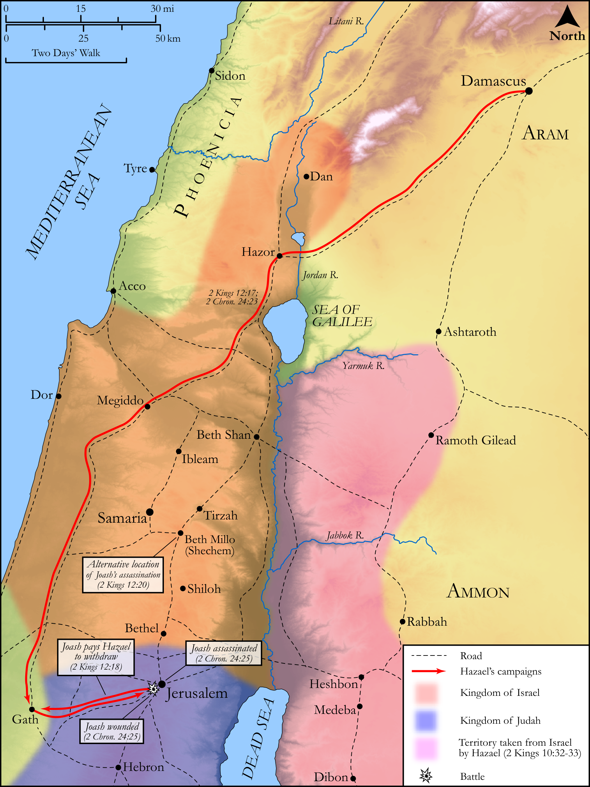

# Biblica Open Bible Maps

## License Information

Biblica Open Bible Maps, © 2023–2025 Biblica, Inc. This work is licensed under Creative Commons Attribution-ShareAlike 4.0 International (https://creativecommons.org/licenses/by-sa/4.0/). More Information: https://docs.google.com/document/d/1Pp44yZ0Zdnd59vJHTrt2rPYq0SppfX5rZbPBt6mz37U/edit?tab=t.0#heading=h.oev9aj1ksvk2

--------------------------------

## Historical: The Reign of Joash (id: OT147)

### Image Content

[link](images/OT147.png)

Original: [Historical: The Reign of Joash](https://drive.google.com/open?id=16TlCr4OHCQF3QdfQVJKAQmsQR-oPiIgv&usp=drive_copy)

* **Associated Passages:** 2 Kings 12:1-22; 2 Chronicles 24:1-27

* **Associated ACAI Concepts:** LORD (ID: `deity:Lord`); House (ID: `realia:House`); Jehoiada (ID: `person:Jehoiada.2`); Joash (ID: `person:Joash.3`); Tribe of Judah (ID: `group:Judah`); Judah (ID: `person:Judah.4`); Jerusalem (ID: `place:Jerusalem`); Money (ID: `realia:Money`); Treasury (ID: `realia:Treasury`); Israel (ID: `person:Israel`); Bier (ID: `realia:Bier`); David (ID: `person:David`); Tribe of Levi (ID: `group:Levi`); Levi (ID: `person:Levi.3`); Shimeath (ID: `person:Shimeath`); Jehozabad (ID: `person:Jehozabad`); Jozacar (ID: `person:Jozacar`); Zibiah (ID: `person:Zibiah`); Shomer (ID: `person:Shomer`); Beersheba (ID: `place:Beersheba`); Offering (ID: `keyterm:Offering`); Moses (ID: `person:Moses`); Syrians (ID: `group:Syria`); Amaziah (ID: `person:Amaziah`); Hazael (ID: `person:Hazael`); Silla (ID: `place:Silla`); Zechariah (ID: `person:Zechariah.12`); Force to Serve (ID: `keyterm:EnticedToServe`); Athaliah (ID: `person:Athaliah`); Gath (ID: `place:Gath`); Holy (ID: `keyterm:Holy`); Work (ID: `keyterm:Work`); Utterance (ID: `keyterm:Utterance`); Ammonites (ID: `group:Ammon`); Jehu (ID: `person:Jehu.2`); Beth-millo (ID: `place:Beth-millo`); Ammon (ID: `place:Ammon`); Jehoshaphat (ID: `person:Jehoshaphat.3`); Damascus (ID: `place:Damascus`); Asherah (ID: `deity:Asherah`); Kindness (ID: `keyterm:Kindness`); Ahaziah (ID: `person:Ahaziah.2`); Moab (ID: `place:Moab`); To Sin (ID: `keyterm:Sin`); Testimony (ID: `keyterm:Witness.2`); Baal (ID: `deity:Baal`); Appoint (ID: `keyterm:Appoint`); Jehoram (ID: `person:Jehoram`); Craftsman (ID: `realia:Craftsman`); Stone Altar (ID: `realia:StoneAltar`); High Place (ID: `realia:HighPlace`); Wick Trimmer (ID: `realia:WickTrimmer`); Tent of Meeting (ID: `realia:TentOfMeeting`); Bowl (ID: `realia:Bowl`); Sacred Pole (ID: `realia:SacredPole`); Temple Altar (ID: `realia:TempleAltar`); Image (ID: `realia:Image`); Doorstep (ID: `realia:Doorstep`); Tabernacle Altar (ID: `realia:TabernacleAltar`); Trumpet (ID: `realia:Trumpet`); Stone Pine (ID: `flora:Pine`); Altar (ID: `realia:Altar`); Bed (ID: `realia:Bed`)
