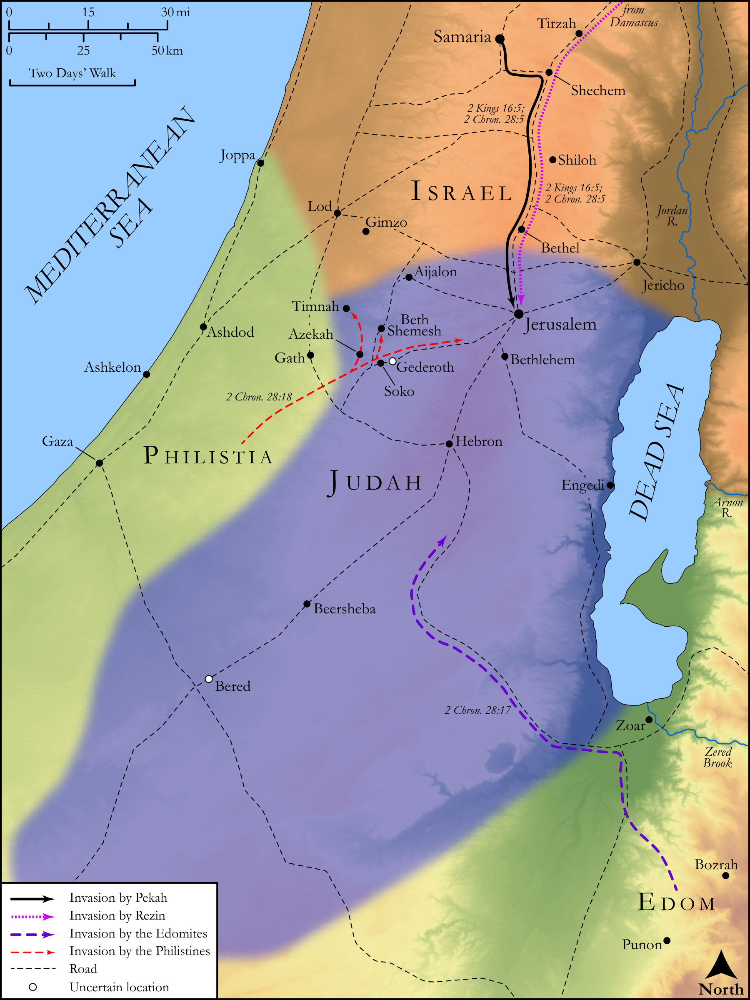

# Biblica Open Bible Maps

## License Information

Biblica Open Bible Maps, © 2023–2025 Biblica, Inc. This work is licensed under Creative Commons Attribution-ShareAlike 4.0 International (https://creativecommons.org/licenses/by-sa/4.0/). More Information: https://docs.google.com/document/d/1Pp44yZ0Zdnd59vJHTrt2rPYq0SppfX5rZbPBt6mz37U/edit?tab=t.0#heading=h.oev9aj1ksvk2

--------------------------------

## Historical: Invasions of Judah during the Reign of Ahaz (id: OT149)

### Image Content

[link](images/OT149.png)

Original: [Historical: Invasions of Judah during the Reign of Ahaz](https://drive.google.com/open?id=1YvvN1O9UuRIOvKIiyjW9aSQVZ1LBlNNf&usp=drive_copy)

* **Associated Passages:** 2 Kings 16:1-20; 2 Chronicles 28:1-27

* **Associated ACAI Concepts:** Ahaz (ID: `person:Ahaz`); LORD (ID: `deity:Lord`); Israel (ID: `person:Israel`); Tribe of Judah (ID: `group:Judah`); Judah (ID: `person:Judah.4`); Assyria (ID: `place:Assyria`); Damascus (ID: `place:Damascus`); Jerusalem (ID: `place:Jerusalem`); Uriah (ID: `person:Uriah.3`); Stone Altar (ID: `realia:StoneAltar`); Temple Altar (ID: `realia:TempleAltar`); Tabernacle Altar (ID: `realia:TabernacleAltar`); Altar (ID: `realia:Altar`); House (ID: `realia:House`); Rezin (ID: `person:Rezin`); Tiglath-pileser (ID: `person:Tiglath-pileser`); Pekah (ID: `person:Pekah`); David (ID: `person:David`); Samaria (ID: `place:Samaria`); Remaliah (ID: `person:Remaliah`); Edom (ID: `place:Edom`); Hezekiah (ID: `person:Hezekiah`); Tribe of Ephraim (ID: `group:Ephraim`); Offering (ID: `keyterm:Offering`); Be Unfaithful (ID: `keyterm:Unfaithful`); Edomites (ID: `group:Edom`); Dispossess (ID: `keyterm:Dispossess`); Ephraim (ID: `person:Ephraim`); High Place (ID: `realia:HighPlace`); Stone Pine (ID: `flora:Pine`); Kir (ID: `place:Kir`); Elkanah (ID: `person:Elkanah.8`); Gederoth (ID: `place:Gederoth`); Zichri (ID: `person:Zichri.10`); Gimzo (ID: `place:Gimzo`); Azrikam (ID: `person:Azrikam.4`); Azariah (ID: `person:Azariah.10`); Berechiah (ID: `person:Berechiah.4`); Jehizkiah (ID: `person:Jehizkiah`); Oded (ID: `person:Oded.2`); Elath (ID: `place:Elath`); Hadlai (ID: `person:Hadlai`); Shallum (ID: `person:Shallum.9`); Johanan (ID: `person:Johanan.4`); Maaseiah (ID: `person:Maaseiah.4`); Amasa (ID: `person:Amasa.2`); Jericho (ID: `place:Jericho`); Beth-shemesh (ID: `place:Beth-shemesh`); Shephelah (ID: `place:Shephelah`); Meshillemoth (ID: `person:Meshillemoth.2`); An Angel (ID: `deity:Angel`); Philistines (ID: `group:Philistine`); Socoh (ID: `place:Socoh`); Slaughtering (ID: `keyterm:Slaughtering`); Philistia (ID: `place:Philistine`); Sabbath (ID: `keyterm:Sabbath`); Negev (ID: `place:Negeb`); Aijalon (ID: `place:Aijalon`); Timnah (ID: `place:Timnah`); To Sin (ID: `keyterm:Sin`); Valley of Hinnom (ID: `place:HinnomValley`); Baal (ID: `deity:Baal`); Jotham (ID: `person:Jotham.2`); Wine (ID: `realia:Wine`); Molten Image (ID: `realia:MoltenImage`); Donkey (ID: `fauna:Donkey`); Date Palm (ID: `flora:DatePalm`); Money (ID: `realia:Money`); Cattle (ID: `fauna:Bull`)
