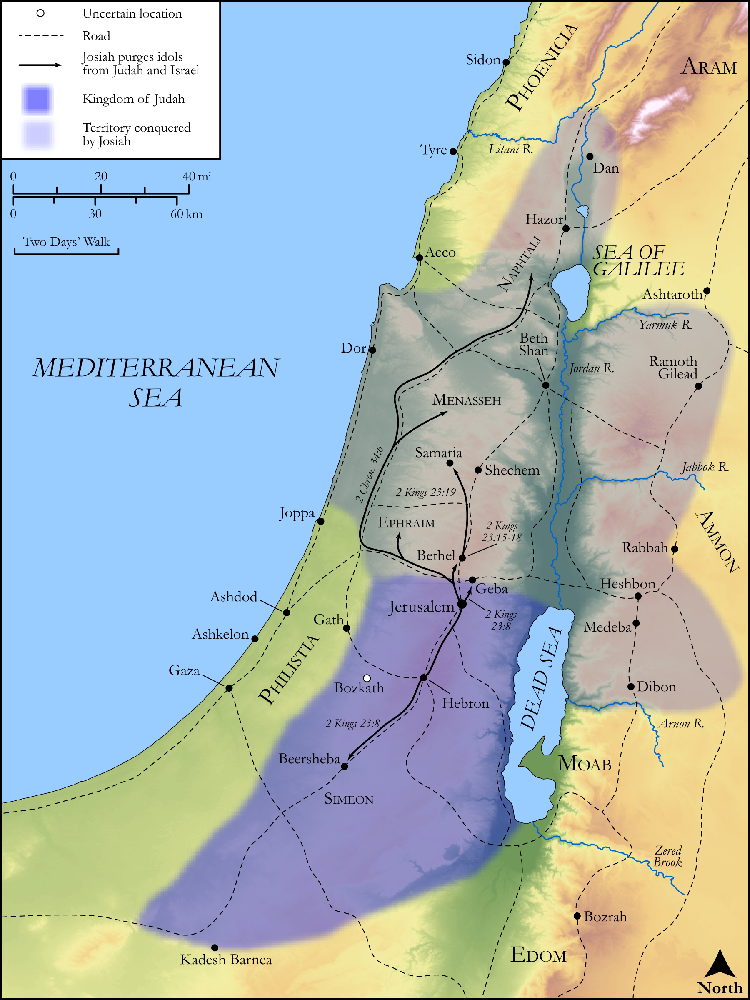

# Biblica Open Bible Maps

## License Information

Biblica Open Bible Maps, © 2023–2025 Biblica, Inc. This work is licensed under Creative Commons Attribution-ShareAlike 4.0 International (https://creativecommons.org/licenses/by-sa/4.0/). More Information: https://docs.google.com/document/d/1Pp44yZ0Zdnd59vJHTrt2rPYq0SppfX5rZbPBt6mz37U/edit?tab=t.0#heading=h.oev9aj1ksvk2

--------------------------------

## Historical: Josiah Purges the Idols (id: OT152)

### Image Content

[link](images/OT152.png)

Original: [Historical: Josiah Purges the Idols](https://drive.google.com/open?id=1gBHowWI3ACBdpxGXESmIXV0zw2fogS5m&usp=drive_copy)

* **Associated Passages:** 2 Kings 22:1-23:37; 2 Chronicles 34:1-35:27

* **Associated ACAI Concepts:** LORD (ID: `deity:Lord`); Jerusalem (ID: `place:Jerusalem`); Judah (ID: `person:Judah.4`); Tribe of Judah (ID: `group:Judah`); Josiah (ID: `person:Josiah`); Israel (ID: `person:Israel`); Hilkiah (ID: `person:Hilkiah.2`); Shaphan (ID: `person:Shaphan`); Tribe of Levi (ID: `group:Levi`); Passover (ID: `keyterm:Passover`); Levi (ID: `person:Levi.3`); House (ID: `realia:House`); Asherah (ID: `deity:Asherah`); Instruction (ID: `keyterm:Instruction`); Neco (ID: `person:Neco`); David (ID: `person:David`); Covenant (ID: `keyterm:Covenant`); Appoint (ID: `keyterm:Appoint`); Work (ID: `keyterm:Work`); Scroll (ID: `realia:Scroll`); Temple Altar (ID: `realia:TempleAltar`); Tabernacle Altar (ID: `realia:TabernacleAltar`); Altar (ID: `realia:Altar`); Stone Altar (ID: `realia:StoneAltar`); High Place (ID: `realia:HighPlace`); Stone Pine (ID: `flora:Pine`); Money (ID: `realia:Money`); Bethel (ID: `place:Bethel`); Defilement (ID: `keyterm:Defilement`); Moses (ID: `person:Moses`)
