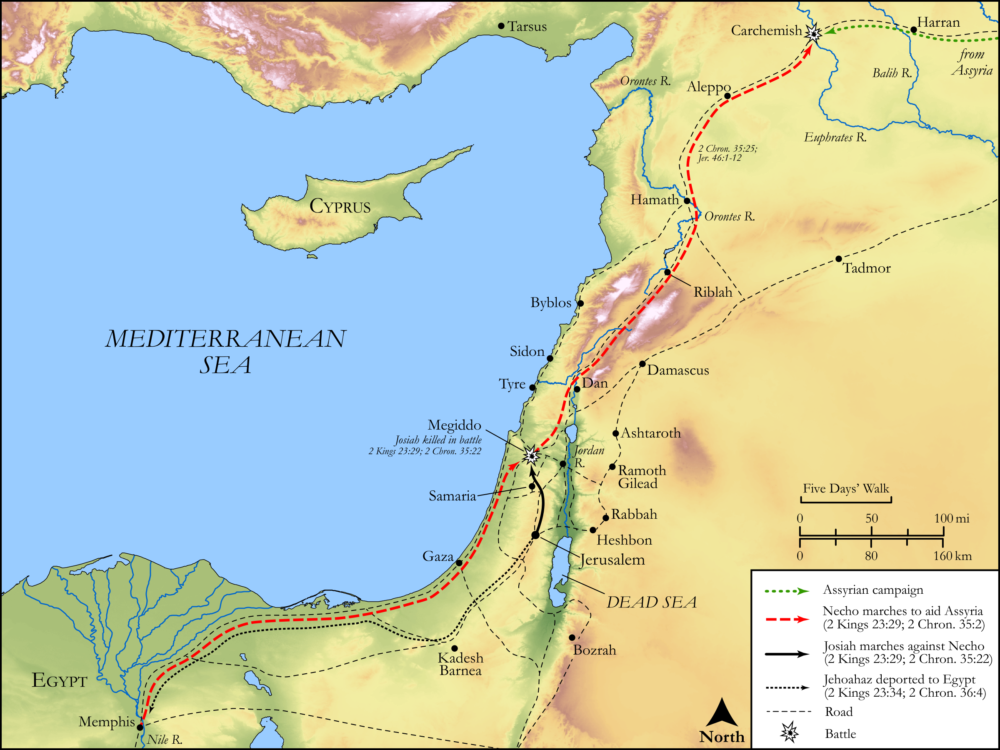

# Biblica Open Bible Maps

## License Information

Biblica Open Bible Maps, © 2023–2025 Biblica, Inc. This work is licensed under Creative Commons Attribution-ShareAlike 4.0 International (https://creativecommons.org/licenses/by-sa/4.0/). More Information: https://docs.google.com/document/d/1Pp44yZ0Zdnd59vJHTrt2rPYq0SppfX5rZbPBt6mz37U/edit?tab=t.0#heading=h.oev9aj1ksvk2

--------------------------------

## Historical: Josiah and Necho (id: OT153)

### Image Content

[link](images/OT153.png)

Original: [Historical: Josiah and Necho](https://drive.google.com/open?id=1Jszd1YPIJpesyRWJuzQzFznHmig9vdH2&usp=drive_copy)

* **Associated Passages:** 2 Kings 23:1-37; 2 Chronicles 35:1-36:23

* **Associated ACAI Concepts:** LORD (ID: `deity:Lord`); Jerusalem (ID: `place:Jerusalem`); Josiah (ID: `person:Josiah`); Judah (ID: `person:Judah.4`); Tribe of Judah (ID: `group:Judah`); Passover (ID: `keyterm:Passover`); Israel (ID: `person:Israel`); Tribe of Levi (ID: `group:Levi`); Levi (ID: `person:Levi.3`); Jehoahaz (ID: `person:Jehoahaz.3`); Neco (ID: `person:Neco`); House (ID: `realia:House`); Jehoiakim (ID: `person:Jehoiakim`); Babylon (ID: `place:Babylon`); Defilement (ID: `keyterm:Defilement`); Egypt (ID: `place:Egypt`); Asherah (ID: `deity:Asherah`); High Place (ID: `realia:HighPlace`); Temple Altar (ID: `realia:TempleAltar`); Tabernacle Altar (ID: `realia:TabernacleAltar`); Stone Pine (ID: `flora:Pine`); Altar (ID: `realia:Altar`); Stone Altar (ID: `realia:StoneAltar`); Jeremiah (ID: `person:Jeremiah.6`); Bethel (ID: `place:Bethel`); Word of the Lord (ID: `keyterm:WordOfTheLord`); Work (ID: `keyterm:Work`); Nebuchadnezzar (ID: `person:Nebuchadnezzar`); Scroll (ID: `realia:Scroll`); Kidron (ID: `place:Kidron`)
