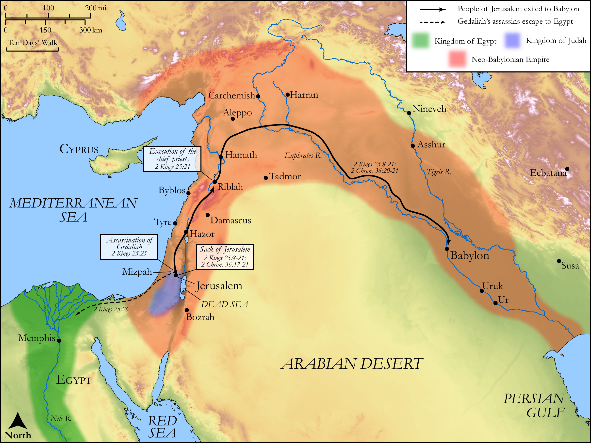

# Biblica Open Bible Maps

## License Information

Biblica Open Bible Maps, © 2023–2025 Biblica, Inc. This work is licensed under Creative Commons Attribution-ShareAlike 4.0 International (<a href="https://creativecommons.org/licenses/by-sa/4.0/">https://creativecommons.org/licenses/by-sa/4.0/</a>). More Information: <a href="https://docs.google.com/document/d/1Pp44yZ0Zdnd59vJHTrt2rPYq0SppfX5rZbPBt6mz37U/edit?tab=t.0#heading=h.oev9aj1ksvk2">https://docs.google.com/document/d/1Pp44yZ0Zdnd59vJHTrt2rPYq0SppfX5rZbPBt6mz37U/edit?tab=t.0#heading=h.oev9aj1ksvk2</a>

--------------------------------

## Historical: Exile to Babylon (id: OT155)

### Image Content

[link](images/OT155.png)

Original: [Historical: Exile to Babylon](https://drive.google.com/open?id=126-mgQdamylpCPj18sSVM96f-VMKLubY&usp=drive_copy)

* **Associated Passages:** 2 Kings 25:1-30; 2 Chronicles 36:1-23

* **Associated ACAI Concepts:** Babylon (ID: `place:Babylon`); LORD (ID: `deity:Lord`); Jerusalem (ID: `place:Jerusalem`); Chaldeans (ID: `group:Chaldea`); Chaldea (ID: `place:Chaldea`); Nebuchadnezzar (ID: `person:Nebuchadnezzar`); Tribe of Judah (ID: `group:Judah`); Judah (ID: `person:Judah.4`); House (ID: `realia:House`); Zedekiah (ID: `person:Zedekiah.3`); Gedaliah (ID: `person:Gedaliah.2`); Riblah (ID: `place:Riblah.2`); Nebuzaradan (ID: `person:Nebuzaradan`); Jeremiah (ID: `person:Jeremiah.6`); Persia (ID: `place:Persia`); Jehoahaz (ID: `person:Jehoahaz.3`); Jehoiachin (ID: `person:Jehoiachin`); Jehoiakim (ID: `person:Jehoiakim`); Egypt (ID: `place:Egypt`); Cyrus (ID: `person:Cyrus`); Nethaniah (ID: `person:Nethaniah`); Ishmael (ID: `person:Ishmael.2`); An Angel (ID: `deity:Angel`); Fear (ID: `keyterm:Fear`); Appoint (ID: `keyterm:Appoint`); Mizpah (ID: `place:Mizpah`); Israel (ID: `person:Israel`); Swear (ID: `keyterm:Swear`); Word of the Lord (ID: `keyterm:WordOfTheLord`); Evil-merodach (ID: `person:Evil-merodach`)
