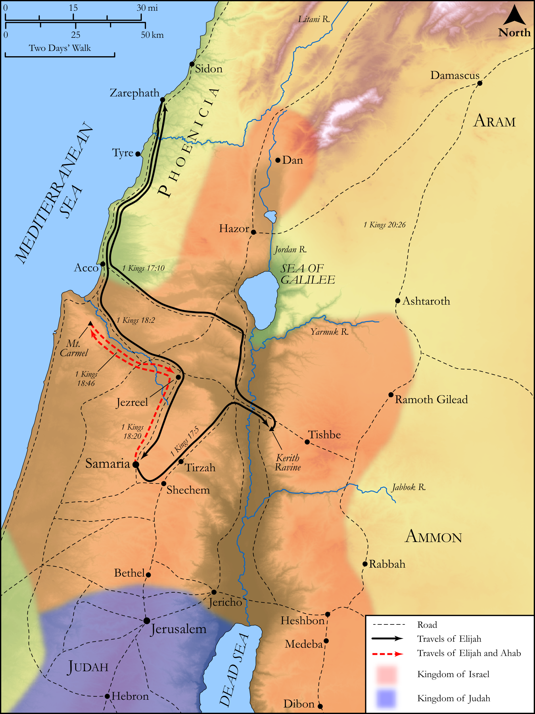

# Biblica Open Bible Maps

## License Information

Biblica Open Bible Maps, © 2023–2025 Biblica, Inc. This work is licensed under Creative Commons Attribution-ShareAlike 4.0 International (https://creativecommons.org/licenses/by-sa/4.0/). More Information: https://docs.google.com/document/d/1Pp44yZ0Zdnd59vJHTrt2rPYq0SppfX5rZbPBt6mz37U/edit?tab=t.0#heading=h.oev9aj1ksvk2

--------------------------------

## Historical: Elijah, Ahab, and the Drought (id: OT156)

### Image Content

[link](images/OT156.png)

Original: [Historical: Elijah, Ahab, and the Drought](https://drive.google.com/open?id=15bNs5Ll46R7Xm_3k007eHeYNSTem_e3A&usp=drive_copy)

* **Associated Passages:** 1 Kings 17:1-18:46

* **Associated ACAI Concepts:** LORD (ID: `deity:Lord`); Elijah (ID: `person:Elijah`); Ahab (ID: `person:Ahab`); Israel (ID: `person:Israel`); Obadiah (ID: `person:Obadiah`); Word of the Lord (ID: `keyterm:WordOfTheLord`); Baal (ID: `deity:Baal`); Offering (ID: `keyterm:Offering`); Cattle (ID: `fauna:Bull`); Mount Carmel (ID: `place:CarmelMount`); Jezebel (ID: `person:Jezebel`); Stone Altar (ID: `realia:StoneAltar`); Temple Altar (ID: `realia:TempleAltar`); Clay Jar (ID: `realia:ClayJar`); Tabernacle Altar (ID: `realia:TabernacleAltar`); Altar (ID: `realia:Altar`); Zarephath (ID: `place:Zarephath`); Cherith (ID: `place:Cherith`); Jezreel (ID: `place:Jezreel.2`); Jordan River (ID: `place:Jordan`); Anointing Oil (ID: `realia:AnointingOil`); Olive Oil (ID: `realia:OliveOil`); A Widow (ID: `person:Widow`); Tishbites (ID: `group:Tishbite`); Asherah (ID: `deity:Asherah`); Tishbe (ID: `place:Tishbe`); Kishon (ID: `place:Kishon`); Abraham (ID: `person:Abraham`); Isaac (ID: `person:Isaac`); Swear (ID: `keyterm:Swear`)
