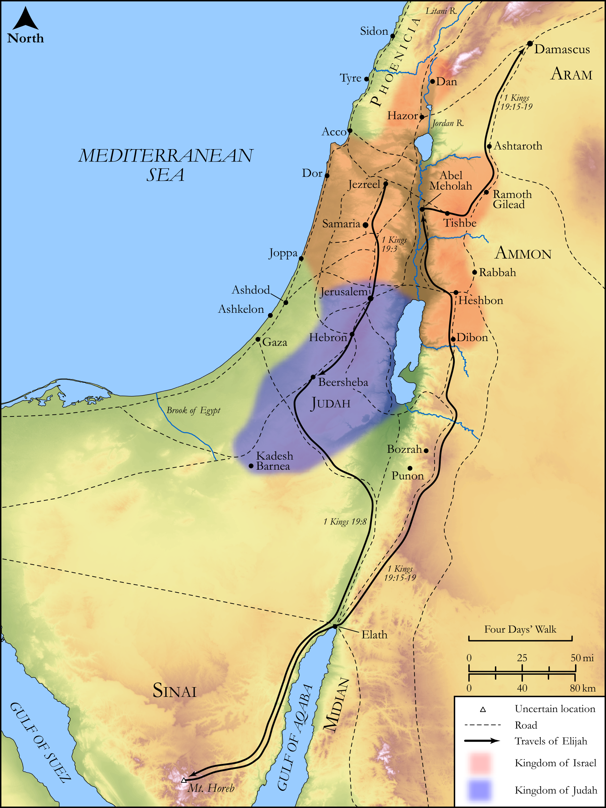

# Biblica Open Bible Maps

## License Information

Biblica Open Bible Maps, © 2023–2025 Biblica, Inc. This work is licensed under Creative Commons Attribution-ShareAlike 4.0 International (https://creativecommons.org/licenses/by-sa/4.0/). More Information: https://docs.google.com/document/d/1Pp44yZ0Zdnd59vJHTrt2rPYq0SppfX5rZbPBt6mz37U/edit?tab=t.0#heading=h.oev9aj1ksvk2

--------------------------------

## Historical: Elijah's Flight to Mt. Horeb and Damascus (id: OT157)

### Image Content

[link](images/OT157.png)

Original: [Historical: Elijah's Flight to Mt. Horeb and Damascus](https://drive.google.com/open?id=1ESSN_UppnHRD3una_4su4UindAk9goys&usp=drive_copy)

* **Associated Passages:** 1 Kings 19:1-21

* **Associated ACAI Concepts:** LORD (ID: `deity:Lord`); Elijah (ID: `person:Elijah`); Israel (ID: `person:Israel`); Elisha (ID: `person:Elisha`); An Angel (ID: `deity:Angel`); Shaphat (ID: `person:Shaphat.2`); Be Zealous (ID: `keyterm:Zealous`); Jehu (ID: `person:Jehu.2`); Hazael (ID: `person:Hazael`); Smear (ID: `keyterm:Smear`); Covenant (ID: `keyterm:Covenant`); Jezebel (ID: `person:Jezebel`); Broom (ID: `flora:Broom`); Stone Altar (ID: `realia:StoneAltar`); Clothing (ID: `realia:Clothing`); Temple Altar (ID: `realia:TempleAltar`); Tabernacle Altar (ID: `realia:TabernacleAltar`); Cattle (ID: `fauna:Bull`); Altar (ID: `realia:Altar`); Abel-meholah (ID: `place:Abel-meholah`); Nimshi (ID: `person:Nimshi`); Ahab (ID: `person:Ahab`); Word of the Lord (ID: `keyterm:WordOfTheLord`); Strength (ID: `keyterm:Strength`); Mount Sinai (ID: `place:SinaiMount`); Tribe of Judah (ID: `group:Judah`); Judah (ID: `person:Judah.4`); Beersheba (ID: `place:Beersheba`); Damascus (ID: `place:Damascus`); Baal (ID: `deity:Baal`); Clay Jar (ID: `realia:ClayJar`); Mattock (ID: `realia:Mattock`); Sword (ID: `realia:Sword`)
