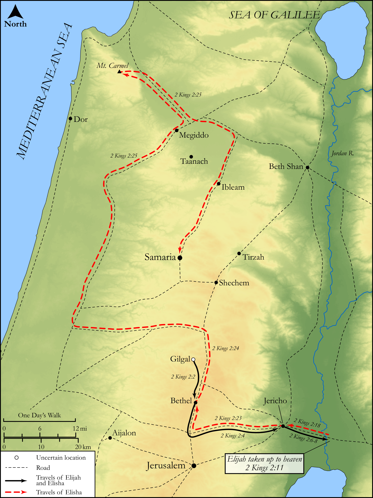

# Biblica Open Bible Maps

## License Information

Biblica Open Bible Maps, © 2023–2025 Biblica, Inc. This work is licensed under Creative Commons Attribution-ShareAlike 4.0 International (https://creativecommons.org/licenses/by-sa/4.0/). More Information: https://docs.google.com/document/d/1Pp44yZ0Zdnd59vJHTrt2rPYq0SppfX5rZbPBt6mz37U/edit?tab=t.0#heading=h.oev9aj1ksvk2

--------------------------------

## Historical: Elisha takes up Elijah's Mantle (id: OT158)

### Image Content

[link](images/OT158.png)

Original: [Historical: Elisha takes up Elijah's Mantle](https://drive.google.com/open?id=1qznut8q66jktsUYcIxxHrraYX5hpXpqs&usp=drive_copy)

* **Associated Passages:** 2 Kings 2:1-25

* **Associated ACAI Concepts:** Elisha (ID: `person:Elisha`); Elijah (ID: `person:Elijah`); LORD (ID: `deity:Lord`); Jericho (ID: `place:Jericho`); Bethel (ID: `place:Bethel`); Jordan River (ID: `place:Jordan`); Clothing (ID: `realia:Clothing`); Chariot (ID: `realia:Chariot`); Mount Carmel (ID: `place:CarmelMount`); Israel (ID: `person:Israel`); Men (ID: `group:GenericMales`); Gilgal (ID: `place:Gilgal.3`); Samaria (ID: `place:Samaria`); Bear (ID: `fauna:Bear`); Horse (ID: `fauna:Horse`); Sandalwood (ID: `flora:Sandalwood`)
