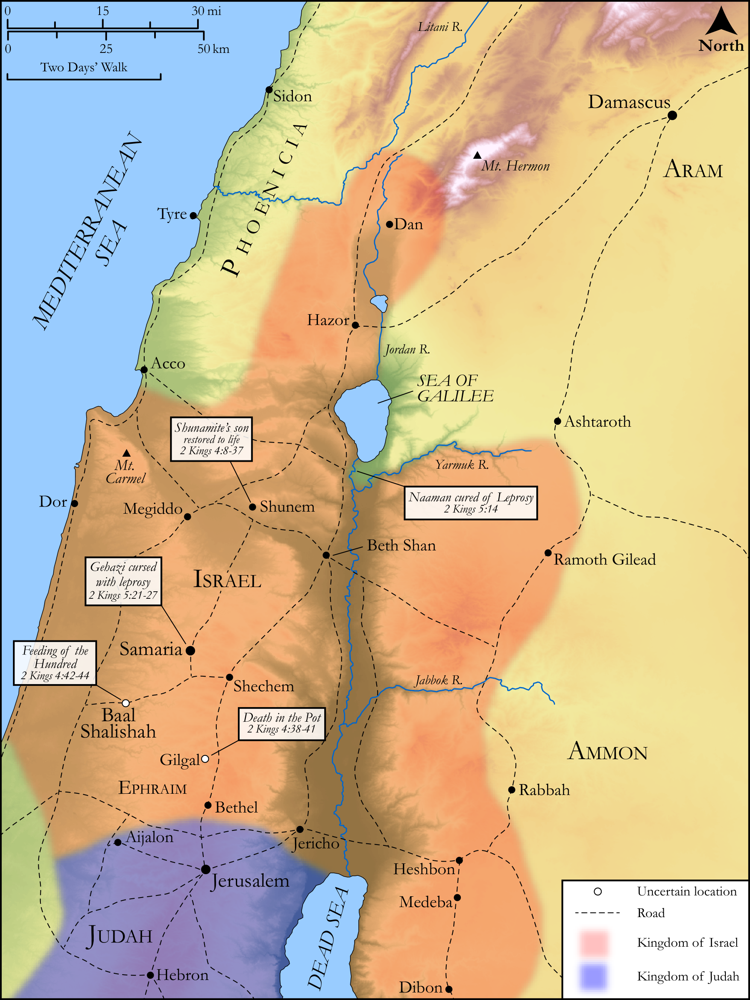

# Biblica Open Bible Maps

## License Information

Biblica Open Bible Maps, © 2023–2025 Biblica, Inc. This work is licensed under Creative Commons Attribution-ShareAlike 4.0 International (https://creativecommons.org/licenses/by-sa/4.0/). More Information: https://docs.google.com/document/d/1Pp44yZ0Zdnd59vJHTrt2rPYq0SppfX5rZbPBt6mz37U/edit?tab=t.0#heading=h.oev9aj1ksvk2

--------------------------------

## Historical: Miracles of Elisha (Part 1) (id: OT159)

### Image Content

[link](images/OT159.png)

Original: [Historical: Miracles of Elisha (Part 1\)](https://drive.google.com/open?id=1efg8-eM2VNQQWM0K8Nj-Sx8xWel1mNj0&usp=drive_copy)

* **Associated Passages:** 2 Kings 4:1-5:27

* **Associated ACAI Concepts:** LORD (ID: `deity:Lord`); Gehazi (ID: `person:Gehazi`); Elisha (ID: `person:Elisha`); Naaman (ID: `person:Naaman.3`); Israel (ID: `person:Israel`); Infectious Skin Disease (ID: `keyterm:InfectiousSkinDisease`); Peace (ID: `keyterm:IntactState`); House (ID: `realia:House`); Pure (ID: `keyterm:Pure`); Shunammites (ID: `group:Shunammites`); Cooking Pot (ID: `realia:CookingPot`); Money (ID: `realia:Money`); Jordan River (ID: `place:Jordan`); Stew (ID: `realia:Stew`); Bless (ID: `keyterm:Bless`); Syrians (ID: `group:Syria`); Olive Oil (ID: `realia:OliveOil`); Chariot (ID: `realia:Chariot`); Talent (ID: `realia:Talent`); Scroll (ID: `realia:Scroll`); Bed (ID: `realia:Bed`); Anointing Oil (ID: `realia:AnointingOil`); Baal-shalishah (ID: `place:Baal-shalishah`); Rimmon (ID: `deity:Rimmon`); Pharpar (ID: `place:Pharpar`); Abanah (ID: `place:Abana`); Mount Carmel (ID: `place:CarmelMount`); Holy (ID: `keyterm:Holy`); An Angel (ID: `deity:Angel`); Forgive (ID: `keyterm:Forgive`)
