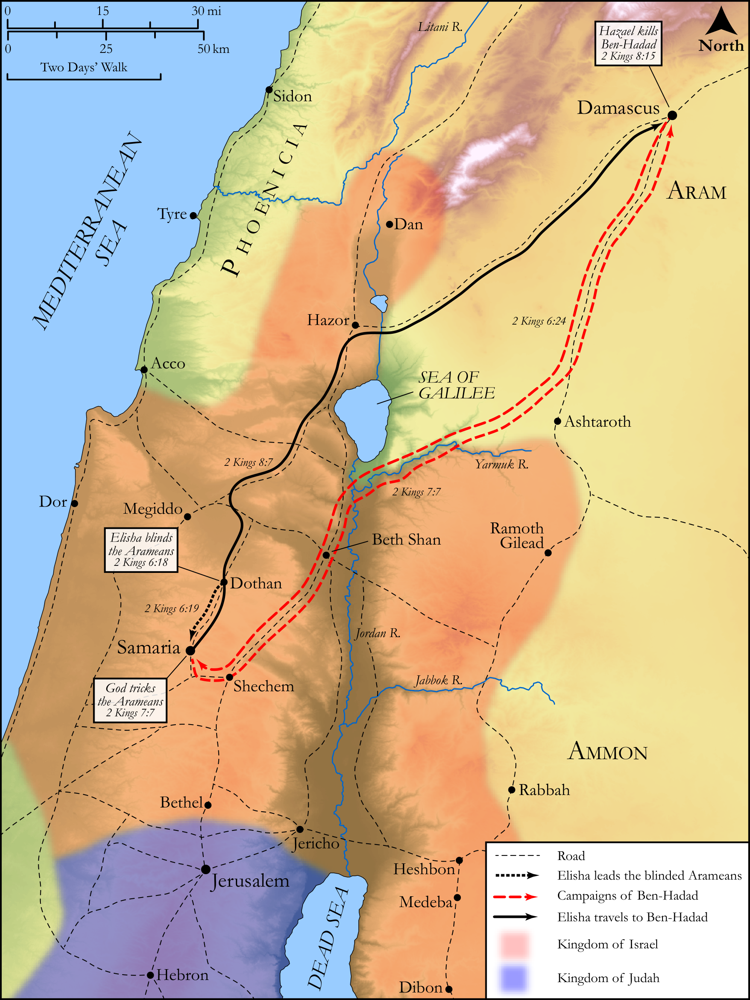

# Biblica Open Bible Maps

## License Information

Biblica Open Bible Maps, © 2023–2025 Biblica, Inc. This work is licensed under Creative Commons Attribution-ShareAlike 4.0 International (https://creativecommons.org/licenses/by-sa/4.0/). More Information: https://docs.google.com/document/d/1Pp44yZ0Zdnd59vJHTrt2rPYq0SppfX5rZbPBt6mz37U/edit?tab=t.0#heading=h.oev9aj1ksvk2

--------------------------------

## Historical: Miracles of Elisha (Part 2) (id: OT160)

### Image Content

[link](images/OT160.png)

Original: [Historical: Miracles of Elisha (Part 2\)](https://drive.google.com/open?id=1Vaxwle3jXh4IoTt-ycWUW6Xpk10P2R_h&usp=drive_copy)

* **Associated Passages:** 2 Kings 6:1-8:29

* **Associated ACAI Concepts:** LORD (ID: `deity:Lord`); Elisha (ID: `person:Elisha`); Israel (ID: `person:Israel`); Syrians (ID: `group:Syria`); Hazael (ID: `person:Hazael`); Judah (ID: `person:Judah.4`); Tribe of Judah (ID: `group:Judah`); Jehoram (ID: `person:Jehoram`); Samaria (ID: `place:Samaria`); Ahab (ID: `person:Ahab`); Horse (ID: `fauna:Horse`); Ahaziah (ID: `person:Ahaziah.2`); Joram (ID: `person:Joram.3`); Chariot (ID: `realia:Chariot`); House (ID: `realia:House`); Ben-hadad (ID: `person:Ben-hadad.2`); Jordan River (ID: `place:Jordan`); An Angel (ID: `deity:Angel`); Edom (ID: `place:Edom`); Ramoth-gilead (ID: `place:Ramoth-gilead`); Prophets (ID: `group:GenericProphets`); Gehazi (ID: `person:Gehazi`); Seah (ID: `realia:Seah`); Word of the Lord (ID: `keyterm:WordOfTheLord`); Jerusalem (ID: `place:Jerusalem`); Philistines (ID: `group:Philistine`); David (ID: `person:David`); Damascus (ID: `place:Damascus`); Infectious Skin Disease (ID: `keyterm:InfectiousSkinDisease`); Offering (ID: `keyterm:Offering`)
