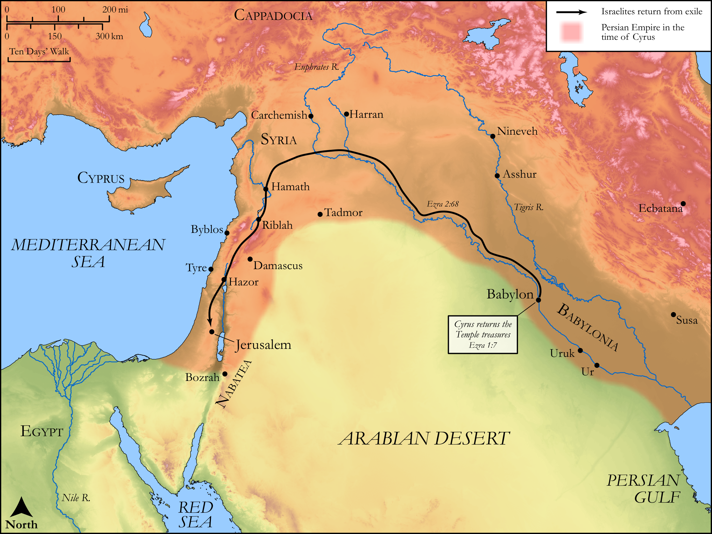

# Biblica Open Bible Maps

## License Information

Biblica Open Bible Maps, © 2023–2025 Biblica, Inc. This work is licensed under Creative Commons Attribution-ShareAlike 4.0 International (https://creativecommons.org/licenses/by-sa/4.0/). More Information: https://docs.google.com/document/d/1Pp44yZ0Zdnd59vJHTrt2rPYq0SppfX5rZbPBt6mz37U/edit?tab=t.0#heading=h.oev9aj1ksvk2

--------------------------------

## Historical: The Return from Babylon (id: OT161)

### Image Content

[link](images/OT161.png)

Original: [Historical: The Return from Babylon](https://drive.google.com/open?id=1q0E6UIZyApFq_olK9H0CLNy7vGkS4hK8&usp=drive_copy)

* **Associated Passages:** Ezra 2:1-3:13

* **Associated ACAI Concepts:** LORD (ID: `deity:Lord`); Israel (ID: `person:Israel`); Levi (ID: `person:Levi.3`); Tribe of Levi (ID: `group:Levi`); Offering (ID: `keyterm:Offering`); Jerusalem (ID: `place:Jerusalem`); House (ID: `realia:House`); Zerubbabel (ID: `person:Zerubbabel.2`); Joshua (ID: `person:Joshua.5`); Hodaviah (ID: `person:Hodaviah.4`); Jeshua (ID: `person:Jeshua.4`); Jehozadak (ID: `person:Jehozadak`); Elam (ID: `person:Elam`); Shealtiel (ID: `person:Shealtiel.2`); Kadmiel (ID: `person:Kadmiel`); Solomon (ID: `person:Solomon`); Asaph (ID: `person:Asaph.2`); Talmon (ID: `person:Talmon`); Harim (ID: `person:Harim`); Zattu (ID: `person:Zattu.2`); Meunim (ID: `group:Meunim`); Ami (ID: `person:Ami`); Arah (ID: `person:Arah.2`); Temah (ID: `person:Temah`); Nekoda (ID: `person:Nekoda.2`); Barzillai (ID: `person:Barzillai.3`); Sotai (ID: `person:Sotai`); Habaiah (ID: `person:Habaiah`); Bigvai (ID: `person:Bigvai.2`); Hagabah (ID: `person:Hagabah`)
