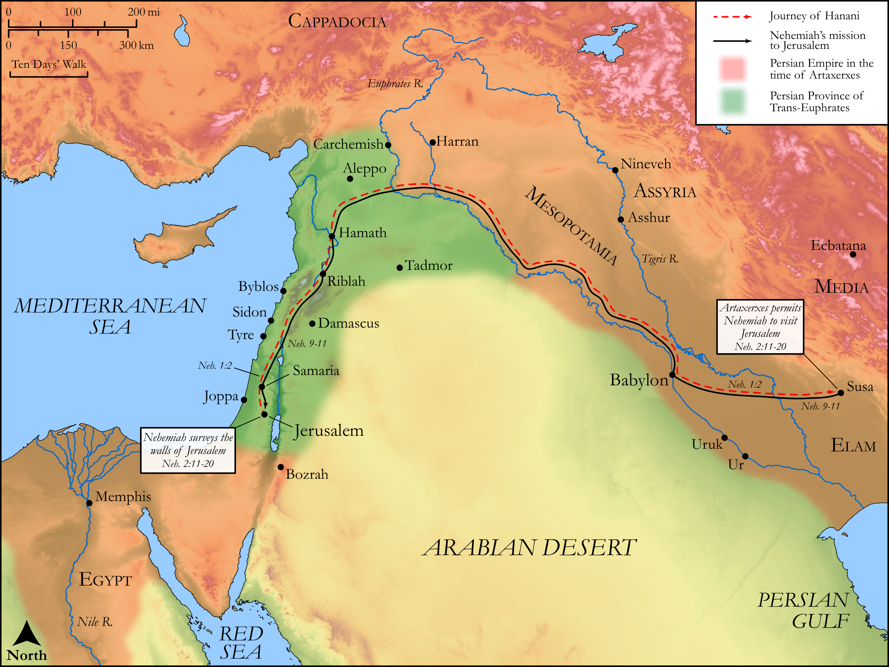

# Biblica Open Bible Maps

## License Information

Biblica Open Bible Maps, © 2023–2025 Biblica, Inc. This work is licensed under Creative Commons Attribution-ShareAlike 4.0 International (<a href="https://creativecommons.org/licenses/by-sa/4.0/">https://creativecommons.org/licenses/by-sa/4.0/</a>). More Information: <a href="https://docs.google.com/document/d/1Pp44yZ0Zdnd59vJHTrt2rPYq0SppfX5rZbPBt6mz37U/edit?tab=t.0#heading=h.oev9aj1ksvk2">https://docs.google.com/document/d/1Pp44yZ0Zdnd59vJHTrt2rPYq0SppfX5rZbPBt6mz37U/edit?tab=t.0#heading=h.oev9aj1ksvk2</a>

--------------------------------

## Historical: Nehemiah’s Mission to Jerusalem (id: OT164)

### Image Content

[link](images/OT164.png)

Original: [Historical: Nehemiah’s Mission to Jerusalem](https://drive.google.com/open?id=1dvP_s3M-R6R7PVHZohasRjukDRGy-yMe&usp=drive_copy)

* **Associated Passages:** Nehemiah 1:1-2:20

* **Associated ACAI Concepts:** LORD (ID: `deity:Lord`); Jerusalem (ID: `place:Jerusalem`); Tribe of Judah (ID: `group:Judah`); Fear (ID: `keyterm:Fear`); Judah (ID: `person:Judah.4`); Horonites (ID: `group:Horonites`); Valley Gate (ID: `place:ValleyGate`); Tobiah (ID: `person:Tobiah.2`); Sanballat (ID: `person:Sanballat`); Moses (ID: `person:Moses`); Jews (ID: `group:Jews`); Ammon (ID: `place:Ammon`); Ammonites (ID: `group:Ammon`); Israel (ID: `person:Israel`); Euphrates River (ID: `place:Euphrates`); Asaph (ID: `person:Asaph.4`); Dragon Spring (ID: `place:DragonSpring`); Hacaliah (ID: `person:Hacaliah`); Geshem (ID: `person:Geshem`); Dung Gate (ID: `place:DungGate`); Artaxerxes (ID: `person:Artaxerxes`); Nehemiah (ID: `person:Nehemiah.2`); Fountain Gate (ID: `place:FountainGate`); Susa (ID: `place:Susa`); Hanani (ID: `person:Hanani.4`); Cattle (ID: `fauna:Bull`); Arabians (ID: `group:Arabia`); Kindness (ID: `keyterm:Kindness`); Siloam (ID: `place:Siloam`); Covenant (ID: `keyterm:Covenant`); Rebel (ID: `keyterm:Rebel`); Be Unfaithful (ID: `keyterm:Unfaithful`); Decree (ID: `keyterm:Decree`); To Sin (ID: `keyterm:Sin`); Love (ID: `keyterm:Love`); Redeem (ID: `keyterm:Redeem`); Repent (ID: `keyterm:Repent`); Arabia (ID: `place:Arabia`); Strength (ID: `keyterm:Strength`); Wine (ID: `realia:Wine`); Vine (ID: `flora:Vine`); House (ID: `realia:House`)
